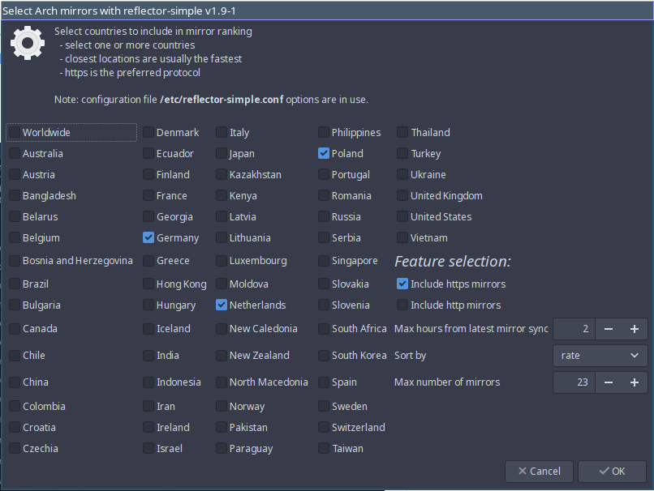

import { Image } from "astro:assets";
import cover from "../../assets/articles/a-gui-app-for-selecting-arch-mirrors/EndeavourOS_6.jpg";

<Image src={cover} alt="" class="cover" loading="eager" width={1440} />

Mirror ranking or selecting the best mirrors (package servers) can be done with a command line utility called `reflector`. A GUI wrapper for reflector is `reflector-simple`. It provides a simple graphical user interface:



All countries having Arch mirrors are shown, and any combination of them can be selected. The typical selection includes your country (if available on the list) and/or countries near your country because usually, the closest mirrors are the fastest. And note the word Worldwide at the beginning of this list, which means (as far as I know) it should work reasonably well in most geographical areas.

After the list of countries, there are some ranking options. Most of these options have a counterpart in `reflector`. For example, selecting **Include https mirrors** means using the `-p https` option with `reflector`.

The following table shows the correspondence between the selections and `reflector`:

| **Selection** | **Related reflector option** | **Purpose** |
|---|---|---|
| Include https mirrors | `--protocol` | Include mirrors that use https protocol. |
| Include http mirrors | `--protocol` | Include mirrors that use http protocol. |
| Use /etc/reflector-auto.conf |  | If package `reflector-auto` is installed, you may automatically re-use its configuration file.<br />More information under **Configuration file(s)** below.<br />*Note*: starting with version 1.5-1 this selection is no more available. |
| Max hours from latest mirror sync | `--age` | Accept only mirrors that have been synchronized with the *master* mirror within the last given number of hours. |
| Sort by | `--sort` | How to sort/rank the resulting list of mirrors. The best mirrors will be placed in the beginning of the list of mirrors. |
| Max number of mirrors | `--number` | Return at most the given number of mirrors. |

Command

`reflector --help`

gives more information about reflector’s options.

## Configuration file(s)

`reflector-simple` supports a configuration file

`/etc/reflector-simple.conf`

if it exists. That file can contain command line options of the `reflector` command (see the example below).

The reflector options given in this file are used as the “starting point” (in version 1.5-1 and later) for the features that can be changed with the GUI. (Earlier versions overwrote the values of the GUI, which was confusing.)

About the contents of the configuration file:

- options can be on several lines
- options can be on the same line(s)
- the file can have empty lines, or comment lines starting with the `#` character

Use command `reflector --list-countries` to see supported country names and country codes.

A (somewhat random) example configuration file:

```
# Example /etc/reflector-simple.conf:

--sort age
--age 5
--number 20
--country Canada,US,"United Kingdom"
```

As the example shows, the country specifications can be country names (`Canada, "United Kingdom"`) or country codes (`US`). Note the usage of quotes when the country name contains spaces.

Note also that file `/etc/reflector-auto.conf` (from the obsolete command `reflector-auto`) is supported if it exists and /etc/reflector-simple.conf does not. Support for the other configuration file was removed at the end of the year 2020.

More information about the configuration file(s) is here:  
[https://github.com/endeavouros-team/PKGBUILDS/tree/master/reflector-simple](https://github.com/endeavouros-team/PKGBUILDS/tree/master/reflector-simple)

---

Editing history:

- created 2019-Dec-12 by Manuel
- edited: 2020-Oct-9 by Manuel
- edited: 2020-Oct-12 by Manuel
- edited: 2020-Dec-10 by JoeKamprad
