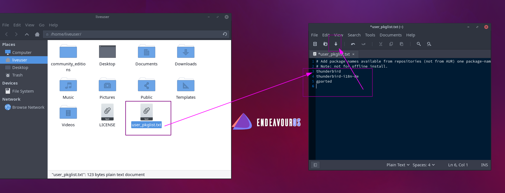

import YouTube from "../../components/YouTube.astro";
import { Image } from "astro:assets";
import cover from "../../assets/articles/add-packages-to-be-installed-in-addition-to-desktop-chosen/2021-04-20_15-09.png";

<Image src={cover} alt="" class="cover" width={1200} />

Since the ISO publication of March 2021, there has been the option of entering additional packages in a list, which will then be installed in addition to the selected [desktop environment](https://endeavouros.com/).

**This will only proceed if you choose online install method, as it needs to fetch the packages.** 
Simply edit and save the **user_pkgfile** file in the live environment.

After this you can simply start installation as usual.

Watch this little video to see how it looks like:

<YouTube url="https://youtu.be/1-h0xFW3ruY" />
