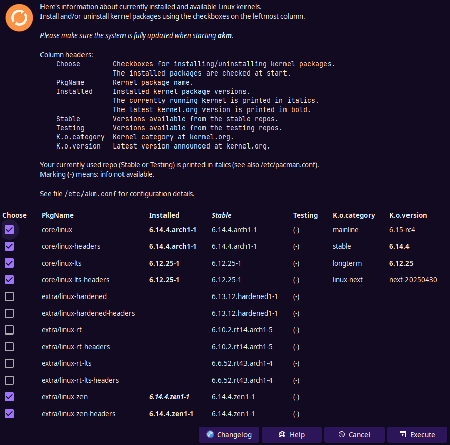
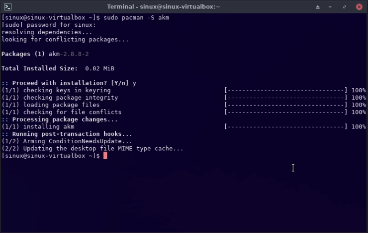

import { Image } from "astro:assets";
import cover from "../../assets/articles/akm/2025-05-01_01-31.png";

<Image src={cover} alt="" class="cover" loading="eager" width={889} />

## A Kernel Manager

Author: @sandmaan  
Update: @manuel 2023-Jan-07

AKM is a simple GUI to manage the kernels. AKM is part of the EndeavourOS tool kit. But it can be used with any other Arch-based distribution. The letters ***AKM*** stands for “**A** **K**ernel **M**anager” according to the main developer who created this wonderful app.

AKM supplies the user with a **G**raphical **U**ser **I**nterface with a list of kernels. The user can select a kernel version he/she wants to install.



## **Installing AKM**

AKM doesn’t come preinstalled due to the minimalistic philosophy followed by the EndeavourOS team. So users who want to use AKM have to install it over `pacman` in the terminal

### Installing from terminal

To install AKM via the terminal, you can use sudo pacman -S akm



## Using AKM GUI

Using AKM is straightforward. From the GUI, a user can check the checkbox in front of the kernel package name which will mark that kernel to be installed. If the user wishes to uninstall a particular kernel then he/she just has to uncheck the kernel package from the list. Once they have selected or unselected the kernel package to change the status of, they only have to click on ***Execute*** to apply the changes. Refer to the image above for clarity.

## Terminal Usage

You can use AKM via the terminal, with or without options. Using `akm` will launch the main AKM GUI. But a user can use the below options to change some characteristics of AKM.

- `--connect-header` - Which will bind the kernel header package and the selected kernel into one unit. As an example, if a user chose to install or uninstall the kernel `linux-zen` then using `--connect-header` option will bind the `linux-zen-headers` to the install or uninstall.
- `--scroll` - It allows the kernel list to be scrollable. By default, the list is scrollable (default changed in 2022).
- `--small` - Make the akm window smaller, suitable for low resolution screens.

## Advanced Configuration

By using the AKM configuration file users can customize how AKM works. You can find the configuration file at `/etc/akm.conf`. Below is the example code of the mentioned file.

```
#!/bin/bash

### Config file for akm.

# When installing/uninstalling a kernel, you may configure to
# install/uninstall the related header too.
# Values: "yes" or "no"
# Default: no
local KERNEL_HEADER_WITH_KERNEL=no

# List of kernel and header names when using additional repos.
# Example:
#   local AKM_KERNELS_HEADERS=(
#       reponame/linux-xxx  reponame/linux-xxx-headers
#       reponame/linux-yyy  reponame/linux-yyy-headers
#       ...
#   )
# where
#    reponame   The name of an additional repository.
#    linux-xxx  The name of a kernel.
#
local AKM_KERNELS_HEADERS=(
)

# Width of the akm window in pixels.
# Default: 900
local AKM_WINDOW_WIDTH=900
```

| Variable | Description | Supported Value |
|---|---|---|
| KERNEL_HEADER_WITH_KERNEL <br /> | Provides the same function as`the` ` --connect-header` option,<br /> binding the header package <br /> with the kernel package. | `no`(default) or `yes` |
| AKM_KERNELS_HEADERS | Lists the additional kernel<br /> and header names when using <br /> additional repositories. | List of `reponame/pkgname` entries. |
| AKM_WINDOW_WIDTH | Predefines the width of the<br />`akm GU`I window. | A positive integer (number) in pixels. Default is `900` |

### Adding a New (unofficial) Package Repository

If you want more kernels you can add the corresponding repository to the `/etc/pacman.conf`. After adding the repository user must perform a database sync using `sudo pacman -Syy` or `sudo pacman -Syyu`. Once this is done, if the repository contains any kernel packages then AKM will try to add them to the list and show them.

**Example:**  
Unofficial Repository entry inside /etc/pacman.conf:

```ini
[archzfs]
Server = http://archzfs.com/$repo/$arch
```

### Using Caveat Method to Add Kernels

This method of automatically detecting kernel names is limited because kernels can be named in various ways. Use the configuration variable `AKM_KERNELS_HEADERS` (mentioned above) to add a list of kernel and header names from an additional repository. This is useful if the automatic kernel name detection does not recognize certain kernel names.

Just as an example, to use the info from the picture above, your `/etc/akm.conf` could look something like this:

```
#!/bin/bash

### Config file for akm.

# When installing/uninstalling a kernel, you may configure to
# install/uninstall the related header too.
# Values: "yes" or "no"
# Default: no
local KERNEL_HEADER_WITH_KERNEL=yes

# List of kernel and header names when using additional repos.
# Example:
#   local AKM_KERNELS_HEADERS=(
#       reponame/linux-xxx  reponame/linux-xxx-headers
#       reponame/linux-yyy  reponame/linux-yyy-headers
#       ...
#   )
# where
#    reponame   The name of an additional repository.
#    linux-xxx  The name of a kernel.
#
local AKM_KERNELS_HEADERS=(
    kernel-lts/linux-lts414  kernel-lts/linux-lts414-headers
    kernel-lts/linux-lts419  kernel-lts/linux-lts419-headers
    kernel-lts/linux-lts44   kernel-lts/linux-lts44-headers
    # and so on...
)

# Width of the akm window in pixels.
# Default: 900
local AKM_WINDOW_WIDTH=1000
```
