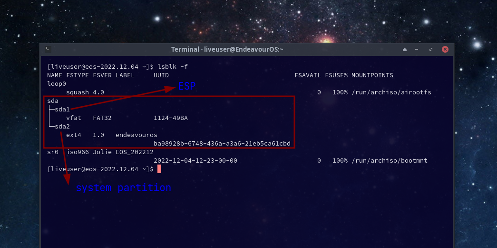
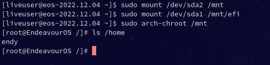
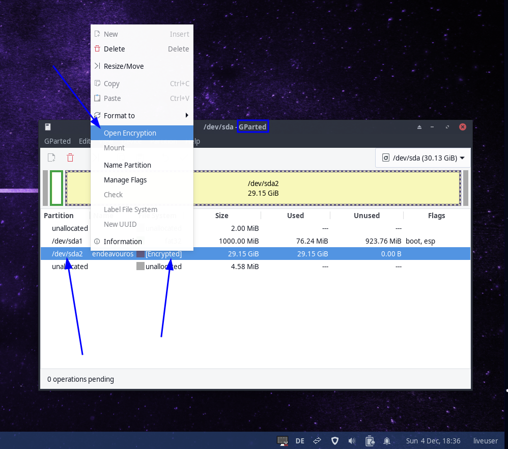
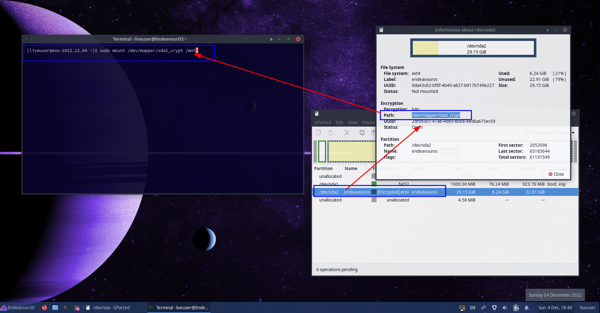

import { Image } from "astro:assets";
import cover from "../../assets/articles/arch-chroot/cassini-arch-chroot.png";

<Image src={cover} alt="" class="cover" width={1200} />

If your machine doesn’t boot caused of a Bootloader or update issue, there is a way to get into your system through the terminal with ***Change of root*** also known as ***Chroot***.

This is a rescue mode where you mount the partitions of the installed system, as it would happen on a real OS boot, and with the help of a chroot helper, you can log in to the installed system and run some rescue tasks.

In our case, we have [arch-](https://man.archlinux.org/man/extra/arch-install-scripts/arch-chroot.8.en)[chroot](https://man.archlinux.org/man/extra/arch-install-scripts/arch-chroot.8.en) which helps to make the process of mounting some needed stuff into the chroot needed to be able to maintain rescue-related stuff inside the chroot properly.

To be able to use arch-chroot these are the steps to follow:

1. Boot into the EndeavourOS installer ISO (archiso itself will work too).

2. Mount needed partitions.

3. Run arch-chroot to log in to the installed system. Run rescue tasks like you would be booted into the system itself.

#### Boot into the EndeavourOS installer ISO

Boot the installer ISO in the same way you have done on installing EndeavourOS but do not run the installer.

#### Mount needed partitions

To be able to chroot, you need to know how the partitions and format are set up.

To uncover that information, open the terminal, and type:

`sudo lsblk -f`

Depending on the way you installed the OS you will have different scenarios.

It can be **ext4**, **BTRFS, **or **xfs **formatted and you may set up encryption.

On most modern systems, and if you do not set legacy Bios Mode on the Firmware, you will run in EFI mode, and in this case, you will have a fat32 partition (**ESP** = EFI-System-Partition) and your system partition if using **ext4 **or **xfs**. If you are using **BTRFS** you have a subvolume scheme running.

---

### **ℹ**

**If you are running CSM/Bios/legacy installs:**

**In the case of old or legacy-enabled Bios systems (if Firmware is set to CSM mode), you will mostly have only one partition so you will not need to mount the ESP in addition. In this case you will not find any fat32 partition, and only need to mount the system partition.**

---

If you set up LUKS encryption you need to unlock the encryption to be able to mount them.

In this example, we use a default ext4 setup with the **ESP** mounted under **/efi** ( you will find other models at the end of the article).

lsblk -f

So we need to mount /dev/sda2 and the ESP (/dev/sda1) make sure to know your ESP mount point on your installed system can be **/efi** or **/boot/efi **(older installs, or if you are using grub instead of systemd-boot).

You will see in the **/etc/fstab** file of the installed system if you cannot remember.

`sudo mount /dev/sda2 /mnt`

`sudo cat /mnt/etc/fstab` (to check the mount point of your ESP)

`sudo mount /dev/sda1 /mnt/efi` (or **/mnt/boot/efi**)

Now your installed system is mounted.

#### Run arch-chroot to login to the installed system

With this information, you are able to arch-chroot, so type the following command:

`sudo arch-chroot /mnt`

Now you’ve chrooted into your installed system, and you are able to access your files, install packages, or alter scripts to rescue your system.

To make sure arch-chroot is working check after your user’s home folder `ls /home` that should give your username from the installed system.

All commands you run into this terminal will now run as you would run them on a real boot of the system.

You can rerun a failed update, rebuild kernel images or reinstall uninstalled packages and fix configs, etc.

##### Useful links:

- Video tutorial about arch-chroot: [https://discovery.endeavouros.com/system-rescue/fix-arch-linux-boot-with-arch-chroot/2021/12/](/fix-arch-linux-boot-with-arch-chroot/)
- Arch-Wiki: [Using arch-chroot](https://wiki.archlinux.org/title/Chroot#Using_arch-chroot)
- [Wikipedia](https://en.wikipedia.org/wiki/Chroot) article about Chroot in general.
- Repair [non booting Grub](/repair-a-non-booting-grub/) from arch-chroot
- About [Systemd-Boot](/systemd-boot/)
- About [Dracut](/dracut/)

---

#### Other mounting examples

##### BTRFS filesystem installs

you need to know your subvol names and their associated mount points inside the system path.

Per default EndeavourOS uses this scheme:

`btrfsSubvolumes:- mountPoint: /subvolume: /@- mountPoint: /homesubvolume: /@home- mountPoint: /var/cachesubvolume: /@cache- mountPoint: /var/logsubvolume: /@log`

*Not all subvolumes need to get mounted to use arch-chroot it needs mainly the / (@) if you only want to repair grub per example*

`sudo mount -o subvol=@ /dev/sdXn /mnt`

`sudo mount -o subvol=@log /dev/sdXn /mnt/var/log`

`sudo mount -o subvol=@cache /dev/sdXn /mnt/var/cache`

`sudo mount -o subvol=@home /dev/sdXn /mnt/home`

And your ESP needs to get mounted also .. as it is not inside your BTRFS scheme and using its own fat32 partition:

`sudo mount /dev/sdXn /mnt/efi`

**where in all cases /dev/sdXn needs to be changed** according to what is used on your install as partition/device path and the mount path for the **ESP** needs to get changed according to your installed system in case. If it is **/efi **you need to mount on **/mnt/efi **if it is **/boot/efi **it would be **/mnt/boot/efi** ...

Now you will be able to arch-chroot into your **BTRFS** system, as you can see above under **Run arch-chroot to login to the installed system**.

##### Encrypted installs

In case /dev/sda2 is the encrypted root partition you need to unlock:

`sudo cryptsetup open /dev/sda2 mycryptdevice`

It will ask for your **LUKS** passphrase and unlocks the device into the path `/dev/mapper/mycryptdevice`

This path can be used to mount the device:

`sudo mount /dev/mapper/mycryptdevice /mnt`

Followed by mounting the ESP (EFI-System-Partition) into the already mounted system:

`sudo mount /dev/sdXn /mnt/efi`

**where in all cases /dev/sdXn needs to be changed** according to what is used on your install as partition/device path and the mount path for the **ESP** needs to get changed according to your installed system in case. If it is **/efi **you need to mount on **/mnt/efi **if it is **/boot/efi **it would be **/mnt/boot/efi** ...

You can also use Gparted to open encryption...

open encryption - Gparted

After this right-click on the partition and show "information" to get the mapper path you need to mount it:

rescue livesession - gparted

##### Open encryption for BTRFS installs:

The mounting process would change from using the device name itself to `/dev/mapper/mycryptdevice`

example:

`sudo mount -o subvol=@ /dev/mapper/mycryptdevice /mnt`

For other subvols follow the same scheme as above on the BTRFS example replacing the device with `/dev/mapper/mycryptdevice`
