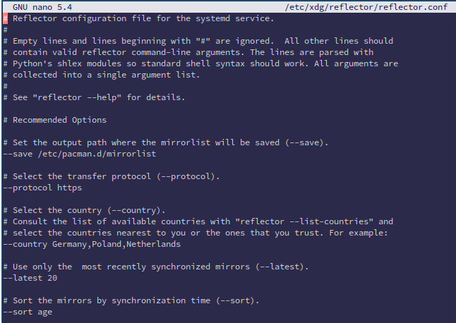
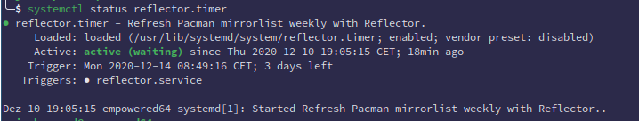

import { Image } from "astro:assets";
import cover from "../../assets/articles/automatically-ranking-the-mirror-list/mirrorlist.jpg";

<Image src={cover} alt="" class="cover" loading="eager" width={575} />

## New solution to auto rank and update mirror list:

When downloading packages, pacman uses the mirrors in the order they are listed in `/etc/pacman.d/mirrorlist` and `/etc/pacman.d/endeavouros-mirrorlist` The order in which servers appear in the list sets their priority.

It is not optimal to only rank mirrors based on speed since the fastest servers might be out-of-sync. Instead, make a list of mirrors sorted by their [speed](https://wiki.archlinux.org/index.php/Mirrors#List_by_speed), then remove those from the list that are out of sync according to their [status](https://www.archlinux.org/mirrors/status/).

It is recommended to repeat this process periodically.

The Arch wiki has some instructions to do all this manually:

[https://wiki.archlinux.org/index.php/Mirrors#Ranking_an_existing_mirror_list](https://wiki.archlinux.org/index.php/Mirrors#Ranking_an_existing_mirror_list)

At the moment of writing, the EndeavourOS mirrors are in a modest amount, but we are already future proof by a package in our repo to automatically rank our own mirror list.

## Steps to enable automatic mirror-rank for Archlinux mirrors with a timer (systemd):

install the package:

```bash
sudo pacman -S reflector
```

Uses [reflector](https://wiki.archlinux.org/index.php/reflector) to rank your Archlinux [mirror](https://www.archlinux.org/mirrors/status/#successful)[](https://www.archlinux.org/mirrors/status/#successful)[list](https://www.archlinux.org/mirrors/status/#successful) once a week.

The reflector package now includes a systemd-timer, so you can use it to automatically update your mirror list once a week:

```bash
sudo nano /etc/xdg/reflector/reflector.conf
```

sample output of setting this file up:



save the file by pressing this key-combination:

[**Ctrl**]+[**X**] and say **yes** to save the file.

The last step is to enable the **reflector timer** to run this once a week:

```bash
sudo systemctl enable --now reflector.timer
```

check if it is running:

```bash
systemctl status reflector.timer
```

This will give something like this:



It shows the following: `enabled` and `3 days left Triggers: reflector.service` This means it is working and will now update the mirrorlist automatically for you.

---

Editing history:

- Edited by Manuel at 2020-Aug-26
- Edited by JoeKamprad at 2020-Dec-10

If you do not get this working just post at the [forum](https://forum.endeavouros.com) and if you want to add something :  
Don't hesitate to tag our moderators or admins.  
Join us at the **[forum](https://forum.endeavouros.com)**, you are more than welcome!
