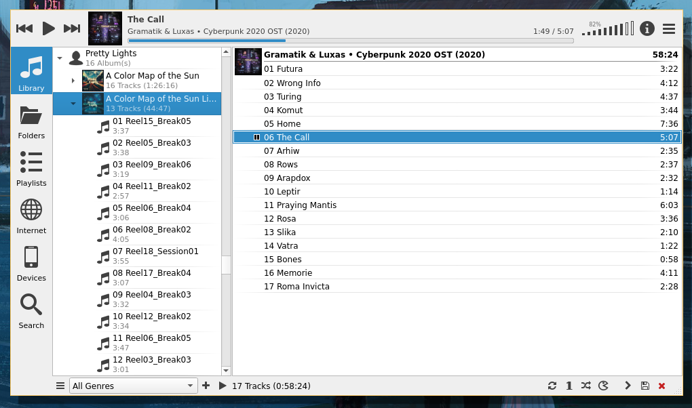
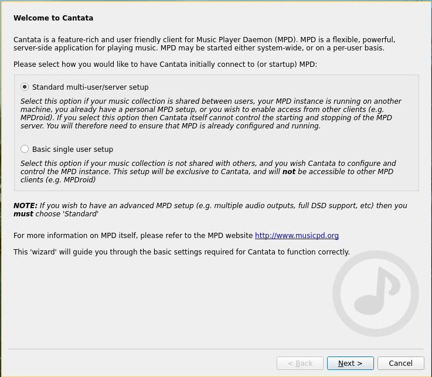
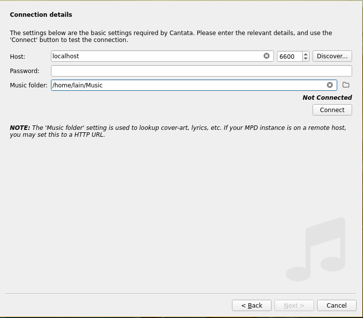
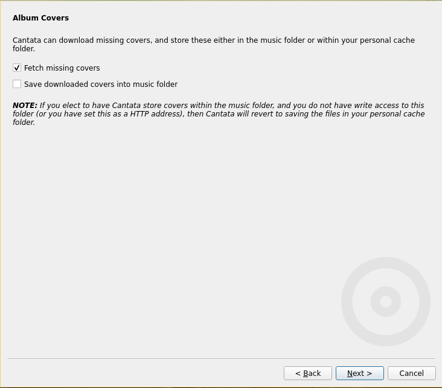
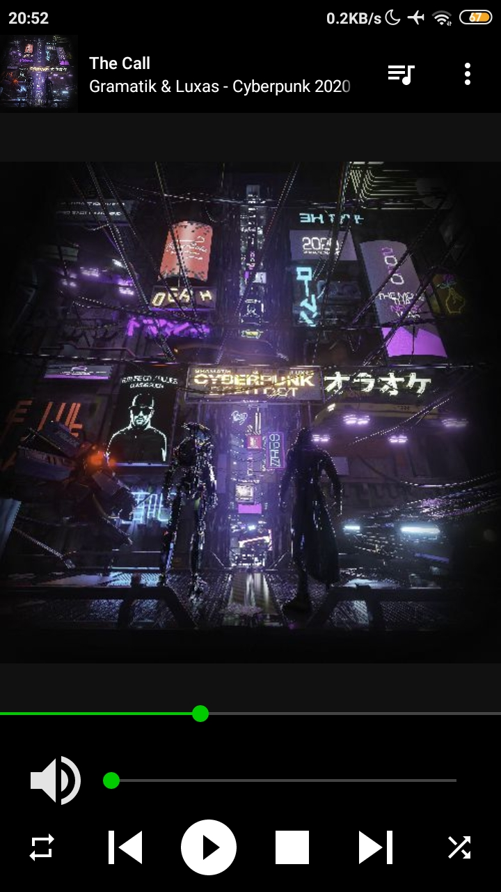

import { Image } from "astro:assets";
import cover from "../../assets/articles/beginners-guide-to-mpd-config-and-clients/mpd.webp";

<Image src={cover} alt="" class="cover" width={440} />

Music Player Daemon (MPD) is a flexible, powerful, server-side application for playing music. Through plugins and libraries it can play a variety of sound files while being controlled by its network protocol.

This guide is for users who store music on their device and want an efficient way to manage it.



Cantata

VLC does a great job of basic playback. But for proper music libraries, using a dedicated music player app can help you manage and find music easily. We can get one step further by using MPD, which supercharges the experience. While it required some editing of text based configuration file, it is not difficult to set up. Should take less that 10-15 minutes at most while following this guide.

#### Enter MPD

*MPD* (music player daemon) is an audio player that has a server-client architecture. It can easily manage large music libraries. To put “large” into perspective, we are talking about libraries with over 50k tracks or almost a terabyte of music. Even such huge libraries are no sweat for MPD. Add to that, the server-client architecture allows many applications to control music playback - even you can write an app to control the *MPD* server!

#### Installing MPD

The package is available in Arch Linux repository. You can install it via Pacman.

```bash
sudo pacman -S mpd
```

#### Configuration

Get the example configuration file at `/usr/share/doc/mpd/mpdconf.example` or from [this link.](https://github.com/MusicPlayerDaemon/MPD/blob/master/doc/mpdconf.example)

Save it in `~/.config/mpd/` with name `mpd.conf`.

Uncomment some options at the beginning of this file. **music_directory**, **db_file**, **pid_file** and **state_file**. Set a location for all these as you like. At the very least I suggest changing the music_directory from “**~/music**” to “**~/Music**”. (notice the capital ‘M’). This is because the pre-created music folder starts with a capital 'M'. It is not a restriction though. Often people store their music collection on an HDD, while the distro is installed on SSD. Having a state file isn't necessary, however, enabling it will allow you to retain play queue when you restart MPD server.

Scroll down to about line 78 and uncomment **bind_to_address**. Change the value to “**localhost**” or to a different address if you want. Next uncomment **port** a few lines below. Let it stay at the default value, which is “6600”. You can also add a password if you want. This will prevent unauthorized users on your network from being able to control your MPD instance.

At around line 97, uncomment **restore_paused** and set value to “**yes**”. This will ask MPD to start in "paused" state, otherwise music playback will start right on startup. However, you may want to have it disabled if you are installing on something like a Raspberry Pi, which will be used specially for music playback.

Now we will enable **ALSA** output. Scroll down to around line 200, where you will see option for ALSA audio output. Uncomment the opening and closing line (**audio_output&#123;** and **&#125;**). Inside the block, uncomment **type** and **name**. You also want to uncomment **mixer_type** and change it from "hardware" to "software". This will allow you to control music playback volume separate from system volume.

Save the file, and we are ready to move forward.

In this post, I have suggested edits in the config multiple times. Every time you edit the config file, you need to restart the MPD server for the changes to take effect.

```
mpd --kill
mpd
```

#### Copying your Music Library

Copy your music folders/songs to **~/Music/**. As simple as that! Remember we set the* music_directory* value to this folder? You can set that value to a different one if you don’t want to copy your library to a new place.

**What do I do?**

I will describe two set ups that I use.

On my PC - I have access to multiple external drives; no need to copy music to internal HDD. So I utilize *symlinks* on my PC. At around **line 134** in **mpd.conf** I uncomment **follow_outside_symlinks** and set it to "yes". (should be "yes" by default). It tells **MPD** that it should follow symlinks while searching the music directory even if the symlink target leads out of your music directory. Next, I create symlinks from my music directories on external locations. These symlinks are all stored in ~/Music. Now, MPD can discover music from external drives as well and you don’t need to copy all the music to your installation root. If I have unplugged a specific drive, then **MPD** will simply skip over the songs from that drive.

On my laptop - it needs to be carried around; I can’t have my external drives always with me. So all my music is copied onto the internal HDD. This location is defined in the **MPD** config. The HDD is mounted automatically on boot since I have it added to my **fstab**.

#### Launch The Server!

Now, you are ready to launch the server! Open a terminal and run **mpd**. Exceptions about Tidal and wildmidi can be ignored. You can add this command to your startup script to have the server launch automatically when you log in. I have it in my** i3wm** config.

There is also a **systemd** service that you can use.

```bash
systemctl --user enable mpd.service
```

This will start the server automatically when you log in.

Important : MPD can be launched as root also, but **don’t** do that please!

#### Adding a Frontend - Cantata

What do you do after you have set up a server? You need a client software that can interact with your server. **MPD**, because its open source and has libraries in multiple languages, enjoys support for multiple frontends. A very popular one is **ncmpcpp**. It's console based, and while I do like console applications, I also prefer managing music via a graphical application. So, I use **Cantata**, as it is feature rich and does a good job of interacting with **MPD** server. It also has an inbuilt tag editor and support for streaming from **SoundCloud**, **Jamendo** etc. It can also work without an **MPD** server by reading files directly off your storage.

When you start Cantata for first time, you should see such a window. Choose "Standard multi-user/server setup" and hit next.

⚠

*According to the MPD webside canata and others are gone unmaintained: [https://www.musicpd.org/clients/](https://www.musicpd.org/clients/)*



Cantata first launch window

Next, you will be asked about server connection details. Use "localhost" for Host and "6600" for port. Alternatively, if mpd is running, then you can click on Discover button and choose your server. Enter a password if you configured it earlier. Set the music folder path to the folder you specified in **mpd.conf**. Now, hit Connect button. It should give success immediately, and you can now click Next at bottom of window.



Cantata server configuration window

You can enable/disable cover fetching as per your wish. Do note that enabling this feature will make Cantata connect to the internet and send basic track info online.



Cover download settings

Click Next, and now Cantata is ready for use.

You can use any other client - GUI or CLI - instead of Cantata.

#### Alternatives:

**MPDevil:**

Mpdevil is a simple music browser for the Music Player Daemon (MPD) which is focused on playing local music without the need of managing playlists. Instead of maintaining a client side database of your music library, mpdevil loads all tags and covers on demand. So you'll never see any outdated information in the browser. Mpdevil strongly relies on tags.

[https://github.com/SoongNoonien/mpdevil](https://github.com/SoongNoonien/mpdevil) ---> [https://aur.archlinux.org/packages/mpdevil](https://aur.archlinux.org/packages/mpdevil)

**Ymuse:**

**Ymuse** is an easy, functional, and snappy GTK front-end (client) for [Music Player Daemon](https://www.musicpd.org/) written in Go. It supports both light and dark desktop theme.

[https://github.com/yktoo/ymuse](https://github.com/yktoo/ymuse) ----> [https://aur.archlinux.org/packages/ymuse-bin](https://aur.archlinux.org/packages/ymuse-bin)

#### Get to know MPC

MPC is a simple command line client to mpd. It is used to issue commands to **MPD** and get info about the current track, queue etc. You can install it from your package manager or compile from source.

One command you should know right now is ***mpc update***. This re-scans your music directory and creates a database of stored tracks. I bind it to *Mod+Shift+m*. **Cantata** also has option to update database, but I prefer using wm keybindings.

Some more commands that I have in my config:

| **mpc seekthrough** **+00:00:10:** | Seek the current playing track 10s forward. Replace argument with a different time duration or use minus instead of plus to seek backwards. |  |
|---|---|---|
| **mpc next:** | Skip to the next track |  |
| **mpc prev** | Play the previous track |  |
| **mpc toggle** | Play queue if paused, and pause if playing |  |
| **mpc volume +2** | Raise volume by 2%. Use a different value for different percentage |  |
| **mpc volume -2** | Lower volume by 2%. Use a different value for different percentage |  |

I have bound these commands to different** wm** keybindings and it lets me control playback right from the keyboard without leaving my active application. Note that its not necessary to use mpc. I mentioned it in this post because it allows easy control with terminal commands which can be used in your configs or wrapped in shell scripts.

#### Controlling MPD with your Android Phone

Now this is where the real fun starts. You can control MPD playback via your smartphone. This makes an easy set up, where you can have your MPD server on a Raspberry Pi and you control playback using your smartphone. And yeah, without using any spooky closed source proprietary applications.

Install one of the many MPD controlling apps available on the Play Store. I used **[MALP](https://play.google.com/store/apps/details?id=org.gateshipone.malp&hl=en_IN&gl=US)** because it is open source and has a decent UI. On first launch, you will be on the profiles page. Tap the plus icon on top right and enter your server details. You can know your system IP address by running the ifconfig command. Note the IP address of the interface you are connected to (wifi, ethernet, etc).

You should now have your phone connected to your MPD server!



MALP running on Android devce

#### Utilizing HTTP Streams

This is another superpower of MPD, that you can stream music over a network (even the internet!).

Go into your mpd.conf and around line 270, uncomment httpd audio output.

```
audio_output {
    type        "httpd"
    name        "My HTTP Stream"
    encoder        "lame"        # optional, vorbis or lame
    port        "8000"
#    bind_to_address    "0.0.0.0"        # optional, IPv4 or IPv6
#    quality        "5.0"            # do not define if bitrate is defined
    bitrate        "128"            # do not define if quality is defined
    format        "44100:16:1"
    max_clients    "0"            # optional 0=no limit
}
```

You can increase the bitrate if you like. 256 is a sweet spot for http streaming of mp3 audio, but keep in mind that your FLAC/WAV music will be down-scaled before streaming. Also, I highly suggest changing the max_clients value to the number of simultaneous connections you would expect. In my configs, I set it to 1 because that’s what I need. If you are streaming music to multiple devices at once, set it to a higher value.

On your other device, open a terminal, and run the following command to start playback.

```
mpv http://<host-name>:8000
```

For example, I run the following:

```
mpv http://192.168.29.129:8000
```

The host machine should be reachable via the other machine. If they are on same local network, all well and good. If not, you can still access the server outside your local network by port forwarding on your router.

You can also stream via icecast if you want. Here is the link to relevant Arch wiki entry. [https://wiki.archlinux.org/title/Icecast](https://wiki.archlinux.org/title/Icecast)

#### Music info/controls on your bar

Polybar has an MPD module that can display current track info and controls on your bar.

You can find the module code here: [https://github.com/polybar/polybar/wiki/Module:-mpd](https://github.com/polybar/polybar/wiki/Module:-mpd)

Suggestions/Changes

In case you want to suggest additions or changes to this entry, you can create a post under this forum thread : [https://forum.endeavouros.com/t/beginner-s-guide-to-setting-up-and-using-mpd/16831](https://forum.endeavouros.com/t/beginner-s-guide-to-setting-up-and-using-mpd/16831)
