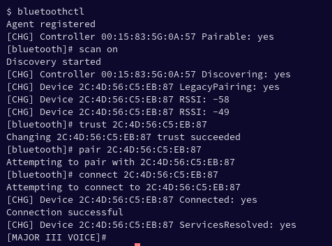
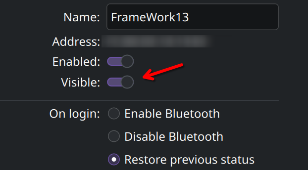
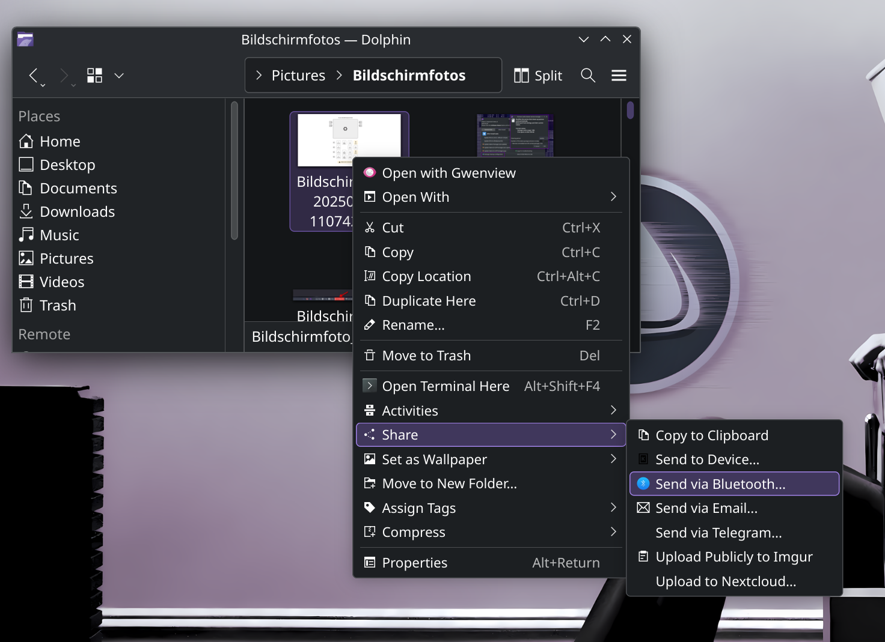
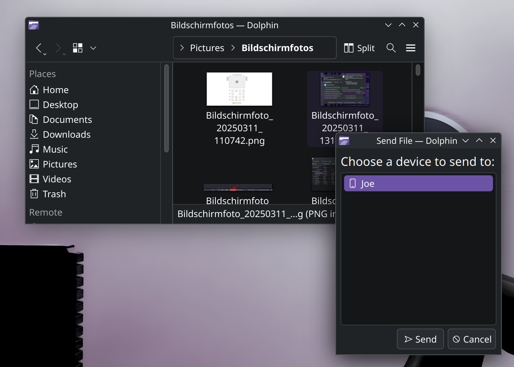

import { Image } from "astro:assets";
import cover from "../../assets/articles/bluetooth/bluetooth-1.png";

<Image src={cover} alt="" class="cover" width={440} />

On EndeavourOS we do not enable Bluetooth by default, because of several security risks, and to prevent unneeded power consumption.

Needed packages are installed by default, but it is in their default disabled state.

To be able to use Bluetooth you need to start the service or enable it if you need Bluetooth running on every boot:

`sudo systemctl start bluetooth` # to start it for the session will stay disabled after reboot.

`sudo systemctl enable bluetooth` # to enable per default, will run after every boot.

With this, you can handle Bluetooth devices over CLI tool `bluetoothctl` most Desktops will have some setup in there setting tools, if not see at the bottom about *And install graphical GUI tools to configure and manage Bluetooth*.

In case you want to make sure all packages are still installed or you may remove some, using custom install e.t.c. install it manually:

If you are using [pipewire](/pipewire/) (default since Atlantis release):

`sudo pacman -S --needed bluez bluez-utils` 
 
If you are using [pulseaudio](https://wiki.archlinux.org/title/PulseAudio) (older installs or manual switching to pulseaudio): 
 
`sudo pacman -S --needed bluez bluez-utils pulseaudio-bluetooth`

And install graphical GUI tools to configure and manage Bluetooth over a GUI application:

[blueman](https://github.com/blueman-project/blueman) (gtk) recommended for GTK based [can be used in Desktop Environments independent] 
[bluedevil](https://www.archlinux.org/packages/extra/x86_64/bluedevil/) (qt) [Integrate the Bluetooth technology within KDE workspace and applications]

[blueberry](https://github.com/linuxmint/blueberry) (gtk) no longer developed

`sudo pacman -S blueman` per example

DEs like KDE/plasma and GNOME ship their own Bluetooth GUI by default.

To use Bluetooth, you will mainly need to enable it for use by default to start on every boot, or start it for a single session to use it only once:

`sudo systemctl start bluetooth` –> This is only for single session use.

If you want to have Bluetooth enabled by default (on every boot) and start the service immediately:

`sudo systemctl enable --now bluetooth`

The default CLI tool to manage Bluetooth connected devices is bluetoothctl:

`bluetoothctl`

In some cases, it helps to run this as root for first connecting devices to be able to use them. But first try as normal user indeed!

[https://wiki.archlinux.org/title/Bluetooth#Console](https://wiki.archlinux.org/title/Bluetooth#Console)

the usual schedule to connect a new device with it is running it like so:

`bluetoothctl ----> scan on ------> trust ----> pair ---> connect`

example in terminal

## Bluetooth File Transfer (Obex)

share files with other devices via Bluetooth

To enable the option you need to install the needed support package first:

`sudo pacman -Syu bluez-obex`

And make the service available to your user:

`systemctl --user enable --now obex-service`

This will enable the service by default, in case you do not want it to run every boot you can start it if you need before sending/receiving files via Bluetooth: `systemctl --user start obex-service`

After this you have the option on most file-browser (right click on a file) to send files via bluetooth. Only devices once paired and may also trusted, can be used to send files to.

It can be smart to use the external device to pair the device from you want to use to send files, this will make sure the client device will trust the obex-send files.

To do so open your Bluetooth settings and make sure the host is visible, after this use the remote device to add your host.

Once setup is done you can use file-browser right click menu to send files directly to the remote device:

It will ask to allow still and may verify by showing a number on both devices, the first time you use it.

## Tips and Tricks

In case you have issues with using same device on dualbooting with another OS or it simply fails to connect, it could help to remove the Bluetooth database of known devices in the system path:

`#sudo rm -R /var/lib/bluetooth`

** ⚠ This will remove all known Bluetooth devices and their settings!**
