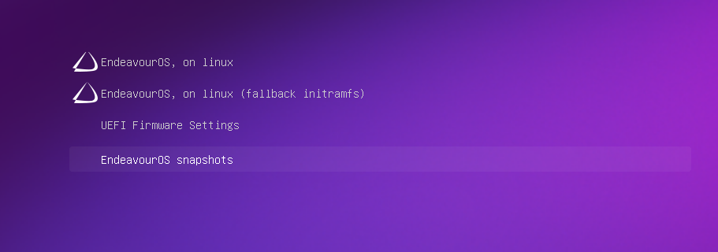
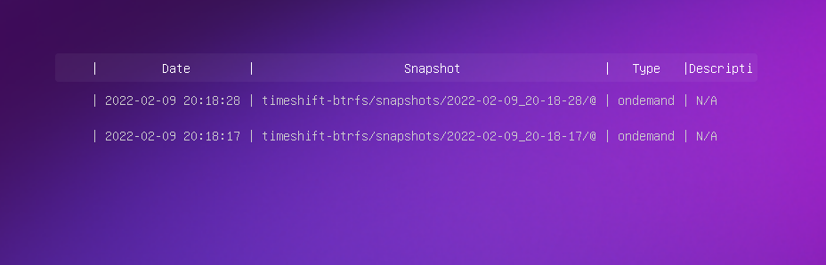
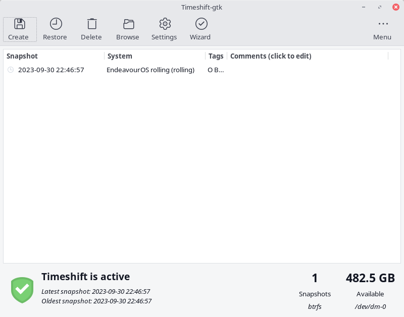
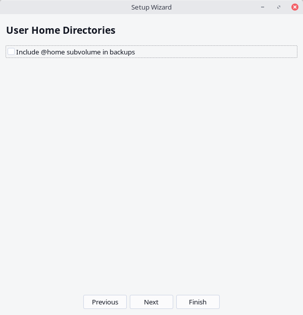
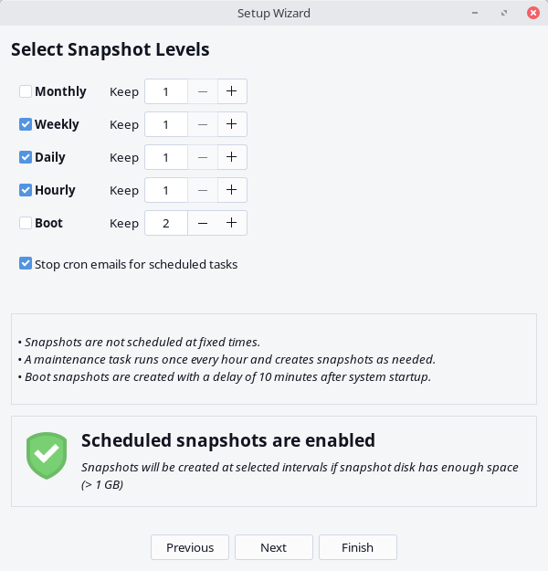
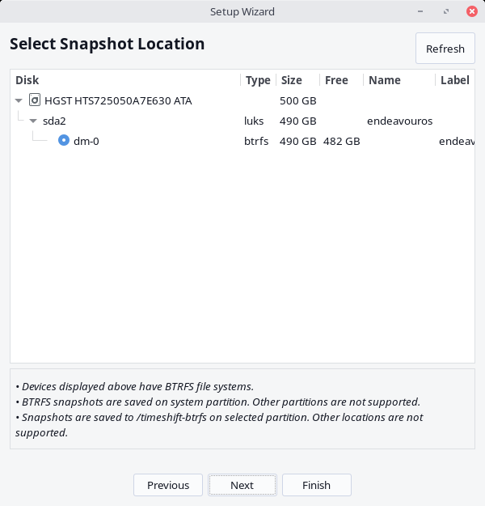
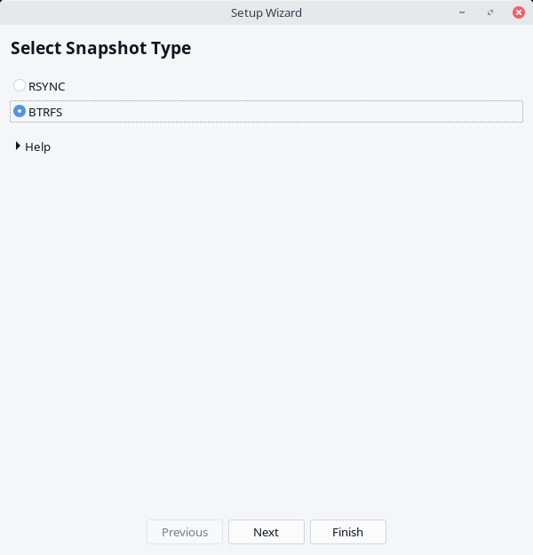
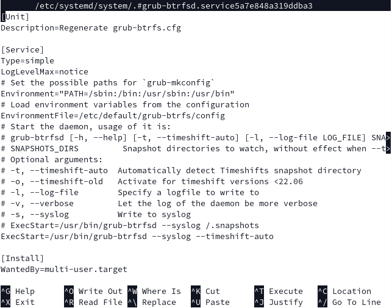

import { Image } from "astro:assets";
import cover from "../../assets/articles/btrfs-with-timeshift-snapshots-on-the-grub-menu/btrfs-snapdhots-grub.png";

<Image src={cover} alt="" class="cover" loading="eager" width={1024} />

- Reviewed corrected and expanded by [nick_0189](https://forum.endeavouros.com/u/nick_0189/summary) (october 2023)
- corrected timeshift not in AUR anymore (joekamprad)

It is easy to add backup snapshots with Timeshift and make them available in Grub’s boot menu!

1. Install EndeavourOS using automatic partitioning and the BTRFS filesystem (with or without encryption).

2. [Timeshift](https://community.linuxmint.com/software/view/timeshift) is a GUI tool from the Linux Mint developers to manage system backups using rsync or BTRFS. Install Timeshift: 
`sudo pacman -Syu timeshift`

3. The **cronie service** is a service used by Timeshift to run services periodically, but is not enabled by default. Cronie was installed as a dependency of Timeshift and should be enabled: 
`sudo systemctl enable --now cronie.service`

4. Launch Timeshift and set it up to use BTRFS. Optionally enable automated snapshots at the intervals provided and choose if you would like your home folder included in snapshots (home folders are often not backed up using snapshots). Then create the first snapshot by clicking the “Create“ button in the top left corner of the window.

5. timeshift-autosnap provides a script which creates a snapshot before each package/system update using a Pacman hook. The default number of snapshots kept is three. Older snapshots are then deleted to make room for newer ones.

If you want this functionality, timeshift-autosnap can be installed from the AUR for automated snapshots:`yay -S ``timeshift-autosnap`

Otherwise, snapshots will only be taken manually (they will still show up in the boot loader though).

6. Now install the grub-btrfs package from the community repository: 
`sudo pacman -S grub-btrfs`

To include Timeshift’s BTRFS snapshots in the boot options, grub-btrfs needs to be reconfigured as it is using /.snapshots as the default snapshot directory and Timeshift uses a different directory: 
`sudo systemctl edit --full grub-btrfsd`

Add the --timeshift-auto option by changing the following line:

`ExecStart=/usr/bin/grub-btrfsd --syslog /.snapshots`

to

`ExecStart=/usr/bin/grub-btrfsd --syslog --timeshift-auto`

Save the service file by pressing **Ctrl+X** **and answering the prompts shown**.

7. The final step is to rebuild the grub configuration file: 
`sudo grub-mkconfig -o /boot/grub/grub.cfg`

and enable the service:`sudo systemctl enable --now grub-btrfsd`

For more information on grub-btrfs go to its source:

#### Sources:

grub-btrfs 
[https://github.com/Antynea/grub-btrfs](https://github.com/Antynea/grub-btrfs) 
Information on the grub-btrfs program.

timeshift-autosnap 
[https://gitlab.com/gobonja/timeshift-autosnap](https://gitlab.com/gobonja/timeshift-autosnap) 
Information on the timeshift-autosnap program. 
 
Timeshift 
[https://github.com/linuxmint/timeshift](https://github.com/linuxmint/timeshift) 
Information on Timeshift.

BTRFS 
[https://btrfs.readthedocs.io/en/latest/Introduction.html](https://btrfs.readthedocs.io/en/latest/Introduction.html) 
Introduction to BTRFS, snapshots, and COW.
