### What **NOT** To Do

Some USB Writing utilities alter the labels of the partitions included in the ISO image. **This causes the boot to fail**. There are workarounds to fix the failure, but that is beyond the scope of this article. For best results, it is recommended that you **NOT** use these types of utilities to create your Live USB. Some of the more widely known utilities that fall into this category are:

- UNetbootin
- Linux Live USB Creator
- Universal USB Installer
- Live USB Creator

### Get the latest ISO

[https://endeavouros.com/latest-release/](https://endeavouros.com/latest-release/)

## Create Live USB From Linux

There are many methods of creating Live USB images using Linux. This article lists only some options. Recommendation is always to use copy as it is methods like dd. But Suse image writer and also rufus or ventoy are widely used for the EndeavourOS ISO.

**The one and most done error is to not wait for the USB flash drive to get fully syncing the ISO file data in the process, this can in worse case take up to 10 minutes! **

A common issue is with the legacy options on modern EFI systems being enabled. Make sure to set USB boot option to **no**t be set to** CSM / legacy Bios.** Make sure you are booted ISO **in EFI mode** if your system is EFI and not over 10y old legacy Bios device!

On the Live Session check from terminal:

` efibootmgr`

this will show your EFI boot entries in case you are booted in EFI mode, if not it will show an error message:

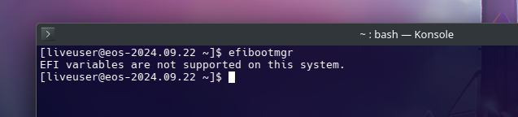

Read here for more information:

[Live ISO Installation Info Tricks & Tips](/live-iso-tricks-tips/)

### Command Line

The dd command will almost always result in a working Live USB. Just change the paths to the **correct paths** for your system.

> NOTE: The USB drive is specified as **/dev/sdx** and not **/dev/sdxX**. The most common path of a USB drive is **/dev/sdb**, BUT yours might be different depending on your system.

To view a list of all drives currently attached to your system, run this command:

```bash
sudo fdisk -l
```

Another command to show information about the drives:

```bash
lsblk -f
```

Note: the USB drive may ***not*** be mounted when writing an ISO to it! So make sure you **unmount** it first:

```bash
sudo umount /dev/sdX
```

To write the Live Install image to your USB, run the following command:

```bash
sudo dd bs=4M if=/path/to/endeavouros-x86_64.iso of=/dev/sdX conv=fsync oflag=direct status=progress
```

But indeed, Linux has possibilities without ending:

using `cat` (with progress)

```
su
cat /path/to/endeavouros-x86_64.iso | pv > /dev/sdX
```

or even `cp`:

```
su
cp /path/to/endeavouros-x86_64.iso /dev/sdX
```

And exactly `tee` can do it too:

```
su
tee < /path/to/endeavouros-x86_64.iso > /dev/sdX
```

**But keep in mind and check your command 3 times before executing, as putting something wrong will possibly destroy personal data!**

### GUI’S

All GUI writers can be installed using `yay -Syu packagename` as mentioned below:

---

### **[Suse Image Writer](https://github.com/openSUSE/imagewriter)**

Available in the AUR as `imagewriter`

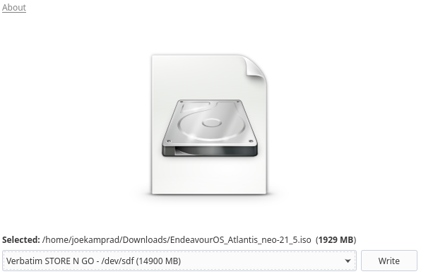

---

### **[Popsicle](https://github.com/pop-os/popsicle)**

Popsicle is a Linux utility for flashing multiple USB devices in parallel, written in [Rust](https://www.rust-lang.org/en-US/).

And known to work nicely for EndeavourOS ISO.

Available as `popsicle-bin` from the AUR

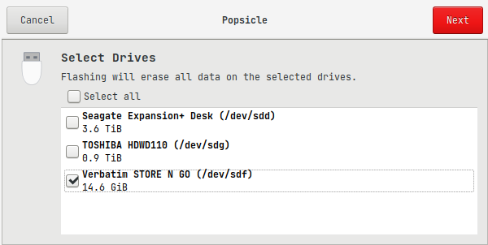

---

### GNOME Disk Utility

Linux distributions running GNOME can easily make a live CD through [nautilus](https://archlinux.org/packages/?name=nautilus) and [gnome-disk-utility](https://archlinux.org/packages/?name=gnome-disk-utility). Simply right-click on the *.iso* file, and select *Open With Disk Image Writer*. When GNOME Disk Utility opens, specify the flash drive from the *Destination* drop-down menu and click *Start Restoring*.

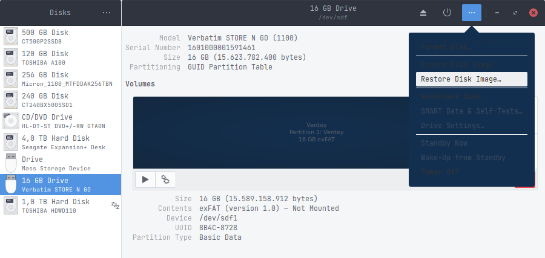

---

### [**Ventoy**](https://www.ventoy.net/en/doc_start.html)

Ventoy is an open source tool to create bootable USB drive for ISO/WIM/IMG/VHD(x)/EFI files. 
With ventoy, you don't need to format the disk over and over, you just need to copy the ISO/WIM/IMG/VHD(x)/EFI files to the USB drive and boot them directly. 
You can copy many files at a time and ventoy will give you a boot menu to select them.

⚠ currently **(in some cases) **ventoy fails to boot EndeavourOS ISO (up from January 2023) possible to boot only if you use grub2 mode from Ventoy when selected the ISO.

And make sure you are using the latest ventoy on the stick!

Available from AUR as `ventoy-bin`

After creating the ventoy USB stick, starting the GUI with `ventoygui` from terminal:

Always make sure the ventoy version on the USB stick is the latest, outdated versions may cause issues with the ISO.

Use the web-ui in your browser by starting this in terminal like so:

`sudo ventoyweb`

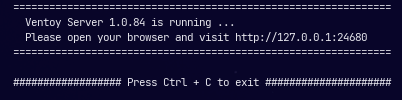

open [http://127.0.0.1:24680](http://127.0.0.1:24680) inside your browser.

The gui is to be started with: `ventoygui` also from terminal, or from your menu...

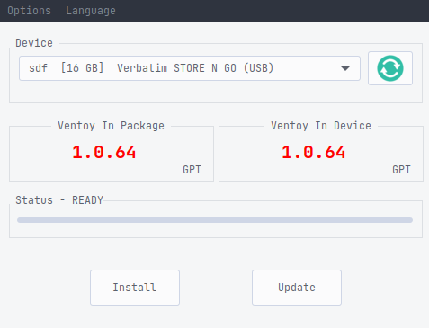

You can also run the install on your usb stick with the commandline.

See `ventoy --help` in your terminal to see the options.

After creating the ventoy-stick with one of the tools, you simply need to copy the ISO file/s into the ventoy folder on the USB stick to be able to boot them from the ventoy-stick.

After copy the ISO file/s you need to make sure the USB device is fully syncing the files! File manager should do that in most cases, but to make sure open a terminal and run `sync`-command there till it frees the prompt again:

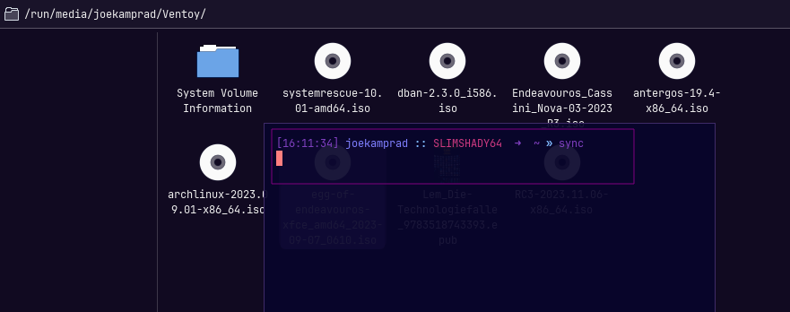

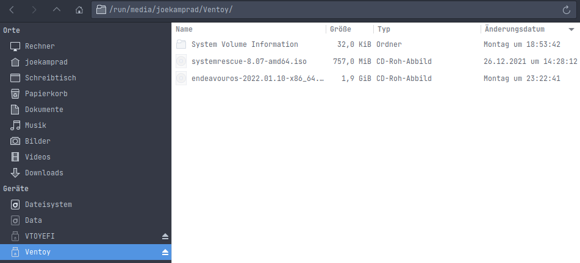

ventoy folder on the stick

---

#### **Etcher** [(https://www.balena.io/etcher/)](https://www.balena.io/etcher/)

**⚠ **

**Warning!**

We do not recommend using etcher anymore as there are privacy concerns, etcher is Anonymously reporting errors and usage information. It is not clear if this is done. Also, it wants you to validate that you agree with it. Lately, users reporting also burned sticks does not work properly for the latest ISO.

### Burn ISO to DVD:

And indeed, you still can burn the same ISO to a DVD using any common burner tool available.

On Linux, there is Brasero for GTK environments and the all mighty K3B using QT.

- **Brasero:** [https://wiki.gnome.org/Apps/Brasero](https://wiki.gnome.org/Apps/Brasero)

- **K3B:** [https://apps.kde.org/de/k3b/](https://apps.kde.org/de/k3b/)

And the command line would be something like:

`growisofs -dvd-compat -Z /dev/sr0=endeavouros-2023.03.25-x86_64.iso`

## Create Live USB From Windows

**USBWriter**, and **Rufus** are free USB image writers that support .iso files (which EndeavourOS uses) with ease. Just head to the [Source Forge link for USBWriter for Windows](https://sourceforge.net/projects/usbwriter/) and download the program. Once downloaded, follow the similar instructions for them below:

**USBWriter for Windows**

USBWriter is the easiest solution to burn ISO images to USB on Windows, it has no options to confuse users or prevent stick from booting.

- “browse” to the .iso image of EndeavourOS, select the target USB drive and click the “Write” button and it will properly format the drive and write the image.

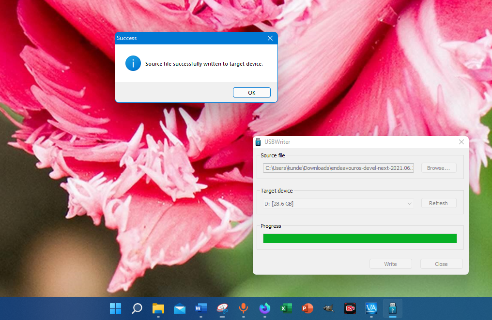

**USBWriter for windows**

**Rufus**:

Rufus has a lot of options to create bootable USB-Sticks for different situations, our ISO does not need any modifications and should be "burned" as it is a so-called hybrid ISO ready to boot in all cases, from Stick or burned DVD-Rom.

Leave all settings from Rufus window as they are and click **Start, **this will pop up a question window that asks to burn hybrid ISO in ISO-mode or DD-mode, choose DD-mode to be sure it will not be modified at all.

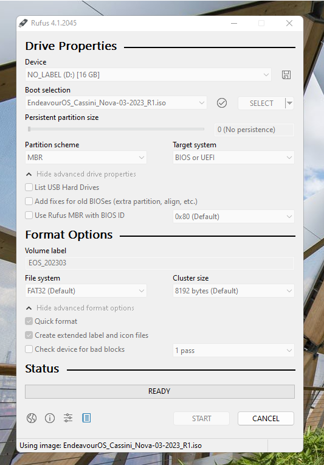

**Rufus main window**

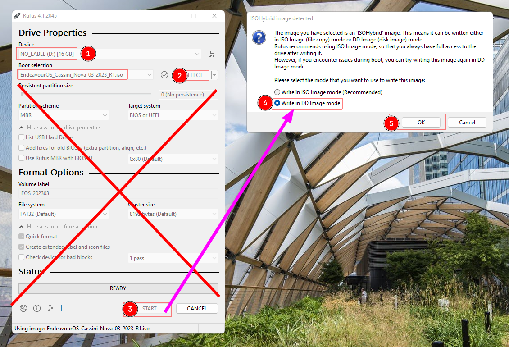

**Rufus question on hybrid ISO image burning**
