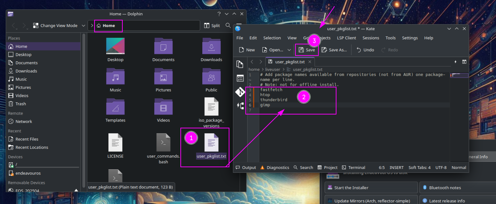
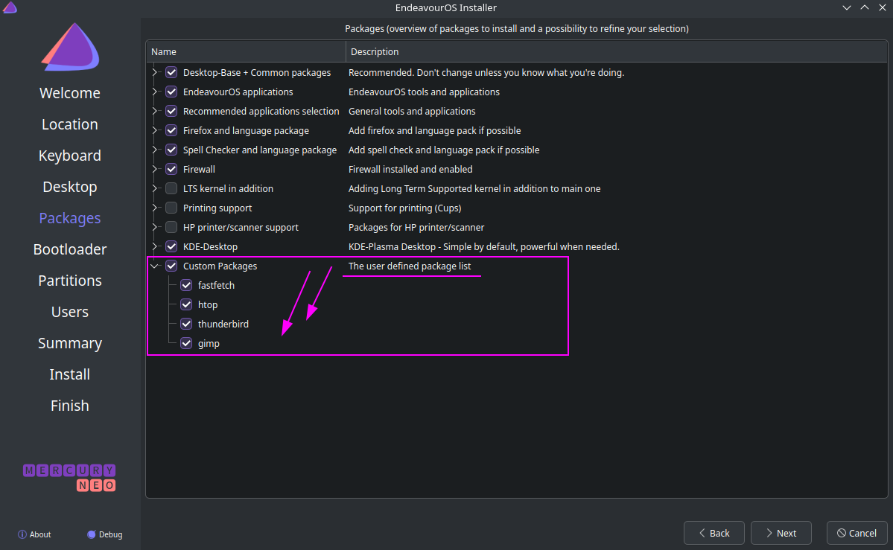

EndeavourOS provides users a couple of ways to customize what to install. Just boot up the installer USB drive and prepare your customized features!

#### User Packagelist

File `/home/liveuser/user_pkglist.txt`

This is the easy way to add your favorite package names to be installed. After booting up the installer USB:

- open a terminal
- run command 
` nano ~/user_pkglist.txt` 
and add the names of packages you want to install to the file
- close the Welcome window
- start Welcome again with command 
 ` eos-welcome`

Note that there are some rules/restrictions:

- Use only package names from the configured repositories (see `/etc/pacman.conf`), not from AUR
- Write only one package name per line.
- The Installer will add them to be installed, and will error message if package is not available or you have a typo per example.

You will find a group added on the package screen of the installer where you can see the added packages too:

#### User Commands

This is a much more advanced feature. Basically it provides user the opportunity to modify the installer and the installed system in various ways using bash language and usual commands (like pacman). Note that a reasonable knowledge of the bash language and typical linux commands is needed.

For example, this feature makes possible to 
- configure calamares settings 
- add new package sources 
- install or remove packages 
- start or stop systemd services 
- change settings for the user created at install 
and much more.

Note that the usage of this feature changed slightly from Galileo neo to Gemini.

##### Galileo neo and older

File `/home/liveuser/user_commands.bash`

You can write various bash language commands to this file. This script file will be executed (as root) in two phases:

1. in the beginning of install *before* starting calamares
2. in the end of the install process (in calamares)

Note: phase 1. is a *new* feature implemented in **Cassini neo** (beginning of Feb 2023). Phase 2. has been around in a few ISOs already.

In the beginning (phase 1.) you can configure calamares settings, for example set the *default* filesystem type to be used in the installed system. In file user_commands.bash phases are recognized by parameters. In phase 1. **user_commands.bash** gets parameters `--iso-config` and `install-mode`. The first parameter tells that only your phase 1. commands should be executed, nothing more. The second parameter tells what you selected as the install mode, and this value is one of: **online** or **offline**.

In the end of install (phase 2.) you can customize the installed system in many ways. For example:

- install and/or remove packages
- enable and disable systemd services
- write and/or customize files in the $HOME folder of the new user (e.g. ~/.bashrc)
- add third party repositories into `/etc/pacman.conf` (may help e.g. with unusual drivers!)
- customize grub features (e.g. blacklist unnecessary drivers)
- modify various app or system configuration files
- and more!

In phase 2. user_commands.bash will be called with **the new user name** you gave during the install.

Note that file `user_commands.bash` on the *liveuser* contains more details and many usage examples.

##### Gemini and later

Now we have two files instead of one: 
1) `~/user-commands-before.bash` 
2) `~/user_commands.bash`

The first file is meant for making user defined configurations to *calamares* before starting the installer. It takes one parameter, the install mode (either **online** or **offline**).

The second file is meant for running user defined commands in the end of the install process. It takes one parameter, **the user name** that was created by the installer.

So these two files do the same things that only one file did in *Galileo neo*. The separation should make their function and usage more clear.

Note that templates of both files exist on the *liveuser*. They include more details and tips.

**Tip**: if you already have file `user_commands.bash` for Galileo neo, you can use it as follows: 
- remove file `~/user-commands-before.bash` on the liveuser 
- symlink `~/user-commands-before.bash` to `~/user_commands.bash` 
provided the parameter handling is fixed to comply with the explanation above.

For example: 
`cd $HOMErm user-commands-before.bashln -s user_commands.bash user-commands-before.bash`

#### Limitations for the commands

The commands are run as the `root` user, so

- AUR packages cannot be installed
- some commands do not run properly as `root`
- files modified under $HOME need to be `chown`'ed from root to the real user

In addition, commands written into this file **must never stop** e.g. for asking any confirmation. So, for example, `pacman` must be used with option `--noconfirm` to prevent stopping.

#### How to start a customized install

Simply write your commands into user_commands.bash and restart Welcome.

Or, you can use your personal URL file which contains your commands! To use the URL, re-start welcome with a terminal command:

`eos-welcome --ni="URL"`

and welcome will fetch your command file and use it as user_commands.bash. 
Note that the URL must start with either `https://` or `http://` because only these protocols are supported.

## 

#### Conclusion

Please look at the files mentioned above on the ISO. They contain more tips and details, which should help you use them. 
Hope you’ll enjoy these customization possibilities!

---

Edits:

- **20. dec 2023:** joekamprad: added some details to user Packege option and two pictures to make it visually easier to understand. Plus some format fixes (needed caused by changes to the CMS)
- 27. mar 2024: manuel: added Gemini info
- 20 apr 2024: manuel: slightly more details in the beginning
