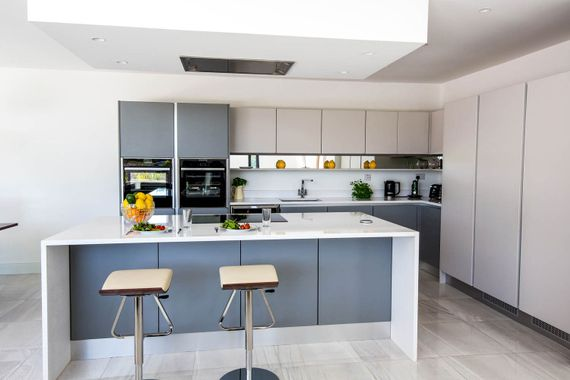

import { Image } from "astro:assets";
import cover from "../../assets/articles/does-endeavouros-frown-upon-gui-solutions-for-pacman/arch-code.jpg";

<Image src={cover} alt="" class="cover" width={440} />

'Hi, I'm really trying to like your distro, but I really don't understand why you aren't shipping Pamac by default. Don't you know that Pamac is the standard and therefore mandatory for every Arch-based distro out there?'

'Hi, I'm a former Antergos user and thank you for deceiving the entire Antergos community by excluding Pamac. Antergos was a topnotch system and EndeavourOS is a poor reflection of it. How dare you to call yourselves the Antergos successor?'

'Hey, you terminal friggin' freaks!!! I have a message for you: EndeavourOS sucks big time!!! I've tried it in a VM, thank God for that, and your system is worthless, how do you expect me to install stuff if you haven't got Pamac installed!!! You won't be seeing me running this shitty system, Hail Manjaro, ArcoLinux and Namib, bury EndeavourOS, because you won't be missed!!!'

These comments are not a product of my creative writing that was hidden in a dark corner of my brain. These are a small collection of actual messages sent to us, the only creative writing I did, was cleaning up the language.

To be honest, I do understand these comments and if they were written in the way I 'translated' them over here, I would be happy to continue the discussion.

The absence of a GUI solution in our distro has a few reasons, first of all, we want you to give you the freedom of choice right from the start. The second reason is in relation to the first: most GUI solutions don't implement very well on every single Desktop Environment.

And the third one is quite a bit hard to explain without sounding elitist, so let me paint you the following picture.

You're living in a rented apartment that has a kitchen equipped with all the conveniences you wished for. Because of all these conveniences, you're used to eating takeaway food or ready-made food set to be prepared in the microwave or oven. There's nothing wrong with that, especially these days microwave or frozen food has improved a lot since the bland dishes they were, back in the seventies and eighties.

You're living a busy but happy life when all of a sudden the microwave and the oven simultaneously break down. No problem, you call the landlord to report the problem and, for the sake of the story you have a landlord that reacts quick and correctly, the day after tomorrow a brand new oven and microwave will be delivered and installed and in the meantime you order food in, no problem!

**Basic kitchen**

Well, on the day of delivery 'the guy' who's going to install the appliances discovers that the wiring in the kitchen needs to be redone because it doesn't meet the modern standards anymore. He has called the landlord and he has permission to redo the wiring, but therefore he needs to book in a certified electrician and there isn't one available sooner than 4 weeks from now.

You're screaming and throwing a tantrum at everyone who crosses your path because this is insane!! How is it possible that in this day and age simple appliances can't be installed and working within a matter of hours! This is simply out of order, how are you suppose to eat now?!?

I think a lot of people would agree with you that the situation you're in is uncomfortable but no one can actually help you expedite the operation. Until your snarky sister comes along and says: 'Stop shouting to each and everyone in the world, anyway what's the fuzz all about? You have running water, a cooker, knives, spoons, pots and pans, then prepare dinner you lazy cow and I know you can't cook but you can get a cookbook or call friends and mum to help you learn, you Drama Queen!!!'

You don't want to admit it at that time, but you know in your heart your sister had struck *the* chord that lies at the root of your anger: This situation is slamming you, with the fact that you can't cook, in your face with brutal force.

This situation is similar to when you run a powerful Arch-based distro solely relying on a GUI solution for Pacman. It is a convenient tool to have, but a little understanding of what that GUI solution actually does is highly recommendable on a system like ours.

Why should you look and learn it the hard way, if we provided that tool right from the start? By giving you the choice to run the system with the tools you feel comfortable with, we also make you aware of the responsibility those choices bring.

By installing it yourself, your attitude changes towards that tool, so when it breaks and you asked the community for help, your approach will be more open to search for a solution, instead of fixating on the fact why this tool that came by default doesn't work anymore.

That's what an Arch-based distro is all about, it's not the knowledge (that comes with experience) but it's the open attitude to think in solutions to make an Arch-based distro run successfully.

Go and explore this great foundation we brought you and there's no shame in using a GUI tool, but whilst using them, visit the forum for inspiration. The forum is your cookbook to prepare you in case your convenient microwave breaks down or try one of those recipes and I'm sure you will get enthusiastic for doing it manually.
