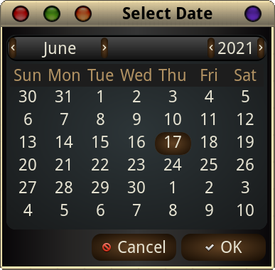

import { Image } from "astro:assets";
import cover from "../../assets/articles/easy-downgrade-by-date/arch-pacman.jpg";

<Image src={cover} alt="" class="cover" width={1200} />

Actually - this item has been upgraded and error-checked into an actual EndeavourOS application, ***eos-shifttime***. This has been left here for the sake of those who want to know how it works, for those who want to see how to add mini-apps to the Welcome *Personal Commands* tab, and as an explanation for the uses it might be put to.

This a little setup I have made to ease usage of the Arch Archives. You can think of it as an alternative to the downgrade of a single package (which may need multiple packages downgraded to match!) and is often used to temporarily 'hold' updates until a more suitable time, while ensuring that packages are correctly in sync for use together.

This item is essentially a script that can be run on its own! However, I decided I would try to make the script even more easily accessible, so here I will also describe setting it up as a button in the Welcome app - although of course it works fine if just called from the command line.

Alternatively, of course, you could carefully read the Archwiki entry on reverting your package status to a previous date, and follow the steps as they describe them. Also, somewhat more accessible, is the entry in the EndeavourOS Wiki. I have called my script ShiftTime, as one of the main uses of TimeShift is to recover from a "bad" upgrade. What this does essentially, is take your system packages back to the date that you specify - by reverting, or internally downgrading all the packages that have been updated after that date to the state (version) they were in ON that date. This has the advantage over *downgrade* that all packages that interact with each other are taken to the same level at the same time (no dependencies missed).

There are 2 pieces to the setup - the script itself, and the .desktop file that describes it and can launch it. The locations they need to be in may have to be created if they do not already exist. The .desktop file is only needed if you intend to access it from the Menu, or add it to the Welcome app as a **Personal Command**.

***$ mkdir -p ~/.local/share/applications***

This command will create the directory if it does not already exist. The following .desktop file goes into it - with the name ShiftTime.desktop suggested.

------------copy between dashed lines only, and paste into a text editor ----------- 
[Desktop Entry] 
Name=ShiftTime 
Comment=Revert pkg state to a previous date. 
GenericName=Revert pkg state to a previous date 
Exec=RunInTerminal shifttime 
Icon=system-software-install 
Type=Application 
NoDisplay=true 
StartupNotify=true 
Categories=Utility 
------------------Do not include the dashes, and **Save As** *shifttime.desktop* -------

Then you create a file called ***shifttime*** with the following content:

```
---------------Copy between the dashed lines, and paste into text editor ------
#!/bin/bash
# This script enables an after-the-fact timeshift equivalent for Arch systems
# Give it a date (as in 2020-09-20) and it will use the Arch archive repos 
# to revert to the package state that applied on that date.
#
# 21 September 2020 - freebird54

echo "Select the date to revert your packages to. Press ENTER when ready"
read
REVERTDATE=`yad --calendar --title "Select Date" --date-format=%C%y/%m/%d`
echo " "
echo "Packages will be reverted to the state they were in on $REVERTDATE."
echo " "
echo "Ready to copy /etc/pacman.d/mirrorlist to backup"
sudo mv /etc/pacman.d/mirrorlist /etc/pacman.d/mirrorlist.backup_st
# building the repo entry for the specified date, and temporarily making it the mirrorlist 
echo "Server=https://archive.archlinux.org/repos/$REVERTDATE/\$repo/os/\$arch"  > /tmp/mirrorlistchk
sudo cp /tmp/mirrorlistchk /etc/pacman.d/mirrorlist
rm /tmp/mirrorlistchk
echo " "
echo "Here is the reversion mirrorlist"
cat /etc/pacman.d/mirrorlist
echo "If the date shown is correct please press ENTER"
read
echo " "
# run the 'downdate' command
sudo pacman -Syyuu
echo " "
echo "Restoring the backup mirrorlist..."
sudo cp /etc/pacman.d/mirrorlist.backup_st /etc/pacman.d/mirrorlist
echo " "
echo "Done. Press ENTER to exit."
read
# end of ShiftTime script
```

---------------Save As shifttime --------------------------

Make the file executable:

***$ chmod +x shifttime***

Copy the file to somewhere on your path:

***$ sudo cp shifttime /usr/bin***

At this point, the command is accessible, and will work fine from the command line.

Here is the date selection screen: Using it should be obvious… Click on the date desired, then OK.



Now to add it to the Welcome "**Personal Commands**" tab if desired. Start up the *Welcome* app, choose the ‘**Tips**’ tab, and click on the **Personal Command drag&drop** button - which will open up a window. Open your File Browser, navigate to ~/.local/share/applications, and click on, hold and drag **ShiftTime.desktop** over to and drop it in the window that Welcome opened up.

That’s it! Once Welcome comes back, it will have a **Personal Commands** tab (if it didn’t already) and ShiftTime will be waiting for you. Click on the button that shows its name to easily run the script.

## How it works

Pacman will be called to determine which packages will need to be downgraded to revert your system to the way it was on the date you specified. You can interact with pacman as usual to decide whether or not to proceed with the downgrade. The pacman ‘control’ files that the script modifies will be returned to normal after the modified ones have been used.

Again, this does nothing you could not do directly yourself by following the Wiki (Arch or EndeavourOS) instructions - but it saves typing (or looking it up again for the exact format) if you happen to need it. This also shows how easy it is to add your own ideas to the buttons on the Welcome app! Essentially, for most things, all you need to do is create an appropriate .desktop file, and drop it in the drag&drop window.

Another use case I have come up with (beyond 'bad' update recovery) is for keeping a server updated "safely", despite the rolling release nature of Arch based systems. I run a mirror server, and I want it to be 'up' as much as possible. By running this little script, once a week, and choosing a date that is each time one week in the past - I end up with a system that is up-to-date as of a week prior - all the time! This allows time for any glitches caused by updates to have been 'fixed', and sets the system to a date where everything was fine. Of course, if something comes up that takes longer to fix - just hold off on updating until things are working again.

The final use case that I have in mind is for system updating when (for whatever reason) an Arch-based setup has been left without updates for a LOONGG time - maybe months. If you choose intermediate dates to update to, perhaps every 2 weeks forward in time, you greatly reduce the likelihood of major changes causing you problems over the timespan the system has been left unupdated.
