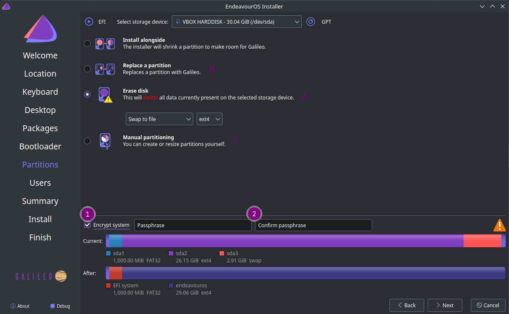
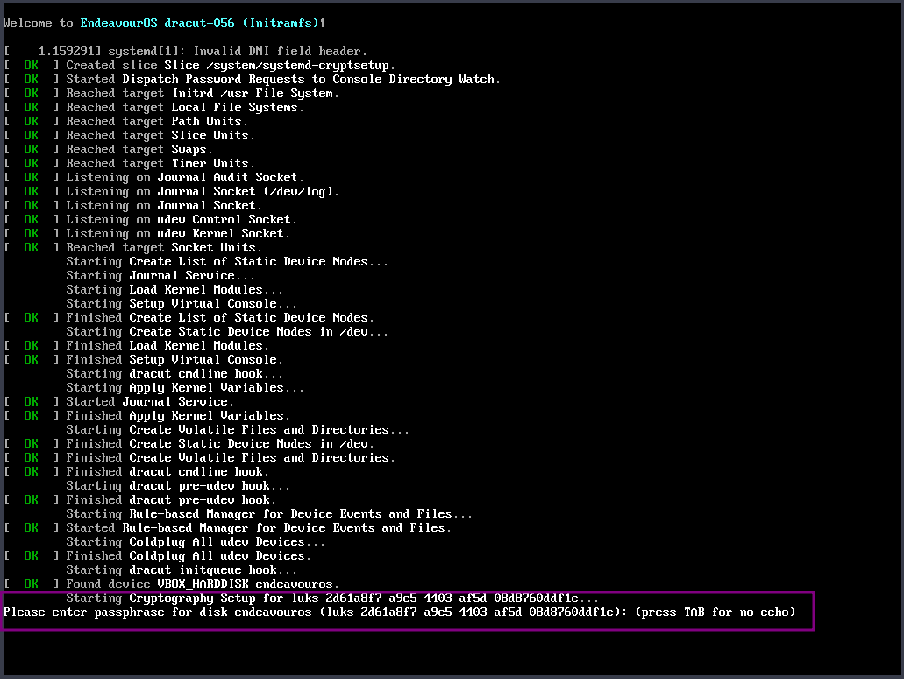

import { Image } from "astro:assets";
import cover from "../../assets/articles/encrypted-installation/171205-hacking-experts-beginning-feature.jpg";

<Image src={cover} alt="" class="cover" width={1200} />

**by anonym :)**

**Install EndeavourOS with disk-encryption and swapfile, as the only OS on a Notebook/Laptop (mobile used systems) or on your Desktop.**

If you want to create a dual-boot first get knowledge on how to do this!

This tutorial is for installing EndeavourOS** as the only OS on the device**.

Boot the Live ISO

Following the installer and choose what you want as the Desktop and for the Bootloader in the same way you would follow the installer for unencrypted installs. The only step you need to change is to enable encryption on the partition screen:

Partition Screen

Enable (check) Encrypt System and give the passphrase you want to use (second one to validate).

Click Next and follow the other settings as usual. you will see the LUKS marking on the partition that shows encryption is used.

If using the systemd-boot method this is how the unlock prompt will show up:

systemd-boot passphrase prompt

Enter your encryption passphrase and hit enter to unlock the encryption and proceed to boot into your newly installed OS.
