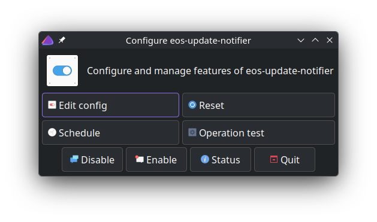
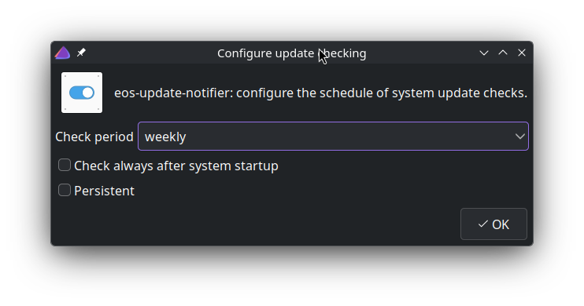

By: Manuel 
Created: 2019-Dec 
Updated: 2020-Apr-23, 2020-Aug-24, 2021-Jan-18, 2021-Feb-07, 2026-April-04

**Note**: eos-update-notifier is not installed/used by default anymore and not maintained its as is, but uasable.

## What is it?

EndeavourOS Update Notifier as the name suggests, is a notifier for software updates. As is true for many other notifiers, it can also start the update process.

In addition to notifying about updates, it can

- show news about important software changes (from Arch web pages)
- call an external program for other updating (e.g. updating flatpaks)
- show if a reboot is recommended after updating certain core system packages (e.g. *kernel*)

## Getting started

**Note**: newer versions of eos-update-notifier do not start automatically after install. Instead, you need to manually start the service (once) using a terminal command:

`eos-update-notifier -init`

By default, it checks for software updates very soon (in about a minute) after login, and then after every two hours. So that’s it for basic operation.

But if you want to change the times when to check for updates, see paragraph *Configuration* below.

## Notifier in action

When the notifier detects any available software updates, it starts a terminal and shows what the updates are. Then it starts command `pacman` to do the actual update — it asks the password for elevated privileges and so on.

The notifier checks for both *upstream* (Arch repos) and *AUR* updates. But it does so in two phases: first, it handles all upstream updates, and then it handles all AUR updates. This phasing is designed to keep the basic (upstream) system in good order before updating any other software.

Note that packages in the *EndeavourOS* repo are updated in the first phase.

## Additional services

### Arch news for you

The notifier can check for Arch news. The Arch news may contain very important information about software updates, especially when user actions are required beyond the normal update process. 
The Arch news checker tries to keep the amount of information as small as possible, thus avoiding news that is not relevant to the particular system. It does so by checking if the package mentioned in the Arch news is currently installed. If not, then that piece of news is skipped. That’s why the feature is referred to as “Arch news for you”. 
Please note that this *ad hoc* method is not “foolproof”, so some relevant news might be skipped. That’s why it is recommended to check the Arch news with a browser as well at times.

Version 0.9-1 added a new alternative Arch news checker. It does not use *the ad hoc* method, but simply remembers the date of the last news it has shown. See **/etc/eos-update-notifier.conf** below.

### Reboot recommended

If during the upgrade process the packages upgraded are those that will require a reboot, the notifier will show it using the system’s notification feature.

### Call an external updater

If you have other software that needs updating, eos-update-notifier can call an external program, like your script, to do so. To enable that, you can write your external script name as the value of variable **AdditionalEosUpdater** in file /etc/eos-update-notifier.conf. See more below.

### Configurator of eos-update-notifier



A small GUI program for configuring the EOS update-notifier is `eos-update-notifier-configure`. It can:

- edit the configuration file /etc/eos-update-notifier.conf
- start the scheduler that defines when updates are checked (see below)
- reset the scheduling timer to the factory default
- show the timer status
- run eos-update-notifier once to see if changes are OK

It can also show the *changelog* (git) of the eos-update-notifier program.

## Configuration

### Schedule checking: the GUI way (v1.8-2)

`eos-update-notifier -conf`

The configuration window looks like this:



### Schedule checking: the manual way

To *manually* configure the systemd timer that sets the checking schedule, you need to modify the file

`~/.config/systemd/user/eos-update-notifier.timer`

The manual configuration provides more detailed configuration possibilities. Note that in the current implementation it is a *user-specific* systemd service. To get the modifications in effect, the service daemon should be reloaded (or alternatively simply reboot). 
The commands could be something like this:

`cd ~/.config/systemd/usernano eos-update-notifier.timer # modify settings with any editor, here with 'nano'`

```ini
[Unit]
Description=EOS update notifier runs periodically, and optionally after each boot, or if missed.

[Timer]
OnCalendar=weekly
# OnStartupSec=
Persistent=false
RandomizedDelaySec=10min

[Install]
WantedBy=timers.target
```

`systemctl --user daemon-reload`

To modify the values with the editor, please check the manual page first:

`man systemd.time # especially: CALENDAR EVENTS`

For example, there can be lines that specify *when* the notifier is called:

`OnStartupSec=30secOnCalendar=0/2:25:00`

The first one tells when the first check is started after login. 
The second line tells the schedule of future checks. The format is

`hour-spec:minute-spec:second-spec`

The hour-spec here is 0/2. The tail ‘/2’ is easier to explain: it means every two hours. The 0 means the start is at 00:00. So it checks for updates at 00:25, 02:25, 04:25, etc.

Now that you know the syntax, it should be easy to change it to your liking.

Note that this file may be overwritten with certain options given to eos-update-notifier. Fortunately, eos-update-notifier makes a backup, but only one! 
So if you want to keep using your modified schedule, please make a backup of your modifications.

And if you want to revert back to the *default* schedule, you can use the command:

`eos-update-notifier -init-force`

### /etc/eos-update-notifier.conf

The configuration file currently includes these (bash) variables:

- CheckAurUpdates
- AdditionalEosUpdater
- CheckArchNewsForYou
- ShowWhatAboutUpdates
- ArchNewsProg

The default values (note the bash syntax: no spaces around the “=” mark!) in this file are:

`CheckAurUpdates=yesAdditionalEosUpdater=""CheckArchNewsForYou=yesArchNewsProg=eos-arch-newsShowHowAboutUpdates=notifyShowWhatAboutUpdates=number`

If CheckAurUpdates is `yes`, then also AUR updates are checked, otherwise, they are not checked.

The AdditionalEosUpdater variable is an advanced feature. It may contain the name of your external script. The script is meant for performing other tasks related to updating your software. It is called right after updating Arch, EndeavourOS, and possibly AUR packages. One useful example of this is to have a script that updates your flatpacks. The script gets the name of a log file as a parameter and can add log information if needed. The script should provide an exit code similar to the `checkupdates` program (0, 1 or 2).

If CheckArchNewsForYou is yes, then the Arch news is checked, otherwise, they are not checked.

If ShowWhatAboutUpdates is, then a simple number of available updates is shown in the notification window. Value package means the notification window includes a list of package names to be updated, including changes in the version number.

ShowHowAboutUpdates can have the following values: `notify`, `notify+tray`, `tray`, or `window`. Their meanings are:

- notify: show a simple notification using standard notification services
- notify+tray: same as above + a tray icon that can start the actual updating
- tray: show only a tray icon like above
- window: show a simple popup window that shows info about updates and allows to update or dismiss

ArchNewsProg selects the Arch news checker program. Possible values are `eos-arch-news` and `arch-news-for-you`. The first one is simpler and more reliable in showing the latest Arch news. The latter uses an ad hoc method to determine if the latest Arch news is relevant to the machine; however, this method *may* skip showing some relevant news, so an alternative program was added in version 0.9-1.

## Some useful command line options

You may give various options to the eos-update-notifier, but probably the most useful options are:

| -init | Initialize the service. Must be executed (once) in order to start checking for updates. |
|---|---|
| -conf | Configure the schedule of the update check timer. |
| -show-timer | Show the status of the update check timer. |
| -q | Be quiet: don’t show the popup that tells there are no updates. |

## About supported terminals

The eos-update-notifier supports (= have been tested) the following terminals:

- xfce4-terminal
- konsole
- gnome-terminal
- mate-terminal
- lxterminal
- deepin-terminal
- terminator
- qterminal
- tilix
- termite
- xterm
- kitty

Other terminals have not been tested and thus they are not supported. 
Note: you might want to check the Welcome app documentation, especially the chapter *Special note about the code*.
