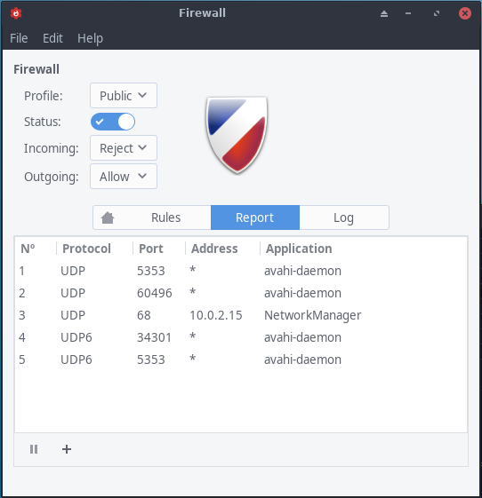

By Bryanpwo

You can simply install [GUFW](http://gufw.org/), which stands for Graphical Uncomplicated Firewall. It is a personal firewall with a graphical settings menu that is easy to use.

It i*s recommended to **not use UFW anymore** nowadays **[firewalld](https://wiki.archlinux.org/title/Firewalld)** is a way more versatile tool to manage your security.* See here on how to use and set it up:

[FirewallD](/firewalld/)

Make sure your system is up to date before installing it. So just enter

`sudo pacman -Syu`

to make sure it is updated, then install needed packages :

`sudo pacman -S gufw`

**Even though we provide the graphical settings app for UFW, I will show you the command line settings to help you understand UFW better.**

You can put these settings in the graphical app also.

After installation UFW isn’t enabled by default, so the first step is to enable the firewall with this command:

`sudo systemctl start ufw.service`

Now you’ve enabled the firewall for this session. I’m going to give you some basic settings.

UFW and in general all firewall tools use “rules” to enable or disable package arrive/receive to any computer.so by default, you must allow any outgoing traffic to be streamed and reject any incoming traffic by:

```bash
sudo ufw default allow outgoing
sudo ufw default deny incoming
```

**Adding rules**

Rules can be added in two ways: By denoting the **port number** or by using the **service name**.

For example, to allow both incoming and outgoing connections on port 22 for SSH, you can run:

```bash
sudo ufw allow ssh
```

or:

```bash
sudo ufw allow 22
```

and these are other samples:

```bash
sudo ufw allow 80/tcp
sudo ufw allow http/tcp
sudo ufw allow 1725/udp
sudo ufw allow 1725/udp
sudo ufw allow from 123.45.67.89/24
sudo ufw allow from 123.45.67.89 to any port 22 proto tcp
```

**Removing rules**

To remove a rule, add `delete` before the rule implementation. If you no longer wish to allow HTTP traffic, you could run:

```bash
sudo ufw delete allow 22
```

You can check the status of UFW at any time with the command: `sudo ufw status`. This will show a list of all rules, and whether or not UFW is active:

```
Status: active

To                         Action      From
--                         ------      ----
22                         ALLOW       Anywhere
80/tcp                     ALLOW       Anywhere
443                        ALLOW       Anywhere
22 (v6)                    ALLOW       Anywhere (v6)
80/tcp (v6)                ALLOW       Anywhere (v6)
443 (v6)                   ALLOW       Anywhere (v6)
```

Now you’re almost ready, the last step you have to do is to enable firewall with every boot by typing this command:

`sudo systemctl enable ufw.service`

**GUI interface**

If you prefer a GUI interface for your settings you can use the graphical app GUFW which only needs to get installed:

`sudo pacman -S gufw`

and enable the firewall service:

```bash
systemctl enable --now ufw.service
```

This will enable and start the needed firewall service.

Now you can start the GUI and start or stop the firewall on your needs:


