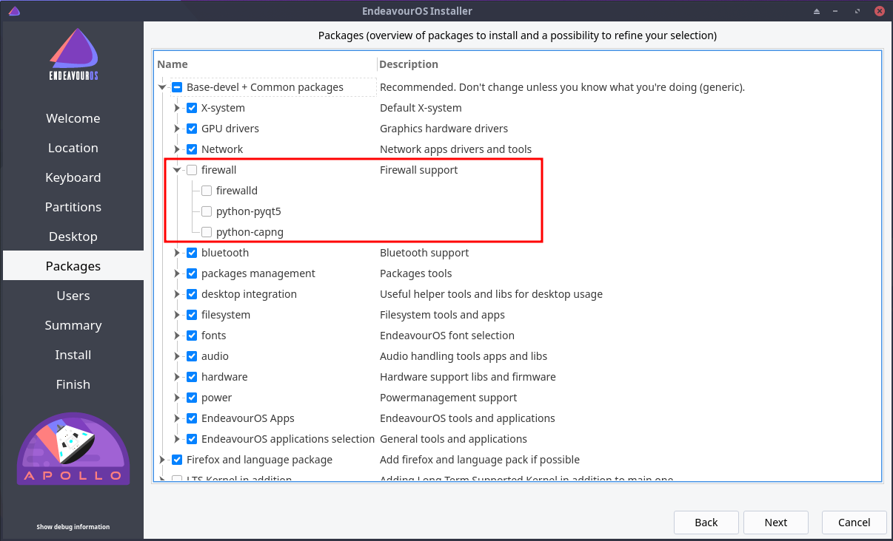
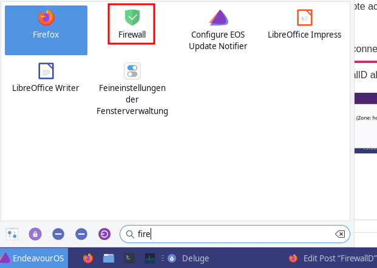
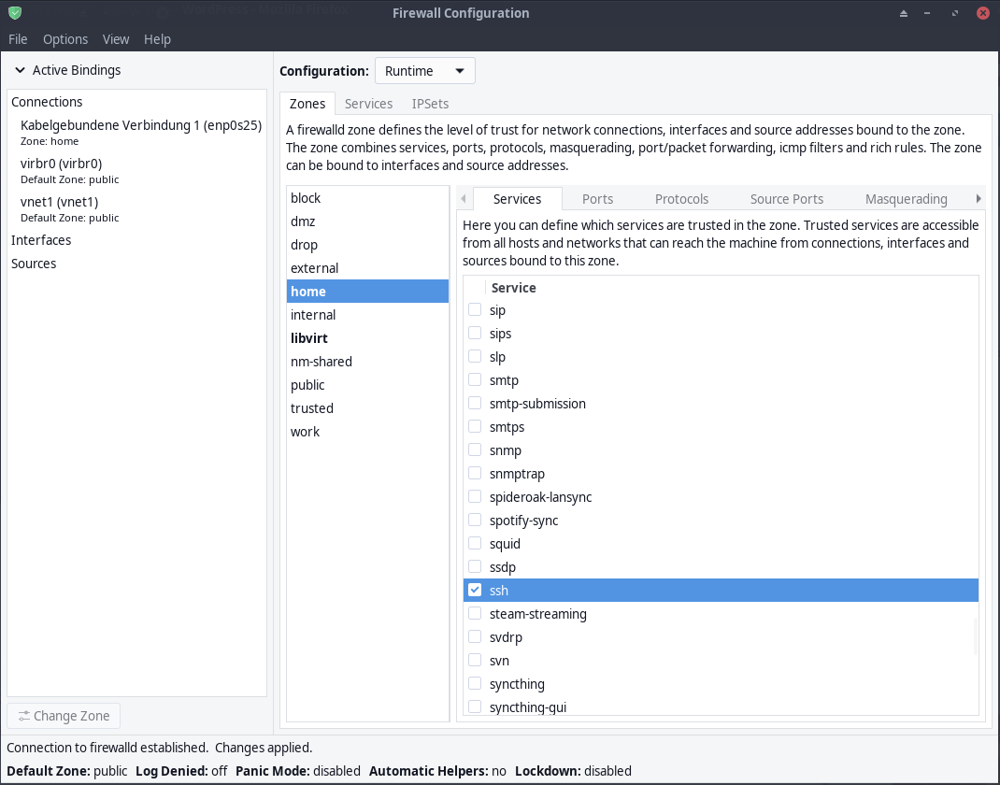
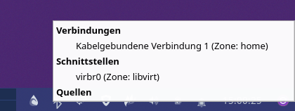
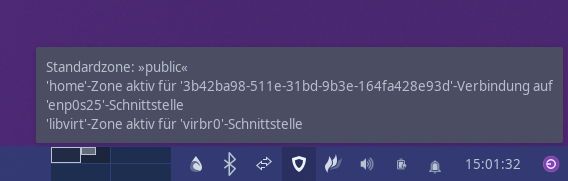
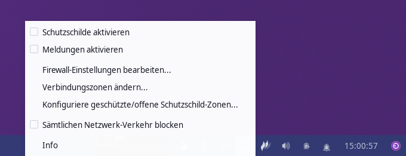
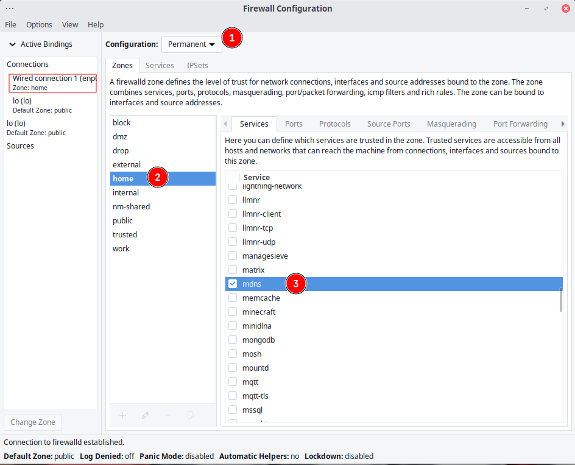
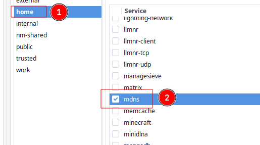
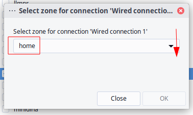

import YouTube from "../../components/YouTube.astro";
import { Image } from "astro:assets";
import cover from "../../assets/articles/firewalld/firewall.webp";

<Image src={cover} alt="" class="cover" width={440} />

**Some info on FirewallD to read:**

[**Official FirewallD Documentation**](https://firewalld.org/documentation/)

[**Archwiki entry about FirewallD**](https://wiki.archlinux.org/title/Firewalld)

[**A beginners Guide into FirewallD on RedHat **](https://www.redhat.com/sysadmin/beginners-guide-firewalld)

[**opensource.com firewall-cheat-sheet**](https://opensource.com/article/20/2/firewall-cheat-sheet)

## **Why EndeavourOS is using FirewallD now?**

After some discussion dev team come to the conclusion that it would be a good idea to enable a decent firewall per default on all installations for EndeavourOS.

Also, a more experienced user may already is used to set up firewall rules from some saved rules, the majority of users still forget to secure the system after the initial installation.

Nowadays this is nothing we can ignore anymore from the side of offering an Operating system for you.

So there you are up from now (Apollo release 2022) FirewallD will be installed for all EndeavourOS installs and the service is enabled per default.

This will give a secure basic firewall using the default public zone running.

From there users can decide to disable and install a firewall of choice or set up rules manually as they like.

It is also possible to untag FirewallD inside the installation process if you do not want it to get installed.



## **General Info on how to install and handle FirewallD:**

### **How to install and enable:**

[Enable](https://wiki.archlinux.org/title/Enable) and [start](https://wiki.archlinux.org/title/Start) `firewalld.service`.

`sudo systemctl enable --now firewalld.service`

You can control the firewall rules with the `firewall-cmd` console utility.

`firewall-offline-cmd` the CLI (Terminal based) utility can be used to configure when firewalld is not running. It features similar syntax to `firewall-cmd`.

GUI is available as `firewall-config` which comes with [firewall-config](https://archlinux.org/packages/extra/any/firewall-config/) package.

You will find the GUI inside the menu as firewall:





common view of the firewall-config GUI application

The GUI can look a bit intimidating at the first look, but once you understand it has anything you need right at your fingertips.

In the end, for normal Desktop usage, you do not need to change anything, and if you want to use something like open your system for remote access via ssh a simple click on the ssh services and you open the needed port for it to work.

Other things like network connections for Qemu (VirtManager) will get enabled automatically on the run if needed.

Aside from the GUI FirewallD also enables a tray icon with some info and menu to reach settings:







## Remove/Replace FirewallD

If you want to remove FirewallD to install another one or use your own set of rules manually you can do that by the following steps, it is **needed to stop firewall before removing it** as it could block installing a new one later.

Disable temporarily (this will stop the service immediately)

```bash
sudo systemctl stop firewalld
```

Disable permanently (this will stop the service immediately and disable the automatic start on boots)

```bash
sudo systemctl disable --now firewalld
```

Remove:

```bash
sudo pacman -R firewalld python-firewall firewall-config firewall-applet firewalld-test
```

## Related packages:

- [firewalld](https://archlinux.org/packages/extra/any/firewalld/) [needed]
- [python-firewall](https://archlinux.org/packages/extra/any/python-firewall/): Python bindings for firewallD [dependency]
- [firewall-config](https://archlinux.org/packages/extra/any/firewall-config/): Graphical user interface for firewallD configuration [optional]
- [firewall-applet](https://archlinux.org/packages/extra/any/firewall-applet/): Systray applet for firewallD [optional]
- [firewalld-test](https://archlinux.org/packages/extra/any/firewalld-test/): firewallD test suite [optional]

## Open FirewallD for network printing:

If you missed that and want to open the firewall manually for Network printing support use the firewalld-application:





Switch to permanent configuration and change *zone* to **home**. You will see **mdns** Services are enabled with it.

<YouTube url="https://youtu.be/9MCdy8ZGQ1I" />

To switch the zone for your current location (Network) click *options* **>** *change zones of connections* **>** select the used network connectiona nd select home from the dropdown in the popup:



This will be permanent over reboots, as long as you are connected to the same Network (location).

[Printers](/printers/)

#### Open firewalld for kdeconnect:

The easy way is using the terminal and the firewalld-cmd commandline tool:

`sudo firewall-cmd --permanent --zone=public --add-service=kdeconnect `

`sudo firewall-cmd --reload`

ℹ

`--zone=public` must be changed to the used zone for the network (location) you want this to be used in.

This will permanently open the firewall for the [kdeconnect](https://userbase.kde.org/KDEConnect) service to allow to connect to mobile device and receive messages on the desktop.
