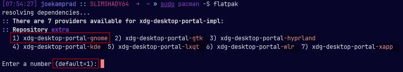

**Installing Flatpak Support**

Because Flatpak support is not installed by default, some package installation from the repositories and configuration must be done first.

1. Open a terminal and make sure your installation is up to date by typing:

`sudo pacman -Syu`

1. Once the update is complete, we need to install Flatpak support.

`sudo pacman -S flatpak`

Be aware to check the right xdg-desktop-platform package in the install process!

In cases on some Desktops (aside from Gnome and KDE) it will install `xdg-desktop-platform-gnome` as default selected, and you ma yneed the one fitting your Desktop/WM in use.



`xdg-desktop-portal-gnome` will **only** work on GNOME Desktops and can cause a lot of issues in other Desktops!

1. To make installation of software easier, we need to add the default Flatpak repository. Please note that `sudo` is no longer needed. If `sudo` is used, the user will not have access to the repository or any applications that are installed.

`flatpak remote-add --if-not-exists flathub https://dl.flathub.org/repo/flathub.flatpakrepo`

Unlike Snaps, developers can host their own repository. It can be added by doing the following command.

`flatpak remote-add --if-not-exists (repository name) (repository url)`

Make sure to replace the items enclosed in brackets with the required information. For example:

`flatpak remote-add --if-not-exists fubar https://dl.fubar.edu/repo/fubarrepo`

1. Restart the system to have the Flatpak support enabled.

`systemctl reboot`

**Installing Applications**

Now you are ready to install a Flatpak application. To do this, we need to know the name of the package you want to install. For this example, we will be installing the Spotify application.

1. To find the name of the package, open a terminal and type:

`flatpak search spotify`

The result will look similar to this:

```ini
[mark@FX504GD ~]$ flatpak search spotify
Name               Description                    Application ID               Version    Branch Remotes
Spotify            Online music streaming service com.spotify.Client           1.1.42.622 stable flathub
nuclear music pla… A electron based music player  org.js.nuclear.Nuclear       0.6.6      stable flathub
Clementine Music … Plays music files and Interne… …lementine_player.Clementine 1.4.0rc2   stable flathub
Tauon Music Box    Play your music collection wi… com.github.taiko2k.tauonmb   6.4.2      stable flathub
```

From the search results, we see that the package name for Spotify is `com.spotify.Client`

You can also go to the Flathub website, [https://flathub.org/home](https://flathub.org/home), and search for the application there. On the application’s page, it will list the name of the package for that program.

1. Now that we know the name of the package, we can install it by typing:

`flatpak install com.spotify.Client`

Remember, do **not **use `sudo` when running the above command. If root privileges are needed for the install, you will be prompted to enter your root password.

1. You can now run the program in the normal manner from your programs menu.

**NOTE:**

During the install process, an icon for the program should be placed in your programs menu. If it does not, you may need to run the program from the terminal one time. To do this, in the terminal type:

`flatpak run com.spotify.Client`

This should place an icon in the programs menu. If it does not, a log out or a reboot may be required.

**Updating and Uninstalling Applications**

To update an application installed using Flatpak, open a terminal and type:

`flatpak update`

This will update all Flatpak applications and their related libraries.

To uninstall an application installed using Flatpak, open a terminal and type:

`flatpak uninstall (application package name)`

For our example using Spotify, we would type:

`flatpak uninstall com.spotify.Client`

**More Information**

The steps above are only the basics needed to install and manage Flatpak applications on a system. For more information, take a look at the Flatpak Command Reference located here: [https://docs.flatpak.org/en/latest/flatpak-command-reference.html](https://docs.flatpak.org/en/latest/flatpak-command-reference.html)
