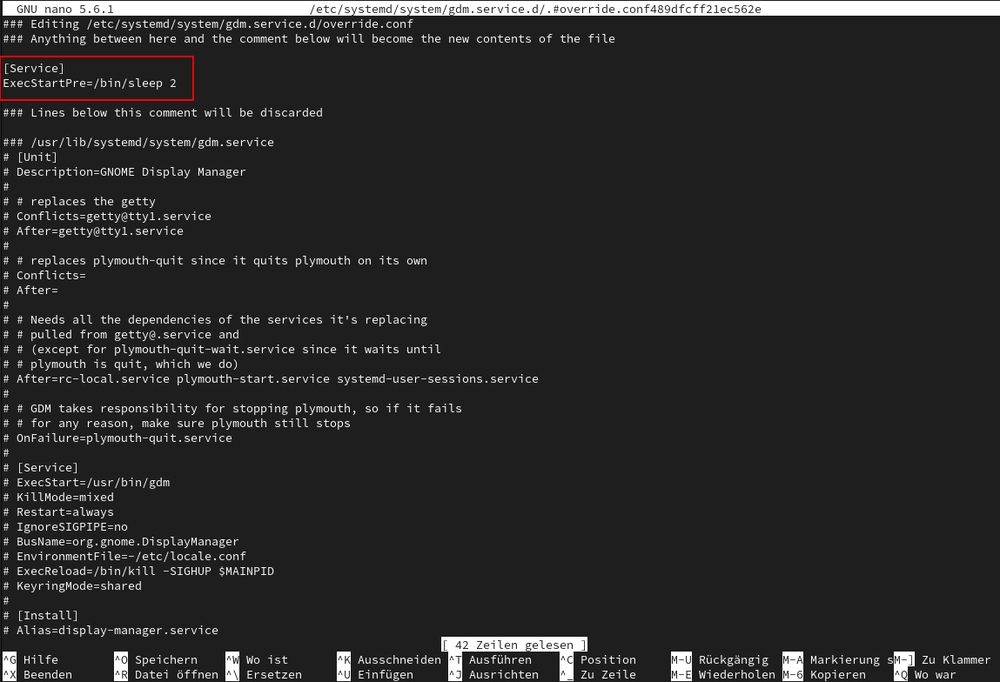

The [GNOME Display](https://wiki.gnome.org/Projects/GDM)[Manager](https://wiki.gnome.org/Projects/GDM) (GDM) is a program that manages graphical display servers and handles graphical user logins.

More information:

[https://help.gnome.org/admin/gdm/stable/](https://help.gnome.org/admin/gdm/stable/)

[https://wiki.archlinux.org/title/GDM](https://wiki.archlinux.org/title/GDM)

## Tips and Tricks:

- there is gdm-settings application in the AUR:[gdm-settings](https://aur.archlinux.org/packages?O=0&K=gdm-settings)

let you set theming wallpaper and other options for the really bare GDM login screen.

## Troubleshooting:

### GDM shows black screen with blinking white cursor

After booting, GDM may present you with a black screen with a blinking white cursor in the top left. This may be caused by GDM starting up before the graphics drivers are fully initialized. One possible workaround is to [start KMS early.](https://wiki.archlinux.org/title/Kernel_mode_setting#Early_KMS_start) Another possible workaround is to [edit the systemd service](https://wiki.archlinux.org/title/Systemd#Editing_provided_units) and either set its type to "idle" or add a small delay:

```ini
 [Service]
 Type=idle
```

or

```ini
 [Service]
 ExecStartPre=/bin/sleep 2
```

If a longer delay is required, increase the delay time.

to do so:

The easiest way to do this is to run:

```bash
sudo systemctl edit gdm.service
```

This opens the file `/etc/systemd/system/unit.d/override.conf` in your text editor (creating it if necessary) and automatically reloads the unit when you are done editing.


