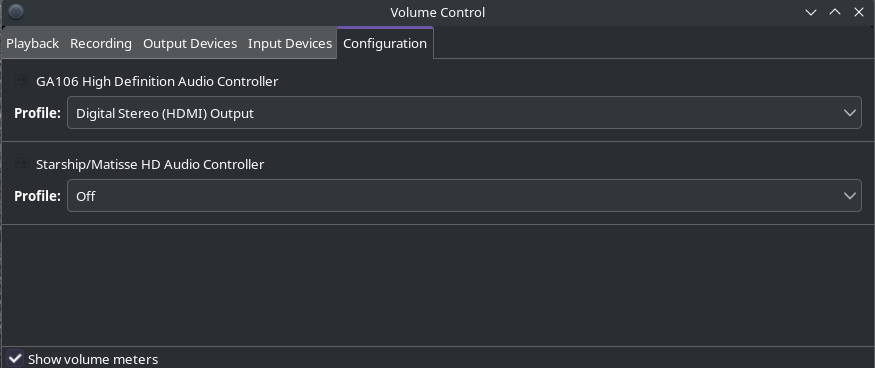

import YouTube from "../../components/YouTube.astro";
import { Image } from "astro:assets";
import cover from "../../assets/articles/getting-information-while-having-sound-issues/Audio_Icon.jpg";

<Image src={cover} alt="" class="cover" width={380} />

**by &lt;joekamprad>**

Sometimes it is a puzzle to get around with a new soundcard, or getting a mix to work, I give some hints on getting information about devices and system here:

First check if alsamixer is enabled so you can use it as a simple source to solve most mute problems, and get a view of what is available:

<YouTube url="https://youtu.be/LAspViAl9Hs" />

Pipewire is used by default but it still lags of tools, but most pulseaudio tools will work.

Pavucontrol and mainly the Configuration tab, can resolve most of the common issues with audio:



Some other tools:

- GTK GUIs: [paprefs](https://www.archlinux.org/packages/?name=paprefs), [pavucontrol](https://www.archlinux.org/packages/?name=pavucontrol) and [helvum](https://archlinux.org/packages/extra/x86_64/helvum/)

- KDE plasma applet: [kmix](https://www.archlinux.org/packages/?name=kmix), [plasma-pa](https://www.archlinux.org/packages/?name=plasma-pa) and [qpwgraph](https://archlinux.org/packages/extra/x86_64/qpwgraph/)
- Xfce4 plugin: [xfce4-pulseaudio-plugin](https://www.archlinux.org/packages/?name=xfce4-pulseaudio-plugin), [pa-applet-git](https://aur.archlinux.org/packages/pa-applet-git/)

Configs are here: **`~/.config/pulse ~/.local/state/wireplumber ~/.local/state/pipewire`** and can easily reset by removing the files and log in again in the DE (`rm -R ~/.config/pulse ~/.local/state/wireplumber ~/.local/state/pipewire`) as a normal user.

#### Auto-Mute:

If the Mode is enabled, it can cause problems for multiple users:

It can be disabled by using alsamixer.

See [http://superuser.com/questions/431079/how-to-disable-auto-mute-mode](http://superuser.com/questions/431079/how-to-disable-auto-mute-mode) for more.

```
pacmd list-sinks
```

will show info about connected output-input-devices

Some more tools:

`wget http://www.alsa-project.org/alsa-info.sh && sh alsa-info.sh`

will give you advanced info about the Soundcards + system and outputs an URL where the info is posted.

```
pactl list sinks
```

Lists your active devices.

```
speaker-test -c 6
```

The number needs to be changed to your situation.

More info on pipewire:

[Pipewire](/pipewire/)

In case you are reverted to use Pulseaudio:

[Pulseaudio](/pulseaudio/)

And indeed check the Archwiki:

[https://wiki.archlinux.org/title/PipeWire](https://wiki.archlinux.org/title/PipeWire)
