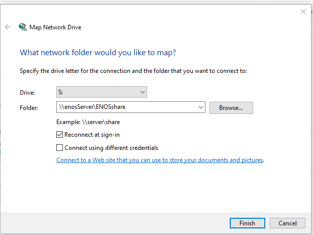
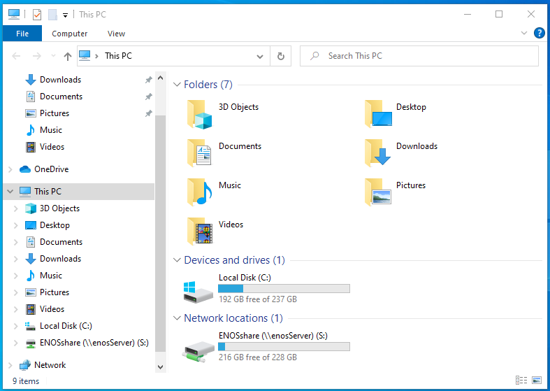
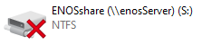

We will be setting up a Windows 10 computer as a client to share files on our LAN server. 
This assumes that *Homeserver 4 - Install and setup a SAMBA server* 
 [https://discovery.endeavouros.com/arm/install-and-setup-a-samba-server/2021/04/](/install-and-setup-a-samba-server/) 
 has been completed.

Make sure that your Windows 10 computer has “Network Discovery” turned on as follows: 
Settings – Network and Internet – Network and Sharing Center – Advanced Sharing Settings

Since this Windows computer will be a Client, an entry must be made in the “hosts” file. 
Click on the Windows button in the panel then Windows Accessories, 
Right click on Notepad, –> more –> Run as Administrator. 
In Notepad, Click on file –> open. 
This PC –> Local Disk (C:) –> Windows –> System32 –> drivers –> etc 
In the lower right, change “Text Documents (*.txt)” to “All Files” 
open the file *hosts* at the end of the file, add the following 
192.168.0.155 enosServer 
adjust the IP address and host name as necessary. 
File –> Save

In Windows 10, Right click on “This PC” then click on “Properties” and find the workgroup. In Windows 10 WORKGROUP is the default work group. If you have an existing work group that is not WORKGROUP you can use that. Otherwise choose a work group name of your choice. All Windows computers wanting to access the enosServer must have the same work group name. To change a work group name in Windows 10: 
Right click “This PC” then “properties” to the right of the work group section click on “Change settings” See this document for the work group naming rules and help changing it. [https://www.tenforums.com/tutorials/36133-change-workgroup-windows-10-a.html](https://www.tenforums.com/tutorials/36133-change-workgroup-windows-10-a.html)

Click on the “This PC” icon --> Computer Tab --> “Map Network Drive” to get the following:

In the “Drive” pull down, select S: for the drive letter to mount Samba Share to, or any other drive letter of your choice.

In the "Folder" pull down enter \\enosServer\ENOSshare 
ENOSshare is case sensitive 
Make sure "Reconnect at sign-in" is checked

Click Finish. You will get a dialog box saying *Trying to connect* 
Then a box asking for username and password. 
Enter pshare for user and pshare's Samba password that we established with # smbpasswd -a pshare 
Make sure “Remember my credentials” is checked.

Go back to “This PC” and in addition to Local Disk (C:) you should see the ENOSshare mounted as Drive S: under the Network Locations header.

If you have the ENOSshare mounted and listed as above, restart Windows and see if the SMBshare is automatically mounted after logging in. If it automatically mounts at boot up, we are done with Samba. Sometimes after login, the Icon for enosServer will look like the following.

Just double click on it, and it will usually go find the enosServer and mount it.

Now Setup any other Windows machines in the exact same manner.
