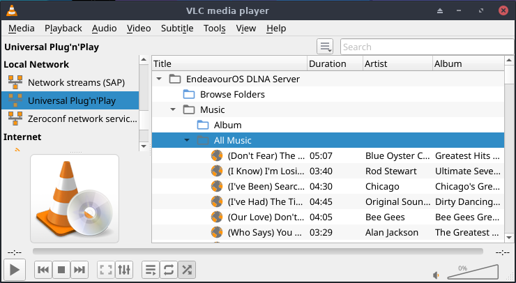
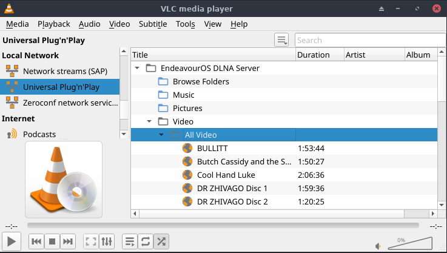

import { Image } from "astro:assets";
import cover from "../../assets/articles/homeserver-6-install-and-setup-a-minidlna-media-server/arm-a7-640x353-1.jpg";

<Image src={cover} alt="" class="cover" width={1200} />

If you want to play your MP3s, display Pictures, and view videos, on your Smart TV or any other DLNA device, a minidlna server will need to be installed.

IN A LINUX CLIENT computer, from a Terminal window, SSH into the headless enosServer and become root.

`# pacman -Syu minidlna ` 
`# vi /etc/minidlna.conf`

In the second line, make sure port is set to 8200 
`port=8200`

You can tell minidlna what directories on enosServer it will share. 
Scroll to the section that begins with `# set this to the directory you want scanned.` 
There are directions and examples given. Here is how I set up my directories.

media_dir=A,/server/MP3 
media_dir=A,/server/Ogg 
media_dir=P,/server/Pictures 
media_dir=V,/server/Movies

The `A,` indicates the following directory will contain Audio. `P,` = Pictures `V,` = Videos 
which are the three media formats that minidlna supports.

In my case the directory /server/MP3 and all sub-directories contains my MP3 Audio. 
The directory /server/Ogg and all sub-directories contains my Ogg Audio. 
The directory /server/Pictures and all sub-directories contains my Pictures (images). 
The directory /server/Movies and all sub-directories contains my MP4 videos.

All directories specified must exist on the enosServer Data drive. Adjust the paths to whatever you set up for your media.

(Right under this section is the Friendly Name section. I uncommented and changed it to: 
`friendly_name=EndeavourOS DLNA server`

Save and close minidlna.conf

`# systemctl enable --now minidlna.service# systemctl status minidlna.service` (ensure minidlna is active, running, and no errors) 
 
Add required groups

`# gpasswd -a minidlna pshare# gpasswd -a minidlna users# groups minidlna` 
 minidlna users pshare (should see these results)

Setup the server firewall. 
When the Client computer issues a request, it does so on port 8200 with TCP protocol. 
The Server computer responds on port 1900 with UDP protocol. 
We need to open port 8200 on the enosServer firewall 
 
`firewall-cmd --reloadfirewall-cmd --permanent --zone=public --add-service=minidlnafirewall-cmd --reloadsystemctl reboot ` (don't skip this server reboot)

In your Linux Client computer, open port 1900 UPD to let in your server's communications. 
In a Client Linux computer terminal window: 
 
`sudo firewall-cmd --zone=public --list-services` 
 dhcpv6-client ssh upnp-client 
 
If upnp-client is listed, your are good to go. If not: 
 
`sudo firewall-cmd --reloadsudo firewall-cmd --permanent --zone=public --add-service=upnp-clientsudo systemctl restart firewalld.service`

Using a Smart TV, Windows MediaPlayer, VLC, or other DLNA enabled device on your LAN, see if it will recognize the EndeavourOS DLNA Server. To use Rhythmbox, ensure grilo-plugins and dleyna-server are installed. Then enable grilo plugins in Rhythmbox's Options --> Plugins tab.

To use DLNA with VLC, if the Playlist column is not visible on the left side, click on the "View" tab and click "Playlist". Scroll down to "Universal Plug'n'Play" and click. EndeavourOS DLNA Server should be listed.

For audio, I know mp3, ogg, flac, and wma are supported, as long as the DLNA client supports those formats. VLC on a PC supports all four. My SMART TV, not so much.

For Pictures (images), jpeg and png are supported, not sure about any others

For Video, mp4 is supported, not sure about any others.

These are the major formats. Experiment around and see what else is supported. 
You can also select and view your MP4 movies on VLC.

Lastly, you can set up your vacation pictures in a folder on enosServer. Then have a slide show on your Smart TV in the family room and bore your friends to death.
