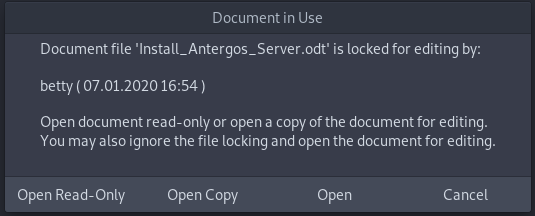

By Pudge

It would be nice to have AutoMountServer run every time you log in. 
Here is how to do this in XFCE, but most Desktop Managers have a GUI for Auto Startup

click on the Start button in the panel, click on “Settings”, click on “Session and Startup” 
Select “Application Autostart” and hit the +Add. 
Name: MountServer 
Description: Auto Mount enosServer 
Command: Navigate to `/home/$USER/bin/AutoMountServer.sh` 
Trigger: on login

Reboot, and enosServer should be automatically mounted at login. Extremely simple for any 
level of Linux user. Once set up for a user, all that user has to do is log in and enosServer is 
ready to use. Using a File Manager, check that enosServer is mounted.

This is how I set up my server access for my convenience.

The variations are many. If you don’t want the server mounted without entering a password, then don’t create any SSH keys. Now when the server is auto-mounted or mounted by clicking on the launcher, you will be prompted for pshare’s password.

If you don’t want the server to auto-mount at login, don’t add it to Session and Startup. With no SSH Keys and no auto-mount at log in, the server would not mount until you manually launched it and then entered the password.

At least in LibreOffice, if someone else has a file open when you try to open it you get:

This is a good thing if multiple people in the household share files. If this happens, I would suggest clicking Cancel.

Try to avoid shutting down the computer with a file open on the server. Next time you try to open that file, you may get a similar warning as above saying the file is locked for editing by you. Improper shut downs can leave a lot of things hanging.

Configure any other Linux machines you have exactly like we did this one. Yes, all Linux Client machines will mount the server as user pshare. You could create different users on the server that match the user names of all users accessing the server. In fact, that is what you would want to do in an Enterprise environment. But that can make administration a nightmare, plus this can cause a lot of permission problems between users. We want to keep our home file server as KISS as possible. This way every file and every directory on the server will have pshare as the owner and pshare as group.

When we set up the Samba server, we will mount SMB shares as user pshare. That way when someone writes files from a Windows machine, the files will still have pshare as the owner and pshare as a group.

Everything will be very homogeneous on the Data Drive. Out of the box, SSH will allow up to ten simultaneous connections per SSH server IP address, in this case 192.168.0.1.150. Most households don’t have ten Linux boxes. But if you need more, edit the `sshd_config` file on the server and change MaxSessions to something higher than ten. I don’t know how many simultaneous SSH sessions a single user (pshare) can have, but I have never exceeded it so far.

As an experiment, I had 3 Windows computers and 4 Linux computers simultaneously on the server, all 7 streaming music, and performing other server tasks. The server never missed a beat. For a simple home server, it works great.
