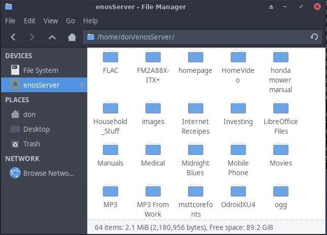
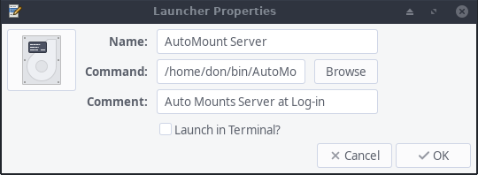

import { Image } from "astro:assets";
import cover from "../../assets/articles/homeserver-use-fuse-and-sshfs-to-view-server-data-in-a-file-manager/arm_endeavouros_xfce4.png";

<Image src={cover} alt="" class="cover" width={440} />

By Pudge

Now we will set up FUSE and sshfs to utilize a terminal window to access the files on the server. 
In the Linux CLIENT COMPUTER open a terminal window, as user install sshfs.

`$ sudo pacman -S --needed sshfs`

Make a new directory to act as a mount point

`$ mkdir /home/$USER/enosServer`

The /home/$USER/enosServer directory is a Mount Point for the enosServer. You should never add any directories or files locally in this directory. If enosServer is not mounted, the enosServer directory should always be empty.

Here is the part you’ve been waiting for. In the CLIENT Linux computer, as user

`$ sshfs pshare@enosServer:/server /home/$USER/enosServer`

It should complete without any errors.

Launch your file manager, then Click on Home and click on enosServer. You should see the lost+found directory that was created when the DATA SSD was formatted. Ideally, the enosServer folder should have nothing but subfolders to organize your data.

Eventually, as the enosServer folder is filled up, it could look something like this.

Also notice in the left column under the DEVICES, the enosServer Icon. Click on that, or click on username under PLACES then click on enosServer folder. Under DEVICES the enosServer Icon also has a unmount icon at the right side. DO NOT try to unmount the enosServer by clicking on this.

sshfs uses the FUSE kernel module to fool your client computer into thinking the /server directory on enosServer is a local directory named /home/$USER/enosServer. Anything you can do on a local directory, you can now do on the remote computer’s directory.

This is how you will manage the content on the enosServer’s DATA drive. Add files, delete files, add /delete folders just like you do on your local Drive.

So, manage data files with sshfs, and do maintenance on the Operating System by using ssh pshare@enosServer. Once set up maintenance is usually just doing updates with pacman -Syu and data backups.

Use the following to unmount enosServer. In the Client computer terminal type in the following:

`$ fusermount -u /home/$USER/enosServer`

Direct your terminal manager to the /home/$USER/enosServer directory, and it should be empty. Because 
there isn’t a remote directory mounted there anymore.

## *AUTOMATE THE MOUNTING PROCESS*

This is all fine and dandy, but who wants to type in these commands all the time, much less remember the exact Syntax for the commands? Let’s automate this process. Here are the instructions for XFCE, it should be doable in Most Desktop Environments.

#### *Mount enosServer with a desktop launcher*

In the client computer as user in user’s home directory

`$ ls -l /home/$USERdrwx------. 2 username username 4096 Jan 31 20:34 bin`

Look for a directory named bin. If bin doesn’t appear, use mkdir to create one

`$ mkdir /home/$USER/bin`

After creating bin, you may want to change the permissions for security reasons

`$ chmod 700 /home/$USER/bin` 
`$ cd /home/$USER/bin`

Using your favorite text editor, create a file named AutoMountServer.sh and add these lines

`$ vi /home/$USER/bin/AutoMountServer.sh ` 
`#!/bin/bash` 
`sshfs pshare@enosServer:/server /home/$USER/enosServer` 
`exit` 
 
 Type in exit as the last line of the file, then close the file 
 
`$ chmod 754 /home/$USER/bin/AutoMountServer.sh` 
`$ ls -l` /home/$USER/bin 
` -rwxr-xr- - don don 47 Jan 8 AutoMountServer.sh` 
`$ sudo pacman -Syu --needed alacarte`

On the Desktop, click on Start button at the left of the panel. Go to` Settings – Main Menu` 
In the left-hand column, select `System` – then click on `+ New Item`

Fill in Name: with what ever you want to call this launcher 
Fill in Command: Browse to `/home/username/bin/AutoMountServer.sh` 
Fill in Comment: with whatever you want 
Launch in Terminal? Leave it unchecked 
Click on image at the left and navigate to a desired icon

+ Other Locations – Computer – usr – share – icons – Adwatia – 32×32 – devices – drive-harddisk.png

select the icon, back in Launcher Properties click OK 
For convenience, highlight AutoMount Server. then click on ^Move up until it is the first entry at the top.

Log off, then Log in so XFCE4 can detect the changes. 
/home/$USER/enosServer should be empty. 
Click on the `Start button – System – AutoMountServer` 
The server should be mounted on the enosServer directory 
You could right-click on the launcher and add it to the Desktop or the Panel.
