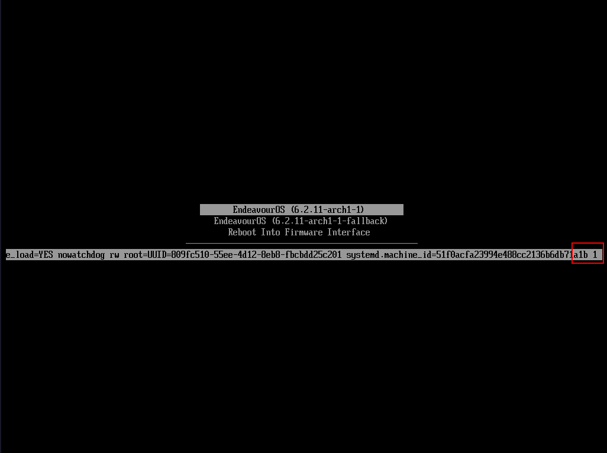
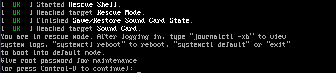

import { Image } from "astro:assets";
import cover from "../../assets/articles/how-to-boot-without-a-graphical-environment/linux-sudo.png";

<Image src={cover} alt="" class="cover" loading="eager" width={480} />

by joekamprad

On using [systemd-boot](/systemd-boot/):

Press **e** on the boot menu and end to reach **end** of the bootline sperate with **space** and add **1**.

To boot into rescue shell press **enter**:

**1** stands for ***Boot into emergency rescue mode (single user mode)***

Once booted it will present the following prompt:

Give your root password to enter the system.

If you are using [grub](https://wiki.archlinux.org/index.php/GRUB) and the graphical interface won't boot up, just restart your machine and follow the next steps:

- Press **e** when the grub-boot menu appears.
- Use the arrow keys to find the line that looks like this: 
`linux /vmlinuz=linux root=UUID=...... rw quiet resume=....` (… = long snake of numbers)
- put **systemd.unit=multi-user.target** right after **rw** like this: 
`rw systemd.unit=multi-user.target resume=....`
- I recommend removing **quiet** to get more informational output on boot (leave the rest untouched!!!)
- Press **Ctrl+X** to boot with this parameter.
- Now your machine is able to boot up without starting a graphical environment, and you can log in to proceed with repairing the system…
