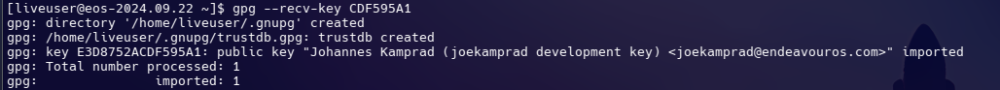
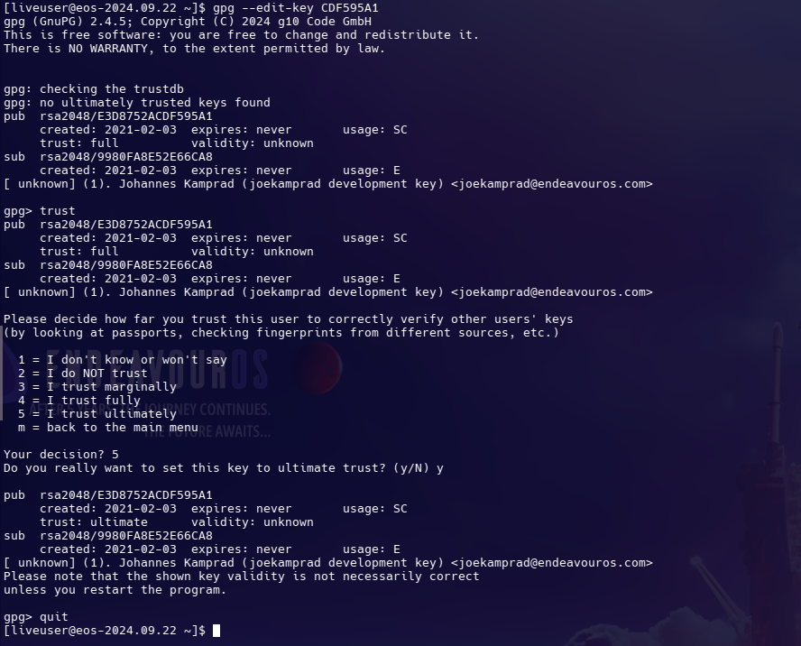
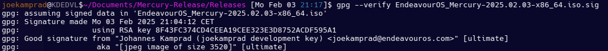
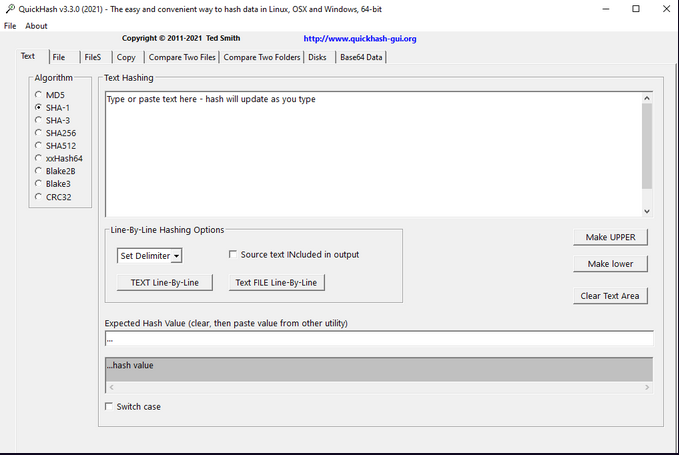

import { Image } from "astro:assets";
import cover from "../../assets/articles/how-to-check-and-trust-key-and-signature-for-the-endeavouros-iso/2025-01-02_19-15.png";

<Image src={cover} alt="" class="cover" width={440} />

Download .ISO file and .SIG file and save them in the same directory.

Check here to use the correct key ID and files, used key here is an example, it could change in the future.

[https://endeavouros.com](https://endeavouros.com)

Open a terminal in that directory and run:

```bash
gpg --recv-key CDF595A1
```

in case, use a specified key-server, if the one default on your OS is not holding the key:

```bash
gpg --keyserver keyserver.ubuntu.com --recv-keys CDF595A1
gpg --keyserver pgp.mit.edu --recv-keys CDF595A1
```



To trust the key run:

```bash
gpg --edit-key CDF595A1
```



In the GPG prompt, enter trust

It will ask you to enter a trust level number 1 the lowest, 5 the highest trust level.

If you fully trust the key (in case of EndeavourOS I do) enter 5

If you enter a lower number, the trust is still there but at a lower level. A warning will pop up saying this trust is only partial. This is to be expected as it depends on your trust level choice.

Enter will save, and exit **gpg** with `quit`

To verify the ISO itself, run:

```bash
gpg --verify EndeavourOS_Endeavour_neo-2024.09.22.iso.sig
```

This should output something like:



All done, you have now imported the key, set its trust level and verified the .ISO with the .SIG file.

## And what is about checking sha512sum?

Under Linux, sha512sum should be installed on most Distributions:

**To check the ISO file with sha512:**

```bash
sha512sum -c EndeavourOS_Mercury-2025.02.08.iso.sha512sum
```

In the terminal of your choice in the path where both the shasum file and the ISO is stored.

In case you are on Windows, it is also possible to check the sha512sum from terminal:

```
certutil -EndeavourOS_Mercury-2025.02.08.iso.sha512sumEndeavourOS_Mercury-2025.02.08.iso SHA512
```

You need to be in the path of the two downloaded files too here.

You can also use a graphical tool to check for correct shasum:

[https://github.com/tedsmith/quickhash](https://github.com/tedsmith/quickhash)


