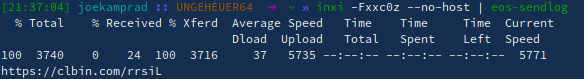
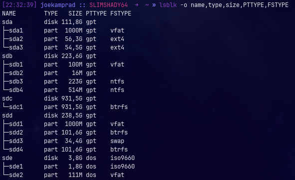
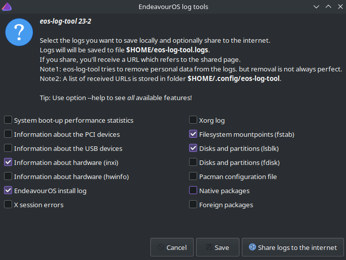
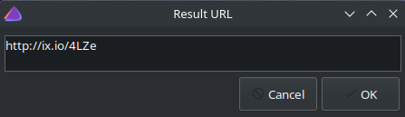
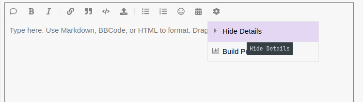
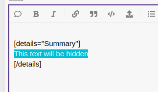
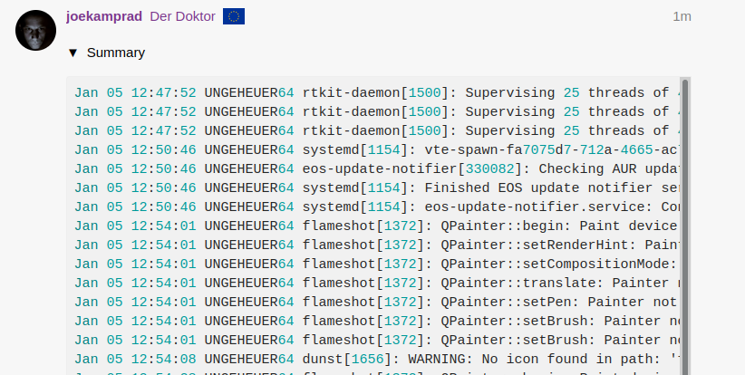

by [joekamprad](https://forum.endeavouros.com/u/joekamprad) (taken over from Antergos and expanding it)

**In the majority of cases, simply describing your issue will not provide enough information for someone to identify its cause and advise you on how to resolve it. It is important to include any system logs that *may* be relevant to your issue to ensure that neither your time nor the other person’s time is wasted. The following is a list of the most common system logs and where/how to obtain them. The logs are listed in order of importance.**

**Essential**: we need to be able to ***reproduce*** the issue, so exact steps are needed.

These two outputs from your system should be included in most cases if you want help on a specific system/hardware related issue:

**Hardware information:**

`inxi -Fxxc0z | eos-sendlog`

> *Using the "z" option filters out most of the privacy related stuff like IP serial numbers e.t.c : 
-z, --filter Adds security filters for IP/MAC addresses, serial numbers, 
location (-w), user home directory name, host name. Default on 
for IRC clients.*

**Boot log:**

See [journalctl](https://www.freedesktop.org/software/systemd/man/journalctl.html) for options.

`journalctl -k -b -0 | eos-sendlog`

Run the commands and share the short-url in your post.

It will show like so in your terminal:

terminal output of pastebin tool

Partition and format info:

`lsblk -o name,type,size,PTTYPE,FSTYPE`

#### Provide Installer Logs (calamares ISO LiveSession):

While you are still on the ISO Live Session logs are stored inside livusers home:

`/home/liveuser/endeavour-install.log`

You can open with text editor or from file browser, or send via tools (needs internet connection):

`cat ~/endeavour-install.log | eos-sendlog`

You can simply share the short URL it produces inside a terminal.

On an installed system, the log from the installation process is stored under:

`/var/log/endeavour-install.log` you can also send it but needs admin to read:

`sudo cat /var/log/endeavour-install.log | eos-sendlog`

In addition, you can use the log GUI tool from EndeavourOS:

##### ℹ

##### A general warning about logs:

If sending/posting system journal, please keep in mind that it could include personal data!!

So consider using something like

`journalctl -b -0 | grep fail | eos-sendlog`

So it will only show the lines including the search term "fail" per example.

Or send the log in a P.M to a user you trust in that matter, so your log will not be visible in public.

### **Info on different logs and tools you can use to fetch and share system information:**

### Systemd Journal:

The systemd journal can only be accessed using the journalctl command.

`journalctl -b -0` # System journal, most recent

`journalctl -b -1` # System journal, 2nd most recent

`journalctl -b -2` # System journal, 3rd most recent

The most interesting one is the last boot in most cases.

Learn more about the Pastebin command further down.

Note that EndeavourOS has a simpler way to Pastebin. For example:

`cat file | eos-sendlog`

The program `eos-sendlog` will (by default) save the received URLs to `~/.config/eos-sendlog.txt` for later inspection.

### Xsession:

Your session log is located in your /home directory:

`~/.xsession-errors`

`~/.xsession-errors.old`

### Xorg (X11):

You can find your Xorg logs here:

`/var/log/Xorg.0.log`

`/var/log/Xorg.0.log.old`

### Lightdm:

LightDM’s logs can be found here:

`/var/log/lightdm/lightdm.log`

`/var/log/lightdm/x-0-greeter.log`

### Other log providers and options:

`journalctl --since "10 minutes ago"`

To get the journal from a given timespan (works also with hours seconds, days)

A good way to get information about a particular program:

`journalctl -f /usr/bin/"Executable" `

Journal from an exact timespan:

`journalctl --since "2025-11-08 10:00:00" --until "2025-11-08 11:00:00"`

also:

`journalctl --since "2 hours ago" --until "30 minutes ago"`

and yes:

`journalctl --since "2025-11-08 10:00"`

You do not need to add hours/minutes too:

`journalctl --since "2025-11-08 10" --until "11:30"`

And nice to post a Pastebin the smart way:

`"command"` | curl -F 'file=@-' 0x0.st

or using EndeavourOS tools:

`"command" | eos-sendlog`

System summary and boot log example:

`lspci > log.txt && lsusb >> log.txt && journalctl -b -0 >> log.txt && cat log.txt `| curl -F 'file=@-' 0x0.st

Or use `eos-sendlog`:

`lspci > log.txt && lsusb >> log.txt && journalctl -b -0 >> log.txt && cat log.txt | eos-sendlog`

The program `eos-log-tool` is a GUI for various logs and system files.

#### Other systemd logs/analyze:

`systemd-analyze blame`

will show times of systemd stuff needed to proceed on boot up

[https://www.freedesktop.org/software/systemd/man/systemd-analyze.html](https://www.freedesktop.org/software/systemd/man/systemd-analyze.html)

### Pastebinit:

install **pastebinit** with package manager or `sudo pacman -S pastebinit`

the command should be passed like this:

`journalctl -b -0 > ~/journal.txt && pastebinit -i ~/journal.txt -b lpaste.net`

Where you can change **journalctl -b -0** with any other command like **dmesg** from below, his will write to a text file: **~/journal.txt** under your home you can change this name (journal) to something related to the command you pass.

**pastebinit** will auto-upload this to the Pastebin service you can choose (list all available by **pastebinit** -l

then it gives the link to it as output, so that you can just copy t to paste inside a post.

**System summary and boot-journal example:**

`lspci > log.txt && lsusb >> log.txt && journalctl -b -0 >> log.txt && pastebinit -i log.txt -b lpaste.net`

This will give out a link (like this:[http://lpaste.net/7802695579456241664](http://lpaste.net/7802695579456241664)) you can post onto the forum, this will include all the output of:

**lspci** (list your pci devices) **lsusb** (same for USB) and dmesg (boot up messages) and make it available.

### The dmesg command:

An alternative to the above command (or if your system is not using **systemd**) is the good old [*dmesg*](https://en.wikipedia.org/wiki/Dmesg) command. This is potentially less informative than **journalctl **above, but not if you have filtered it as I advised you to. So they are essentially equivalent.

`sudo dmesg`

Again, If you look in its man page or type invoke `dmesg --help` you’ll learn about the always useful `-l` flag, which filters dmesg potentially long output to print only certain message levels. And the `-r` flag which prints the message level. So, likewise, **many of us will thank you if you do the following instead of the above:**

`sudo dmesg -rl warn,err,crit`

Or at the very least:

`sudo dmesg -r`

Trivia: The *dmesg* command is basically the same as *journalctl* with the `-k` flag added to it

### Hardware Information Systems:

**INXI:** [smxi.org](https://smxi.org/docs/inxi-options.htm)

`inxi -Fxxc0z`

all **inxi** options in detail:

[https://smxi.org/docs/inxi-options.htm](https://smxi.org/docs/inxi-options.htm)

Or to auto-pastebin it and get a **URL** to post:

`inxi -Fxxc0z | curl -F 'f:1=<-' ix.io`

`inxi -Fxxc0z | eos-sendlog`

using the "z" option filters out most of the privacy related stuff like IP serial numbers e.t.c : `-z, --filter Adds security filters for IP/MAC addresses, serial numbers, location (-w), user home directory name, host name. Default on for IRC clients. `

So also if you use **inxi **for showing only parts of the info like `inxi -Aa` to show audio hardware details you should always add `-z` to the used command if you want to share the output:

`inxi -Aaz`

### EndeavourOS log tool

We also have a GUI app to handle logs which will come in handy if you are not that firm on using all the commands from terminal:

After selecting the logs you want to share, it will create the log and Pastebin this for you so that you easily can share this URL on the Forum or in the Help chat:

## ℹ Final Note:

**Very important!** Do not paste only the printed contents of the command.

**Always show also the command you used to get that output**.

And better to use an external Pastebin if the output is very large because it is hard to get the overall question visible, inside your post, or for the discussion, if it is interrupted by large logs!

At the Forum, you can use also the summary option to hide the text/log itself and instead show an arrow to open it:

