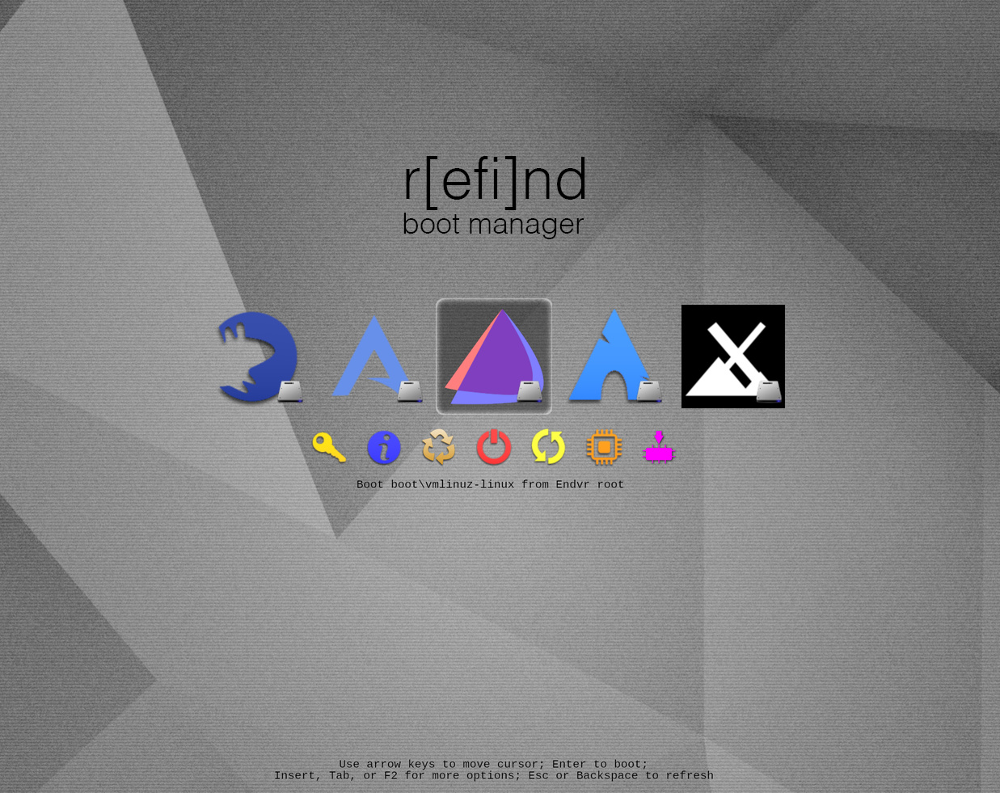

**by Freebird54 
Added: 2020-Mar-28 
Updated: 2020-Apr-09 
Updated: 2020-Jul-25: Fixed some slashes to backslashes.**

**Updated: 2021-Jun-14**: Clarified some additional options .

**rEFInd** is a boot manager, forked and reworked from the EFI boot control program called **rEFIt**. It allows the easy control of multi-boot systems, regardless of what those systems might be.

Note: It will simplify your life, and the setup, if SECURE BOOT (and FAST boot if present) have been disabled in your UEFI BIOS.



These are the steps you need to install it:

### 1. Install the Program

`yay refind`

It will probably show you several packages – number 1 from the extras repository should be your choice. It may even already be installed. After it has been installed,

### 2. run the install script

`refind-install`

The chances are excellent that you now have already the capability to boot with rEFInd in control. If you try it right away, you will most likely see 2 entries for each bootable system on your computer. If you have only 2, for instance Ubuntu and EndeavourOS, there should be 4 choices on the screen. If you see a lot more than that, did you remember to remove the USB stick you installed from? Reset and try without the stick plugged in! OK, you’re back (or never left). As you use the arrow keys to highlight each of your choices, you will notice that a description of the file that will be booted shows up underneath the row of logos. One entry for each will be for grubx64.efi and the other will be similar to the vmlinuz-linux as EndeavourOS uses. Either icon will work. There are other easy things you can do to simplify, or beautify it from here.

- **Give it a customized logo to display for EndeavourOS**
- **Hide the alternative boot choices you won’t be using**
- **Add special boot options (such as microcode and kernel options) to direct boot**

### 3. Customize your displayed logo (optional)

Because **EndeavourOS** is relatively new, the displayed logo for your system is likely to be Tux – the Linux penguin. If you would rather have the EndeavourOS logo, then you need to have a copy of it. You can easily find it as EndeavourOS-icon.png in /usr/share/endeavouros. Copy it into place with the following:

`sudo cp /usr/share/endeavouros/EndeavourOS-icon.png /boot/efi/EFI/refind/icons/os_endeavourOS.png`

When that has been done, the icon you copied will be shown with each of the EnOS choices that rEFInd recognizes.

There are other ways to accomplish this (you can even have different logos for different setups of one OS!), but this method is pretty much automatic from here.

### 4. Hide the extra entries (optional)

If you want to simplify your visible boot options, you should decide which method of booting suits you better – either by starting up the grub system that was created on the original installation (or by subsequent updates) or by directly booting the OS. As you highlight each choice, under it is a description of the boot file it will use. If it says the file to boot will be \EFI\endeavouros\grub64.efi, it will select and boot the grub entry, from which you can choose the item you wish. If it says that it will boot from \boot\vmlinuz-linux, it will do a direct boot. Highlight the item of your choice that you wisk to hide, and hit the DELETE key and it won’t be seen again. To UNhide an entry if you change your mind, choose the recycle tool (Manage Hidden Tags menu) on the lower line.

### 5. **Add special boot options (optional) to direct boot**

To do this you will need to edit some configuration files. In this case, I will describe setting up the booting with the microcode for your processor. First thing to edit is the refind.conf file. This is usually found (at least on EndeavourOS) in the **/boot/efi/EFI/refind** directory. You will need to locate the line containing `extra_kernel_version_strings` and uncomment it. Then edit it to match:

`extra_kernel_version_strings linux-hardened,linux-zen,linux-lts,linux`

Save and Exit. These are the most commonly used alternate kernels in use on Arch systems. This will allow rEFInd to support correctly the naming scheme that Arch and EndeavourOS use for kernels and their matching initramfs images. This will be made use of in the refind_linux.conf file, that should be located in the same place as your kernel. When refind-install ran, it probably set up a copy of this file in the correct place, leaving you only to do some editing. If not, there should be copy of an example file found as /usr/share/refind/refind_linux-sample.conf. Alternatively, running

`sudo mkrlconf`

in /boot will create one for you. It will still need editing. I will assume that you have already obtained your copy of the appropriate microcode image file if you have an Intel or AMD processor – `intel-ucode.img` or `amd-ucode.img` (install using yay if not). If you are working from a generated copy (rather than the sample) refind_linux.conf, it will already contain the identifiers for your boot UUID. If not, then you will need to see what the UUID is - using SUDO blkid is one easy way. Edit the refind_linux.conf to match this example for an amd-ucode.img system:

```
"Boot using default options"     "root=UUID=XXXXXXXX-XXXX-XXXX-XXXX-XXXXXXXXXXXX rw add_efi_memmap initrd=\boot\amd-ucode.img initrd=\boot\initramfs-%v.img"
"Boot using fallback initramfs"  "root=UUID=XXXXXXXX-XXXX-XXXX-XXXX-XXXXXXXXXXXX rw add_efi_memmap initrd=\boot\amd-ucode.img initrd=\boot\initramfs-%v-fallback.img"
"Boot to terminal"               "root=UUID=XXXXXXXX-XXXX-XXXX-XXXX-XXXXXXXXXXXX rw add_efi_memmap initrd=\boot\amd-ucode.img initrd=\boot\initramfs-%v.img systemd.unit=multi-user.target"
```

Notice that the directory character is \ rather than / – that is the standard in UEFI. Yes, I think Microsoft had a large say in setting the standards.

You could add kernel parameters inline on each item, such as`quiet,` after rw, if you don’t want to see the boot messages, but I like to know what happened in the background, so I didn’t add it here.

That should do it. One of the advantages of rEFInd is that you should only need to do this once, and that even the fallback option will include your microcode – unlike even ‘official’ grub2 entries. This means you do not need to go into your /boot/grub/grub.cfg file and add in the initrd entry for loading microcode, especially you do not need to do it again with every kernel update!

### Notes / Troubleshooting:

There are a LOT of other capabilities of **rEFInd** that I haven’t touched on here. Everything about its appearance and theming can be changed, for example. An example shown in the documentation puts your contact information on the boot screen, should you be running a laptop and want to make it easy for a 'finder' to return it if lost etc. Many other things are built in for handling special cases as well. On top of that, there are other ways of achieving the same things we have set up here, but I think these are the easiest I’ve found so far. I find it the simplest way to run a machine with 5 distros on it!

One of the things I appreciate is that it can pick up and display boot options for USB sticks that have ISO’s on them – whether you are distro hopping, or just needing a live environment for troubleshooting. No need to enter the BIOS for that!

One problem, however, that you may run into is what the program’s author calls a ‘boot coup’, where the installation procedure or a change that causes grub to be updated (in any of your distros) can include a routine that replaces rEFInd as the boot manager run first in the BIOS NVRAM boot order. This can be repaired by efibootmgr – or even more easily in many BIOS setups by going into the BIOS and reselecting rEFInd as the first boot method in the list in NVRAM. It certainly simplifies keeping things separate and up-to-date on a system like mine with all those distros on it!

More can be found in the Arch Wiki under rEFInd and microcode – and of course, the most comprehensive information available, direct from the original source of it all:

[https://www.rodsbooks.com/refind/](https://www.rodsbooks.com/refind/)

## Case Studies

[https://github.com/endeavouros-team/User-contributions/blob/master/Freebird54/wiki-pt2.md](https://github.com/endeavouros-team/User-contributions/blob/master/Freebird54/wiki-pt2.md)

[https://github.com/endeavouros-team/User-contributions/blob/master/manuel/rEFInd/rEFInd-use-case.md](https://github.com/endeavouros-team/User-contributions/blob/master/manuel/rEFInd/rEFInd-use-case.md)
