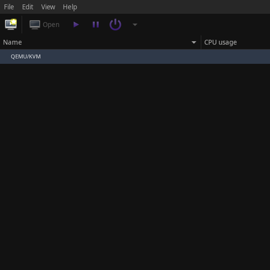
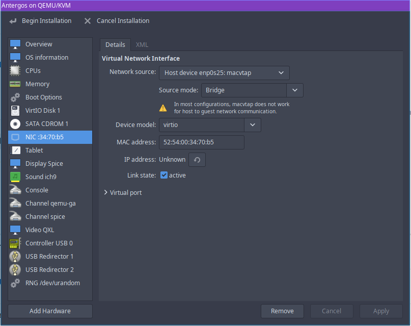

Written by [s4ndm4n](https://forum.endeavouros.com/u/s4ndm4n) 
Cleaned up by [joekamprad](https://forum.endeavouros.com/u/joekamprad) 10 nov. 2022 
[joekamprad](https://forum.endeavouros.com/u/joekamprad) Added user mode setup and some cleanup (3.4.2023) thanks at Prathamesh on telegram for the hint and the code lines!

[joekamprad](https://forum.endeavouros.com/u/joekamprad) cleaned off confusing user setupand 3d fix to keep the wiki easy to understand (9.1.2023).

[joekamprad](https://forum.endeavouros.com/u/joekamprad) bridge-utils moved to AUR (29 january. 2026).

### How to install Virt-Manager

Since its introduction virtualization has come a long way. Nowadays hypervisors are used for almost everything from running enterprise-level servers to testing different operating systems on a local user computer. There are many paid and free hypervisor solutions available in the world.

But in this guide, we are looking at installing one of these best free toolsets used for virtualization and it consists of *Virt-Manager*, *KVM*, and *QEMU*. This guide will show you how to install these tools correctly and with less hassle. Before starting let's get to know this software a bit better.

### What is Virt-Manager?

[Virt-Manager](https://virt-manager.org) is a graphical user front end for the library which provides virtual machine management services. The Virt-manager interface makes it easy for the user to create, delete and manipulate virtual machines without going through the terminal.

Virt-manager mainly supports KVM but it can also work with other hypervisors such as *Xen* and *LXC*.

When virt-manager is installed it comes with the below-listed tool-set.

- **virt-install**: Command-line utility to provision OS
- **virt-viewer**: The UI interface with graphical features
- **virt-clone**: Command-line tool to clone existing inactive hosts
- **virt-xml**: Command-line tool for easily editing libvirt domain XML using virt-install’s command-line options.
- **virt-bootstrap**: Command tool providing an easy way to set up the root file system for libvirt-based containers.

### KVM

The letters [KVM](https://www.linux-kvm.org/page/Main_Page) stands for **K**ernel-based **V**irtual **M**achines. KVM is a Linux full virtualization solution for x86 architecture processors which has the virtualization extension (Intel VT and AMD-V).

KVM is a free (as free beer) and open-source software. The support for KVM is included in all the new Linux kernels by design.

### QEMU

[QEMU](https://www.qemu.org) is the shortened version of **Q**uick **EMU**lator which is a free open-source emulator that can perform hardware virtualization. It emulates the host machine processor through dynamic binary translation. This provides different sets of hardware and device models for the host machine, which enables it to run a variety of guest systems.

KVM can be used with QEMU which allows virtual machines to be run nearly to native speeds. Not just hardware emulation, QEMU is capable of emulating user-level processors which enable applications compiled for one architecture to run on another.

### Installing virt-manager

1. Installing all the packages to run virt-manager.

Basic install:

`sudo pacman -Syu virt-manager qemu-desktop dnsmasq iptables-nft`

Full-featured install:

`sudo pacman -Syu --needed virt-manager qemu-desktop libvirt edk2-ovmf dnsmasq vde2 iptables-nft dmidecode`

- [edk2-ovmf](https://archlinux.org/packages/extra/any/edk2-ovmf/): ovmf is an [EDK](https://github.com/tianocore/tianocore.github.io/wiki/EDK-II) II based project to enable [UEFI](https://github.com/tianocore/tianocore.github.io/wiki/UEFI) support for Virtual Machines.
- [iptables-nft](http://edk2-ovmf: ovmf is an EDK II based project to enable UEFI support for Virtual Machines. iptables-nft https://archlinux.org/packages/core/x86_64/iptables-nft/): Linux kernel packet control tool (using nft interface).
- Ethernet bridge: [https://wiki.archlinux.org/title/Network_bridge](https://wiki.archlinux.org/title/Network_bridge) (bridge-utils are obsolete)

📖 **Note:** there is also a package called: [qemu-emulators-full](https://gitlab.archlinux.org/archlinux/packaging/packages/qemu/-/blob/main/PKGBUILD?ref_type=heads#L7)

what will install all QEMU user mode and system emulators:

`sudo pacman -S qemu-emulators-full`

2. After installation completes you need to enable libvirtd service, if you need `LXC` to be available. For defaul qemu session alone this is not needed.

`sudo systemctl enable --now libvirtd.service`

3. Check for the status to make sure the service is running.

`systemctl status libvirtd.service`

**Now you will be able to start creating your VM setup over the application.**

QEMU connection does not require `libvirtd.service` running!

## Optional Functionality

Package for extra functionality:

- [qemu-arch-extra](https://www.archlinux.org/packages/?name=qemu-arch-extra) – extra architectures support
- [qemu-block-gluster](https://www.archlinux.org/packages/?name=qemu-block-gluster) – [Glusterfs](https://wiki.archlinux.org/index.php/Glusterfs) block support
- [qemu-block-iscsi](https://www.archlinux.org/packages/?name=qemu-block-iscsi) – [iSCSI](https://wiki.archlinux.org/index.php/ISCSI) block support
- [qemu-block-rbd](https://www.archlinux.org/packages/?name=qemu-block-rbd) – RBD block support

### Network:

If Network is disabled after rebooting the host machine and you do not find a way to enable it, you can have it enabled per default from the command line. This will work after rebooting the host:

`sudo virsh net-autostart default`

### libguestfs

If you wish to edit the created virtual machine disk images you can install [libguestfs](https://www.libguestfs.org). These are set of tools that allow the user to view and edit files inside guest systems, change VM script changes, monitor disk space, create new guests, P2V, V2V, perform backups, clone VMs, and much more.

To install.

`sudo pacman -S libguestfs`

### qemu-block-gluster

Glusterfs is a scalable network filesystem. This adds Glusterfs block support to QEMU.

To install.

`sudo pacman -S qemu-block-gluster`

### qemu-block-iscsi

iSCI enables storage access via a network. `qemu-block-iscsi` enables QEMU to block this.

To install.

`sudo pacman -S qemu-block-iscsi`

### samba

This would add support to [SMB/CIFS](https://wiki.archlinux.org/title/Samba) support to QEMU.

To install.

`sudo pacman -S samba`

### Installing virtio guest drivers for Windows

RedHat supplies a set of guest drivers for virtio which covers the graphic drivers for the guest system. You can download the latest drivers from their GitHub **virtio-win-pkg-scripts** page [here](https://github.com/virtio-win/virtio-win-pkg-scripts/blob/master/README.md).
