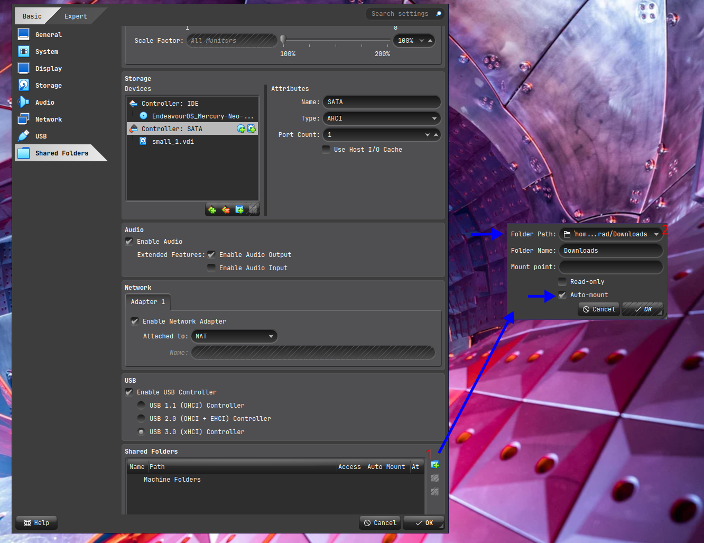
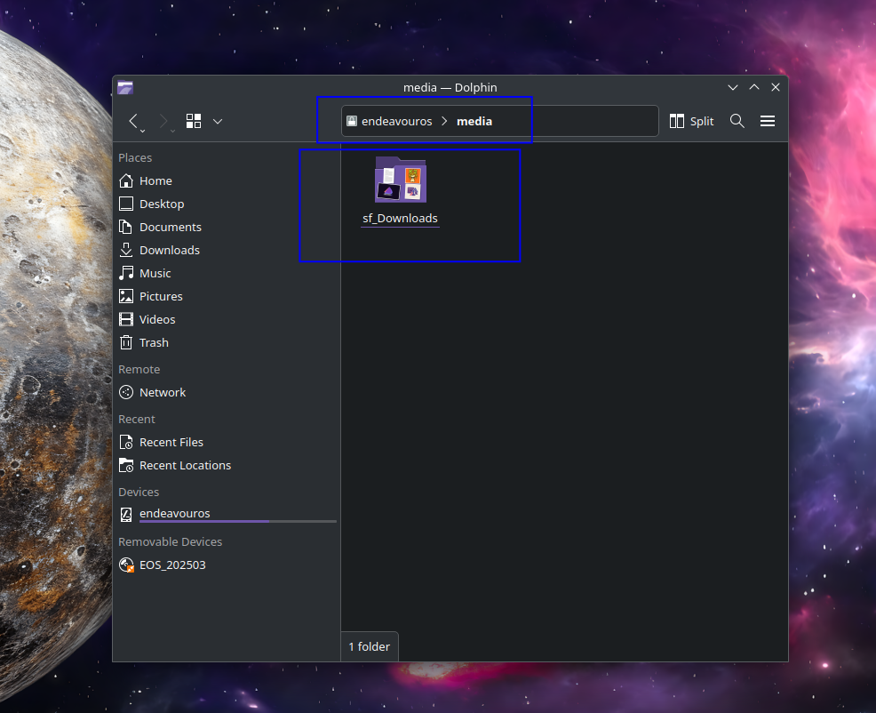
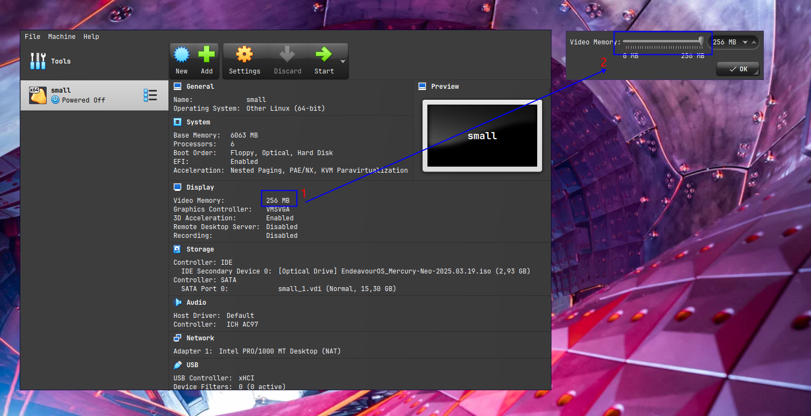

import { Image } from "astro:assets";
import cover from "../../assets/articles/how-to-install-virtualbox/Virtualbox_logo.png";

<Image src={cover} alt="" class="cover" width={380} />

**by joekamprad**

VirtualBox is a powerful x86 and AMD64/Intel64 [virtualization](https://www.virtualbox.org/wiki/Virtualization) product

These are the steps you need to install it:

## 1. Install kernel headers (linux-headers)

`sudo pacman -Syu --needed linux-headers`

**OR** for **LTS** Kernels install the linux-lts-headers

`sudo pacman -Syu --needed linux-lts-headers`

## 2. Install Virtualbox

`sudo pacman -S virtualbox virtualbox-guest-iso`

You will be asked for installing the core-packages:

- for linux kernel choose **virtualbox-host-modules-arch**
- for other kernels (like LTS) choose **virtualbox-host-dkms**

## 3. Install net-tools if you want to use host-only or bridged networking (optional)

`sudo pacman -S net-tools`

## 4. Install virtualbox-ext-vnc if you need VNC server support (optional)

As you want to access the VM from external Systems…

`sudo pacman -S virtualbox-ext-vnc`

## 5. load the needed module:

`sudo modprobe vboxdrv`

## 6. Add your user(s) to the vboxusers group

`sudo gpasswd -a username vboxusers`

## 7. Add Oracle extensions (optional, but needed for USB function p.e.)

This neds to be builded from AUR::

`yay -S virtualbox-ext-oracle`

After installing the extensions will be enabled automatically.

It is also possible to use the VirtualBox-package directly downloaded from oracle instead:

[VirtualBox_Extension_Pack](https://download.virtualbox.org/virtualbox/)

Then you need to open VirtualBox and go to

`File --> Preferences --> Extensions`

enable the package that has been downloaded.

## Notes / Troubleshooting:

### Add shared folder to be shared between host and guest:

Open the Settings and click on shared Folders.

Add a share [1] and give the needed path to the host folder [2] finally mark it to automount [3]

**On the booted guest (inside the VM):** 
`sudo pacman -S virtualbox-guest-utils` 
`sudo systemctl enable vboxservice.service` 
→ reboot vm 
`sudo modprobe vboxsf` 
`sudo usermod -aG vboxsf $USER`

After a reboot of the VM you should be able to access the shared folder as the normal user inside the VM.

You will see it created a folder named `sf_<hostfoldername> under /media/sf_<hostfoldername>`

### Graphics Memory:

From that screen you can set Memory for Graphics bigger than 125 MB what is recommended to set, same for 3d what should be checked.

Click on the MB value [1] it will open a popup [2] slide it to maximum of 246 MB and hit OK.

3d should be enabled for wayland guests in case it is causing issues... disable it again.

As it happens in some circumstances, that Live ISO per example does not show display if enabled.
