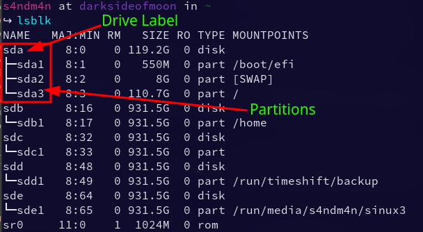
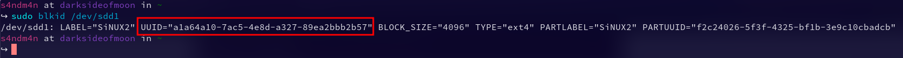
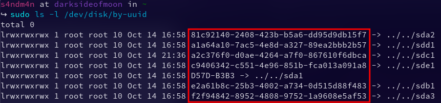
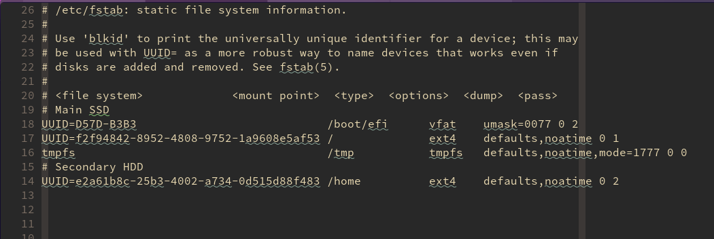
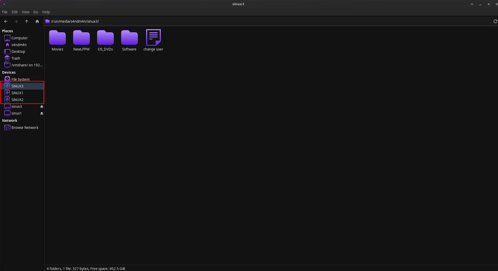

When using external drives we have to manually mount them every time we log in to our Linux distribution or every time we want to use them. If you don't remove them and use the drives as permanently connected external storage devices it would be great if we could auto-mount them every time we log in to the system.

In this article, we will be looking at how to configure these external drives as automounted permanent storage devices. Using this method you can mount almost all external drives (Externalahrd drives, USB Sticks .... etc.) or your internal drives.

**NOTE1:** Please replace all the values within `< >` with your own values.

**NOTE2:** All commands should be used in the terminal.

1. Identifying the drive and its device label. To achieve this you can use the command `lsblk` in your terminal. !



- In the above image the main three letters at the top of each tree view is the device label. Ex: `sda`.

- The three letters followed by a number under the main three letters above the tree view are the partitions. Ex: `sda1`, `sda2`, .... etc.

- In the above image I already have my externals mounted. The drives from sdc below are my externals. In your case, you would only see the drive label and the partition without a mount point in front of the partition details. So don't panic it will get listed once we finish the mounting steps.

1. After identifying the drive label make note of it or remember the correct label. Now we have to make a new folder as the mount point for our external drive. You can use `/mnt` or `/run/media` (Becarfule using this because It is usually a temporary file system not intended to hold persistent data) or any other location but I'm going to use `/mnt` for this tutorial. To make the new folder we can use the mkdir command.

```bash
sudo mkdir /mnt/<your mount folder name>
```

- You have to use **sudo** otherwise you will get a permission denied error.

1. We still can't use the new folder we created in the above step. Due to using `sudo` the new folder belongs to `root` not to your user. So we have to get ownership of the folder before continuing to other steps. To do this we use the `chown` command.

```bash
sudo chown -R <your user name>: <your user group> /mnt/<folder name you created>
```

- User group is similar to your user name. Ex: if your user name is `ben` then your user group will be `ben`. Unless you changed the user group.
- `-R` switch makes the command operate on a file or a directory recursively.

1. After owning the folder we still can't write to the folder so we need to give the folder read and write permissions. To do that, we can use the `chmod` command.

```bash
sudo chmod -R 744 /mnt/<folder name you created>
```

- Number `744` means you have assigned read/write/execute permissions to your user account. You have given read/write permissions to your group and others.

1. There are many ways we can use to mount drives using `fstab` but the best way is to use `UUID` to map the drives. So before we continue to the next step we need to find the `UUID` s of the drive/s that you're mounting. To find the IDs, we can use `ls` or `blkid`. I personally prefer `blkid`.

Using `sudo blkid <your mount device lablel>`



Using `sudo ls-l /dev/disk/by-uuid`



1. After finding the `UUID` of your drive it is time to move on to editing the `fstab` file. Before starting the edit it's always good to make a backup of the file. We can use the `cp` command to make back up.

```bash
sudo cp /etc/fstab /etc/fstab.bkp
```

- Above command will make another copy named `fstab.bkp` so if anything goes wrong you can use that file to restore the original file.

1. Open the `fstab` file in your favorite text editor.

`sudo nvim /etc/fstab` or `sudo nano /etc/fstab` or `sudo vim /etc/fstab`

The file should look something like below,



1. Add the below code to the end of the `fstab` file.

```ini
UUID=<UUID of your external device> /mnt/<your mount point>       <file system Ex: ext4>    noatime,x-systemd.automount,x-systemd.device-timeout=10,x-systemd.idle-timeout=1min 0 2
```

- I'm using `systemd.automount` and `systemd.device-timeout`.

- `system.automount`: Automount units may be used to implement on-demand mounting as well as parallelized mounting of file systems. You can find more information [here](https://www.freedesktop.org/software/systemd/man/systemd.automount.html).

- `systemd.device-timeout`: Configures an idle timeout. Once the mount has been idle for the specified time, systemd will attempt to unmount. For more detail go [here](https://www.freedesktop.org/software/systemd/man/systemd.automount.html).

- Using `systemd` is much better because using other methods sometimes the boot gets stuck if the external device fails to mount. But using this method boot continues after the time mount times out.

After editing `fstab` should look like below,


1. Once making sure everything in the `fstab` is correct save and exit the editor. To make sure there are no errors mount the drives using the below command.

```bash
sudo mount -a
```

- Above command will automount all the unmounted drives in the `fstab` file.

- If there's an issue with the file you will see error output in the terminal.

1. If there are no errors then it's all good. You can test your new mounted drive now. Afterward, you can do a system reboot and verify that the automount is working. The newly mounted drives should show up in your file manager.



## **Conclusion**

This brings us to the conclusion of this tutorial. I hope this tutorial is simple enough so anyone can understand and follow it without any issue. Using `UUID` and `systemd` is the best way I found to mount drives.
