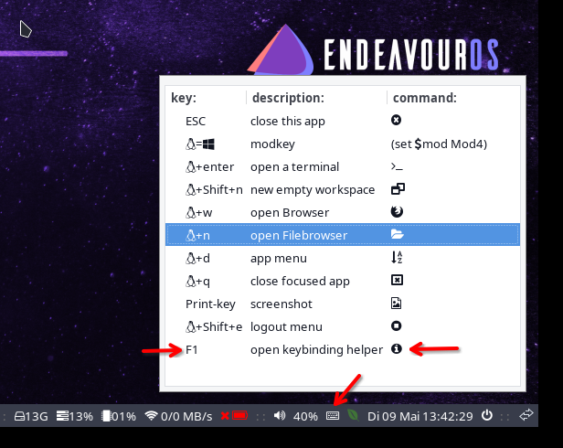
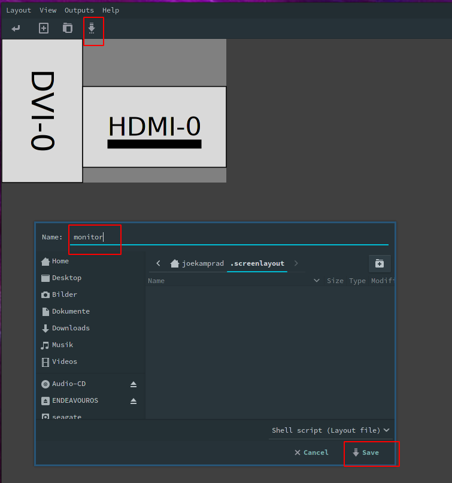
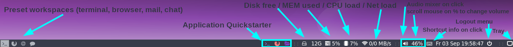
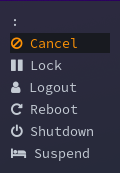
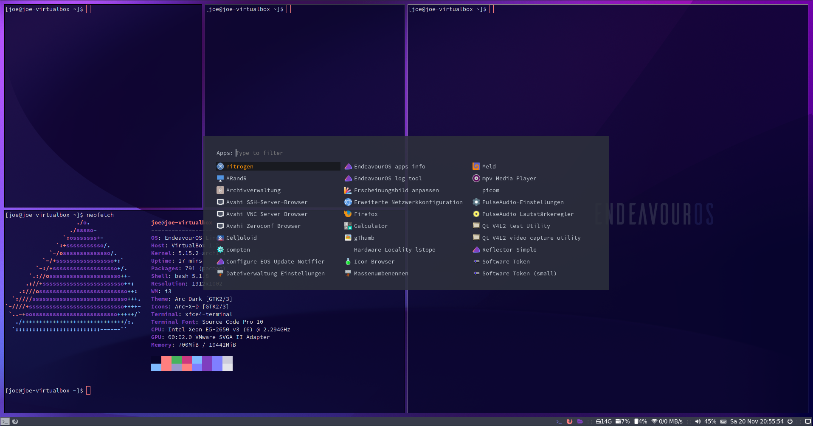
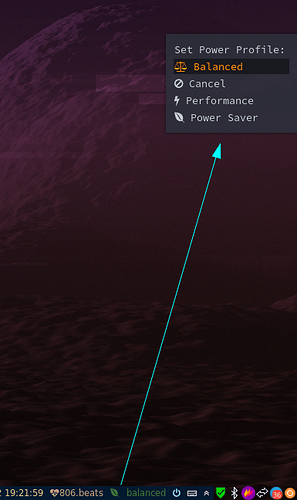
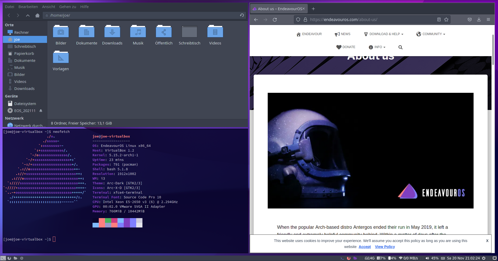

import YouTube from "../../components/YouTube.astro";
import { Image } from "astro:assets";
import cover from "../../assets/articles/i3-wm/i3wm-eos-1.png";

<Image src={cover} alt="" class="cover" width={1200} />

### EndeavourOS implementation:

The configuration Source for EndeavourOS initial configuration after fresh install:

[https://github.com/endeavouros-team/endeavouros-i3wm-setup](https://github.com/endeavouros-team/endeavouros-i3wm-setup)

## endeavouros-i3wm-setup

**maintainer: joekamprad ---> setup for i3-wm under [EndeavourOS](https://endeavouros.com) new config 2022 &lt;---**

## Tutorial for i3-wm settings:

- background handled by [feh](https://feh.finalrewind.org/)
- gtk3 theme handled by [lxappearance-gtk3](https://wiki.lxde.org/de/LXAppearance)
- Filebrowser = [Thunar](https://docs.xfce.org/xfce/thunar/start)
- default Terminal-Emulator = [xfce4-terminal](https://docs.xfce.org/apps/terminal/start)
  - This is set also inside ~/.profile (export TERMINAL=xfce4-terminal) so remind to change it there too if you want to change4 default terminal.
- Text-Editor = [xed](https://github.com/linuxmint/xed)
- [dex](https://github.com/jceb/dex) : autostarting apps from /etc/xdg/autostart/ (*)
- Notifications are done with [dunst](https://dunst-project.org): CONFIG FILE = ~/.config/dunst/dunstrc

**dex is enabled by default in config to autostart like on a DE. To disable, comment out the line:**

`exec --no-startup-id dex --autostart --environment i3`

inside `~/.config/i3/config`.

## Main shortcuts:

[mod] key is set to the win-key (or should i call it linkey?)


## default EndeavourOS i3-wm keycodes:

Keybindings are different from the i3 defaults to fit into the setup.

There are 2 tools that helps you to check them:

The keyboard icon on panel open a little GUI helper and by pressing [F1]



## Display setup with arandr



- open arandr and setup display/s as you need.
- save the setup from arandr menu or button exactly with filename `monitor`.
---> on i3 EndeavourOS we have a starter line in the ~/.config/i3/config

```
# start a script to setup displays
# put `monitor.sh` into the location specified by this line:
exec --no-startup-id ~/.screenlayout/monitor.sh
```

this will handle to set display on each login.
alternatively, you could manually make a script with xrandr.

## Tiling:

is set to default for i3wm and can be changed to:

- stacking:
Only the focused window in the container is displayed. You get a list of windows at the top of the container.
- tabbed:
so each new window will open fullscreen as a tab, you can change between window-tabs with mouse or shortcut:
[mod]+**Left** focus left (left arrow key)
[mod]+**Right** focus right (right arrow key)

## i3blocks:

- pulseaudio (mousewheel volume level, rightclick open pulseaudio control)
- weather (openweather you need to get city code and apikey first [adding it to ~/.config/i3/scripts/openweather.sh])
get your api key here: https://openweathermap.org/appid and City code: https://openweathermap.org/find?q= (search your city and take the city code from the url in your browser [7 numbers at the end of the url])
- tray-icons (showing network-manager and update-icon)
- logout button (poweroff, logout, suspending, hibernate e.t.c.)

## panel bar (i3-blocks):



- CONFIG FILE = ~/.config/i3/i3blocks.conf

## Logout Menu (rofi):



- CONFIG FILE = ~/.config/i3/scripts/powermenu

## application menu (rofi):



- rofi color-schemes: ~/.config/rofi/arc_dark_transparent_colors.rasi

## power-profiles handler menu:



- let you easely switch powermodes from the i3-bar.

### theming/colorshemes:

**for rofi menus (application menu and Logout menu):**

They can be adjust and chenged inside ~/.config/rofi directory:

**Configurations for the menus:**

- `~/.config/rofi/rofidmenu.rasi`
- `~/.config/rofi/powermenu.rasi`

**colorschemes:**

- `~/.config/rofi/arc_dark_transparent_colors.rasi`
- `~/.config/rofi/arc_dark_colors-ori.rasi`

colors are in rgba calling transparency in the last colum:

`rgba ( 26, 28, 35, 100 % )`

**General theming // gtk3 and icons:**

- `~/.config/gtk-3.0`
- `~/.Xresources` 

There is installed where you can browse and set GTK3 theme, icons and Xcursortheme. 

But Xcursor needs to be set inside the `~/.Xresources` manually if you change it in LXAppearance to get applied for all apps.

## Tutorial to install EndeavourOS-i3 setup from scratch

**for later installs, if you have installed another DE on initial install from the ISO**

1. get the dot files:

`git clone https://github.com/endeavouros-team/endeavouros-i3wm-setup.git`

`cd endeavouros-i3wm-setup`

1. copy files to the right directories (.config of your user):

`cp .Xresources ~/.Xresources`

`cp -R .config/* ~/.config/`

1. Scripts inside `~/.config/i3/scripts` must be executable:

`chmod -R +x ~/.config/i3/scripts`

1. set theming for xed texteditor:

`dbus-launch dconf load / < xed.dconf`

1. install needed packages:

`wget https://raw.githubusercontent.com/endeavouros-team/EndeavourOS-packages-lists/master/i3`

`sudo pacman -S --needed - < i3`

or use the packages tool from our repo: `eos-packagelist --install "i3-Window-Manager"`

**Use the `i3_install` script from the git for automatic install it to your users home:**
This script will setup configurations needed and install all needed packages:

`wget https://raw.githubusercontent.com/endeavouros-team/endeavouros-i3wm-setup/main/i3_install`
and run it: `./i3_install`

**warning i3_install will overwrite existing files**
Make sure you backup users configs before running it on your own.

## screenshot:



<YouTube url="https://youtu.be/dwSHX-pEe3o" />

---

### Links:

I3 docs:

[https://i3wm.org/docs/](https://i3wm.org/docs/)

Sources for EndeavourOS i3wm setup:

[https://github.com/endeavouros-team/endeavouros-i3wm-setup](https://github.com/endeavouros-team/endeavouros-i3wm-setup)

If you have a question ask at our Forum:

[https://forum.endeavouros.com/c/desktop-environments/i3wm/23](https://forum.endeavouros.com/c/desktop-environments/i3wm/23)
