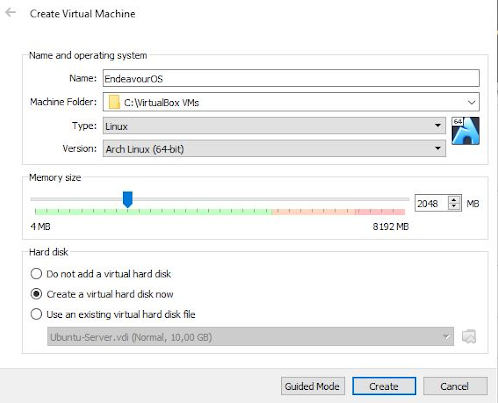
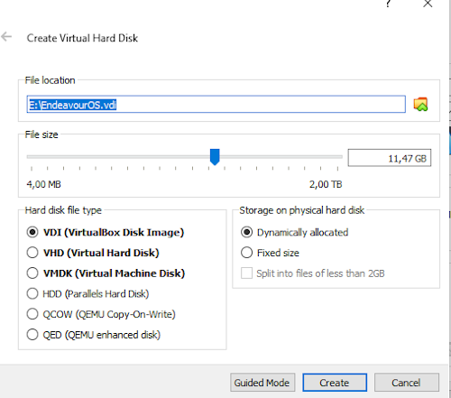
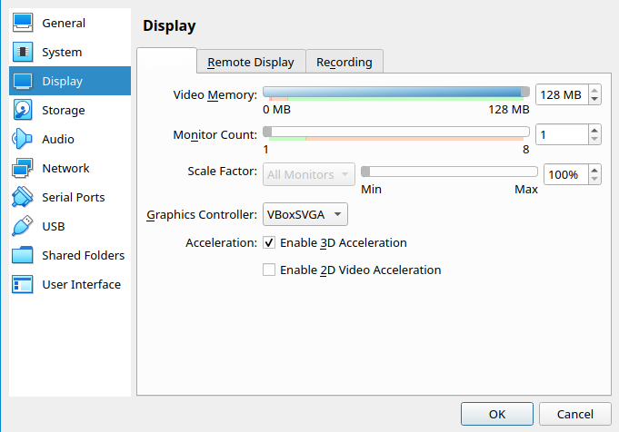
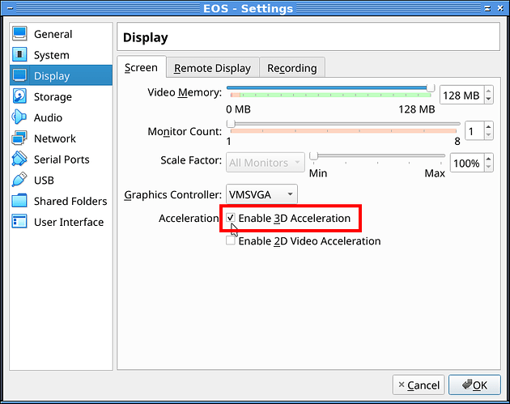
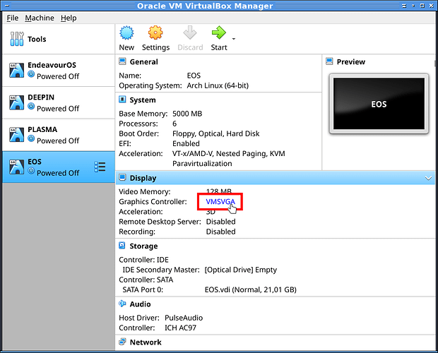
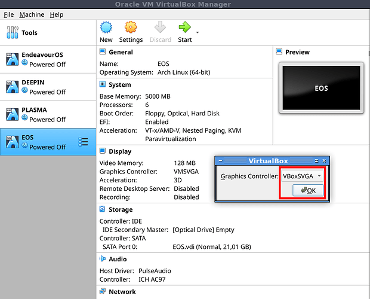
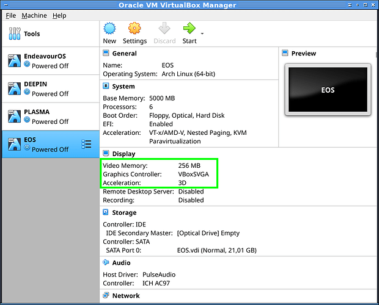
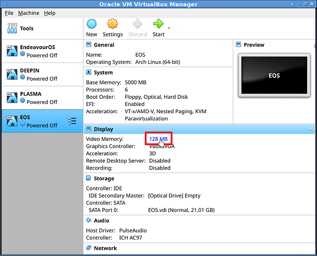

import { Image } from "astro:assets";
import cover from "../../assets/articles/installing-endeavouros-on-virtualbox/endeavour_2_nologo.png";

<Image src={cover} alt="" class="cover" width={440} />

**Big thanks to [DevNul](https://forum.endeavouros.com/u/devnul/summary) for writing this at the [forum](https://forum.endeavouros.com/t/not-being-able-to-boot-into-iso-in-vbox/840/14?u=joekamprad) !**

Create a new machine with your favorite name, for example** –>** EndeavourOS 
**Machine Folder:** as you like 
**Type: **Linux 
**Version: **Arch Linux (64-Bit)

**Memory size**: (minimum 2000MB, recommended 2500MB - 4000MB) 
**Hard Disk**: “Create a virtual hard disk now”

Hit “Create”

**File location:** Where do you want to save your virtual machine? Be aware that you need enough space for the virtual hard drive.

**File size: **with about 15GB you’re good to go – depends on the plans for your virtual machine. Definitely enough for a little test-drive.

**Hard disk file type:** What you prefer, VDI is absolutely ok.

**Storage on physical disk:** Dynamically allocated (The virtual machine takes only the amount of space that is needed. Your chosen file size is the maximum.)

After the wizard, you have to change one or two settings. First, you click on ***[Optical Drive] ***Empty. Then you choose the downloaded **EndeavourOS-ISO** to mount it in the virtual optical drive.

Please read the **Disclaimer**!

If you plan to **activate the 3D acceleration for the GPU** (graphics card) you have to change the graphics controller to “VBox**SVGA**”. And you want to maximize the “Video Memory” to 128MB.

## Notes / Troubleshooting (currently VMSVGA is working fine!):

It helps to change display settings to use the older better implemented  **VBoxVGA** as controller device in the settings. But as VirtualBOX now give a Warning that you have wrong settings if you choose this and it seems that VMSVGA (what VirtualBox set as default on Linux guests) is still not working nicely with Arch-based Guests, it reverts to its default on leaving the settings window and you need to set it from the main overview of the Box:

It will set back sometimes so check if Graphic-Controller is set to VBoxSVGA before starting an ArchBox! from that screen you can also set Memory for Graphics bigger than 125 MB:

All steps for getting graphic controller working in a slideshow:

(Thanks to [FLVAL](https://forum.endeavouros.com/u/FLVAL) for providing this here at the forum installing-[endeavouros-on-virtualbox-6-1](https://forum.endeavouros.com/t/update-wiki-installing-endeavouros-on-virtualbox-6-1/))

Setup to 256MB with scroller or button then click ok

First check the 3D inside your VM Name settings, and let whatever graphic controller you want then click OK.

Close the window settings and click as below directly on the name VMSVGA of your VM

Then a little window appears so change it for VboxSVGA and click OK.

Now the VboxSVGA with 3D checked keeps right.

Click on the 128Mo (could be another value) then a little window appears

Setup to 256Mo with scroller or button then click ok

First, check the 3D inside your VM Name settings, and let whatever graphic controller you want then click OK.

That’s it… time to start the virtual machine and try EndeavourOS.
