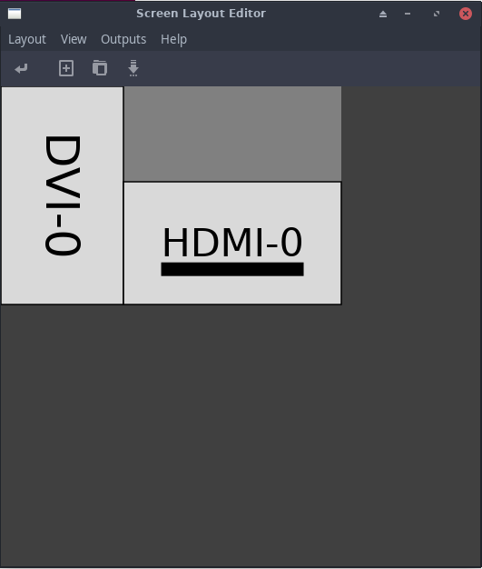
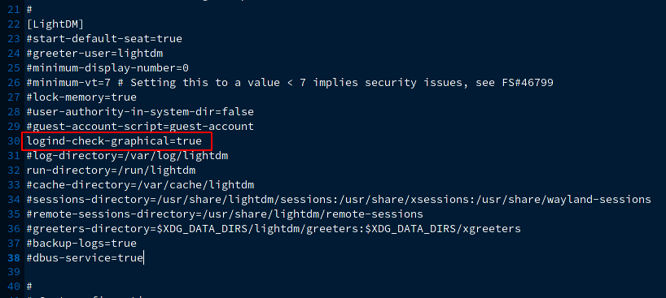
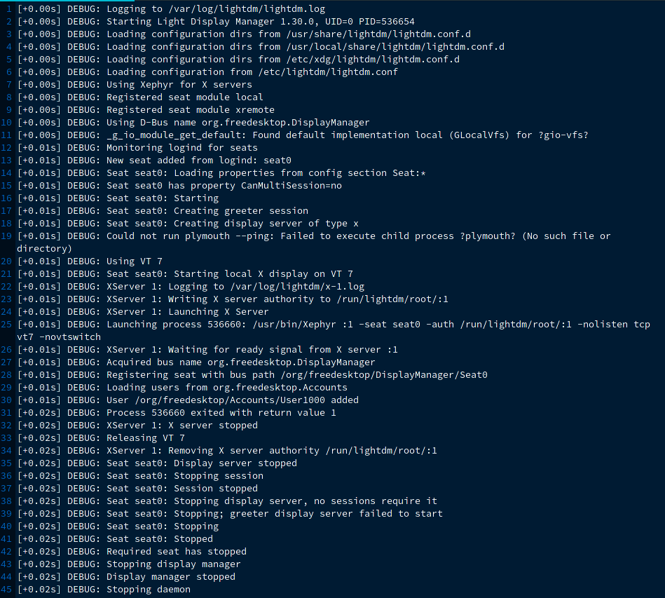
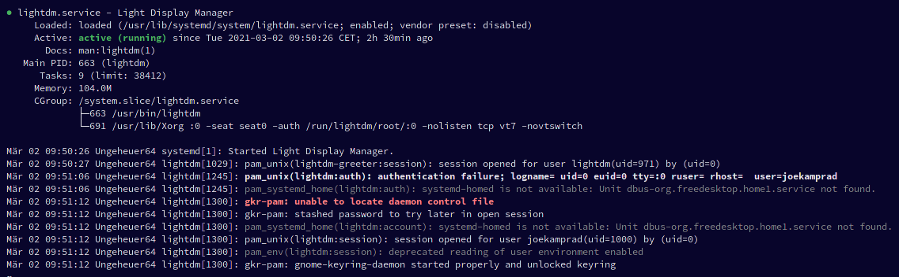

import YouTube from "../../components/YouTube.astro";

LightDM is a cross-desktop display manager. A display manager is a daemon that:

- Runs display servers (e.g. X) where necessary.
- Runs greeters to allow users to pick which user account and session type to use.
- Allows greeters to perform authentication using PAM.
- Runs session processes once authentication is complete.
- Provides remote graphical login options.

Key features of LightDM are:

- Cross-desktop – supports different desktop technologies.
- Supports different display technologies (X, Mir, Wayland …).
- Lightweight – low memory usage and fast performance.
- Guest sessions.
- Supports remote login (incoming – XDMCP, VNC, outgoing – XDMCP, pluggable).
- Comprehensive test suite.

Source: [https://github.com/canonical/lightdm](https://github.com/canonical/lightdm)

### Setup LightDM to work nicely on Multidisplay systems

Use Arandr to fix the display setup on multi-display systems for LightDM

For EndeavourOS (and other Archlinux based):

<YouTube url="https://youtu.be/AiD042zOME4" />

1. Install arandr from repositories: `sudo pacman -S arandr`
2. setup displays with arandr.
3. save the setup as monitor in the given directory.
4. copy the saved script to lightdm directory: 
`sudo cp ~/.screenlayout/monitor.sh /etc/lightdm/`
5. make it executable: 
`sudo chmod +x /etc/lightdm/monitor.sh`
6. edit lightdm.conf: 
`sudo nano /etc/lightdm/lightdm.conf` 
uncomment the display setup option and add the path to the script: 
`display-setup-script=/etc/lightdm/monitor.sh` 
(you can also add this line at the end of the file) 
save the file **[Ctrl+X]**
7. restart lightdm to see if it is working: 
`sudo systemctl restart lightdm`



## Troubleshooting:

1. Lightdm fails to start at all (black screen with no login GUI showing up)

lightdm has an issue where it sometimes happens that it starts **too** fast - before X is ready, or even before the GPU driver is fully loaded. One solution is to set `logind-check-graphical=true` inside *lightdm.conf*



uncomment the line `#set logind-check-graphical=false` and change from `false` to `true` like so:

`logind-check-graphical=true`

There are several different cases where Lightdm can fail to start, most often it is the case that the GPU driver is not loading at all or too late. that makes X system fail to be available for lightdm.

It can be also be a typo or a wrong setting in the config file/s, as EndeavourOS is using lightdm-gtk-greeter - per default it can be missing one of the needed packages ( lightdm lightdm-gtk-settings lightdm-gtk-greeter) causing it to fail to start.

Lightdm has also build-in debugging mode you can start from CLI if it fails:

```
lightdm --test-mode --debug
```

You can also run this from terminal if X is running.

Maybe you need to install Xephyr:

`sudo pacman -S xorg-server-xephyr`

will give a debugging log like this:



Going through the debugging output you can usually find the culprit that may be causing the issue for you.

As the status mostly do not give helpful output:

```bash
systemctl status lightdm
```


