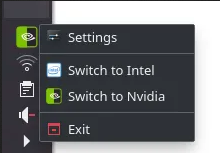
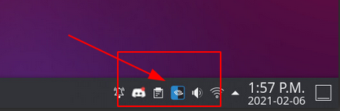

import YouTube from "../../components/YouTube.astro";
import { Image } from "astro:assets";
import cover from "../../assets/articles/optimus-manager-for-nvidia/nvidia-optimus.png";

<Image src={cover} alt="" class="cover" width={440} />

[**for nvidia-latest driver and newer systems supported by that driver**]

ℹ

**[The state of optimus-manager](https://github.com/Askannz/optimus-manager/issues/543)**

If you have a newer **Nvidia-Intel hybrid** Notebook, or also AMD-Nvidia combination:

You can simply switch the intel and NVidia GPU with optimus-manager tool.

*For this you will need the proprietary NVidia driver installed.*

**Boot LiveISO and install EndeavourOS with optimus device**.

—> go to step **4.** if you already installed system and Nvidia Drivers:

1. **Boot on the NVidia boot option**
2. **Install system of your choice (NVidia drivers will be installed automatically)**
3. **Boot into your newly installed system**
4. **install optimus-manager:**

`yay -S optimus-manager`

Install optimus-manager-qt what is working on top of optimus-manager to get a tray icon to switch:

`yay -S optimus-manager-qt`

**If you have a combo if AMD and Nvidia, you need currently the git version to support AMD GPU’s:**

`yay -S optimus-manager-qt-git`

And if you want to use it under KDE/Plasma it is recommended to build with `_plasma=true` to set inside the PKGBUILD:

[https://aur.archlinux.org/cgit/aur.git/tree/PKGBUILD?h=optimus-manager-qt-git](https://aur.archlinux.org/cgit/aur.git/tree/PKGBUILD?h=optimus-manager-qt-git)

That makes it needed to build manually with makepkg or have an AUR-Helper that can handle editing PKGBUILD before building.

If choosing to manually build:

`git clone https://aur.archlinux.org/optimus-manager-qt-git` 
then open the folder **optimus-manager-qt-git** with filebrowser open the file PKGBUILD with Texteditor and change false to true here:

`# Use KDE API features (recommended for Plasma users) `

`_with_plasma=true `

save the file. 
open a terminal inside the same folder (optimus-manager-qt-git) and run makepkg: 
`makepkg -si`

This is the manual way to build and install packages from [AUR](https://wiki.archlinux.org/index.php/Arch_User_Repository).

1. **reboot system**
2. **check optimus manager service (should be running)**

`systemctl status optimus-manager`

To start and enable it run (if it is not running):

`sudo systemctl enable --now optimus-manager`

1. **Now switch to Nvidia GPU, right-click on the Tray and select “Switch to Nvidia“**

On KDE/Plasma it will look like this:

**8. You can switch manually with commands also:**

You can also use it without tray icon:

Run from terminal:

`optimus-manager --switch nvidia` 
to switch to the Nvidia GPU 
`optimus-manager --switch integrated` 
to switch to the integrated GPU and power the Nvidia GPU off 
`optimus-manager --switch hybrid` 
to switch to the iGPU but leave the Nvidia GPU available for on-demand offloading, similar to how Optimus works on Windows.

See the [Wiki 1](https://github.com/Askannz/optimus-manager/wiki/Nvidia-GPU-offloading-for-%22hybrid%22-mode) at the source of it at GitHub for more details.

---

## **Warning:**

- be careful with the packages “[acpi_call](https://github.com/mkottman/acpi_call)” and “[bbswitch](https://github.com/Bumblebee-Project/bbswitch)“. 
they will make the system unstable or it will not boot anymore.

- optimus-manager will only work on Xorg (X11) session not on Wayland.
- If you are running Gnome with GDM you need to install [gdm-prime](https://aur.archlinux.org/packages/gdm-prime/).

For more information read at the source for optimus-manager:

[https://github.com/Askannz/optimus-manager](https://github.com/Askannz/optimus-manager)

[https://github.com/Shatur95/optimus-manager-qt](https://github.com/Shatur95/optimus-manager-qt)

<YouTube url="https://youtu.be/OlIXQRpfJQ4" />

All Nvidia entries: https://discovery.endeavouros.com/?s=nvidia
