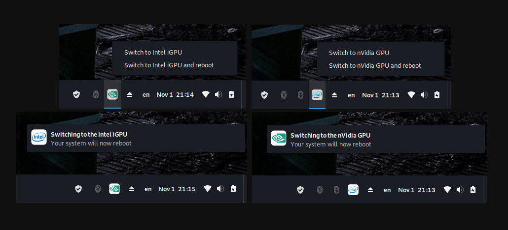

import { Image } from "astro:assets";
import cover from "../../assets/articles/optimus-switch-another-solution-for-optimus-laptops/nvidia-optimus.png";

<Image src={cover} alt="" class="cover" loading="eager" width={491} />

By Linesma

**Introduction**

Since their introduction, getting Optimus (Intel/ nVidia) laptops to work properly has been an issue under Linux. The two most common solutions are Bumblebee and Optimus Manager. Both have their limitations and not every user can get them working properly. Optimus Switch, written by user [@dglt](https://forum.endeavouros.com/u/dglt), is another option for users to switch between graphics cards on Optimus based (Intel/ nVidia) laptops. By following this guide, the user will install and properly configure Optimus Switch and the GUI indicator/ switcher for it.

**Optimus Switch vs. Optimus Manager.**

1. By default, Optimus Switch will completely power down your nVidia card when you are using the Intel iGPU. This allows for longer battery life. While this function can be enabled in Optimus Manager, it is not enabled by default and does not always work properly.
2. Optimus Switch sets up the nVidia card in “Prime Mode” when the user is in “nVidia” mode. This allows the user full access to their nVidia card without using terminal commands or modifying shortcut parameters to run programs.
3. Optimus Switch does not require a “patched” version of GDM from the AUR. Less chance of instability when Gnome is updated.
4. Optimus Switch, unlike Optimus Manager, does not allow for the switching of GPU’s on demand. The user needs to reboot their laptop whenever they “switch” between GPU’s.

**Optimus Switch vs. Bumblebee**

The same comparisons for Optimus Manager apply to Bumblebee as well. The only difference is the use of the proprietary nVidia driver instead of the Open Source Nouveau driver. By using the driver from nVidia, the user is able to use the full capabilities of their nVidia card.

All the above solutions require the use of Xorg instead of Wayland.

**Where to find Optimus Switch**

Optimus Switch can be found at the links below. Because of differences in Display Managers, make sure that you use the version appropriate for the Display Manager you are using.

Gnome (GDM) - [https://github.com/dglt1/optimus-switch-gdm 28](https://github.com/dglt1/optimus-switch-gdm)

KDE (SDDM) - [https://github.com/dglt1/optimus-switch-sddm 23](https://github.com/dglt1/optimus-switch-sddm)

LightDM - [https://github.com/dglt1/optimus-switch 33](https://github.com/dglt1/optimus-switch)

While originally written for Manjaro installs, Optimus Switch can easily be used on other Arch-based distros. For EndeavourOS, we need to follow the instructions below.

**Installation**

1. Install EndeavourOS. Make sure to install the nVidia Drivers package. This will install the nVidia driver. I know it says that it is not for legacy cards or hybrid solutions. The system will still boot, but it may not initialize the Display Manager.
2. Upon reboot, you may be presented with a black screen and a blinking cursor. If you are presented with a log in screen, DO NOT LOG IN. In both cases, hit ctrl-alt-F3 to enter a TTY session. Now log in to your system.
3. Make sure that the nVidia driver is installed.

`pacman -Q | grep nvidia`

You should get a result that looks similar to this:

```
$ pacman -Q | grep nvidia
lib32-nvidia-utils 450.66-1
nvidia-dkms 450.66-1
nvidia-installer-db 2.4.6-1
nvidia-installer-dkms 3.3.7-1
nvidia-settings 450.66-1
nvidia-utils 450.66-1
```

**3a**. If the Nvidia driver did not install, do the following.

`sudo nvidia-installer-dkms`

1. Install the needed dependencies.

`sudo pacman -S linux-headers acpi_call-dkms mesa-demos xorg-xrandr xf86-video-intel git`

**4a.** Be sure to change the `linux-headers` package to match the kernel you are using. For example the `zen kernel` uses the `linux-zen-headers` package and the `lts kernel` uses the `linux-lts-headers` package.

1. Enable `acpi_call` by typing `sudo modprobe acpi_call`
2. Make sure that there are no video related config files on your system. Look in the following folders:

```bash
/etc/X11/
/etc/X11/xorg.conf.d/
/etc/modprobe.d/
/etc/modules-load.d/
```

**6a**. Any conf file that deals with the keyboard, touchpad, or networking can stay. Anything else, you can manually delete. For example, if you have a conf file name `20-nvidia.conf`, it needs to be removed. You can remove it by typing `sudo rm /etc/X11/xorg.conf.d/20-nvidia.conf`

Now we can follow the readme on the GitHub page for the project directly. Make sure you follow the proper instructions for the Display Manager you are using.

1. From your home directory (~/) do the following. If you do not do this from the home directory, the script will not install files properly.

**Gnome (GDM)**

```bash
git clone https://github.com/dglt1/optimus-switch-gdm.git
cd ~/optimus-switch-gdm
chmod +x install.sh
sudo ./install.sh
```

Now we need to make sure that Gnome is using Xorg by default.

`sudo nano /etc/gdm/custom.conf`

Remove the # before the line that reads `WaylandEnable=false` . Hit `ctrl-x` to exit and `Y` to save the changes.

**KDE (SDDM)**

```bash
git clone https://github.com/dglt1/optimus-switch-sddm.git
cd ~/optimus-switch-sddm
chmod +x install.sh
sudo ./install.sh
```

**LightDM**

```bash
git clone https://github.com/dglt1/optimus-switch.git
cd ~/optimus-switch-sddm
chmod +x install.sh
sudo ./install.sh
```

1. Optimus Switch is now installed. You can now reboot your laptop. After your laptop finishes starting up, you will be in nVidia Prime “Mode”.

To switch modes, open a terminal and type the following:

For nVidia mode – `sudo set-nvidia.sh`  
For Intel mode – `sudo set-intel.sh`

Then restart the laptop.

**Reminder: When switching modes, you have to restart your laptop for the changes to take effect.**

**Powering down the nVidia card in Intel Mode**

Optimus Switch uses the functions in the `acpi_call` package to turn off the nVidia card when the laptop is in Intel Mode. This allows for longer use time while on battery. To properly setup up `acpi_call`, we need to do the following.

1. The laptop needs to be in **Intel Mode** . If the user is in nVidia Mode, the laptop will freeze.
2. Open a terminal and type `sudo /etc/switch/gpu_switch_check.sh` . This will display a list of options that acpi_call can use to turn off the nVidia card.
3. Read through the list of options displayed looking for the line that says “works!”
4. Highlight and copy that line.
5. Open the file `/etc/switch/intel/no-optimus.sh` by typing `sudo nano /etc/switch/intel/no-optimus.sh`
6. Near the end of the file, two lines are commented out (#). Remove the (#) and replace the first  
line with what you copied above.

`Example:`

In the default file `/etc/switch/intel/no-optimus.sh`, the two lines look like this:

```bash
#echo '\_SB.PCI0.PEG0.PEGP._OFF' > /proc/acpi/call
#echo -n 1 > '/sys/bus/pci/devices/0000:01:00.0/remove'
```

Remove the (#) before each of these lines so it looks like this:

```bash
echo '\_SB.PCI0.PEG0.PEGP._OFF' > /proc/acpi/call
echo -n 1 > '/sys/bus/pci/devices/0000:01:00.0/remove'
```

Change the `'\_SB.PCI0.PEG0.PEGP._OFF'` with what you copied in step 4.

1. Save and exit the file by hitting `ctrl-x` and answering `Y` to save the changes.
2. Type sudo set-intel.sh and reboot the system.

The nVidia card should now be powered off when you are using the Intel iGPU to render graphics. To test this, open a terminal and type one of the two commands.

a. `glxinfo|grep "OpenGL vendor|OpenGL renderer"`

b. `inxi -G`

You should only see the Intel iGPU listed.

**Installing the GUI Indicator/ Switcher *Optimus-Indicator***

If you are like me, you prefer doing things with a GUI. Also, it would be nice to have an indicator of some sort in the system tray. Because of this, I wrote a program for Optimus Switch that provides not only an indicator, but a way to switch “modes” right from the system tray. It is called *Optimus-Indicator*. It works with all major Desktop Environments and can be found here:`

[https://github.com/linesma/Optimus-indicator 12](https://github.com/linesma/Optimus-indicator)

**Installation**

**NOTE: This program relies on python. When python updates, a reinstall may be required.**

1. Make sure that all the dependencies are installed.

`sudo pacman -S libappindicator-gtk3 libappindicator-gtk2 libnotify`

**Additional requirement for Gnome** – Make sure you have the *KStatusNotifierItem/AppIndicator Support*  
extension [link](https://extensions.gnome.org/extension/615/appindicator-support/) installed and activated. Without this extension, the icon will not display in the top bar’s system tray or in the system tray if you use the Dash to Panel extension.

**Additional requirement for LXQT** – The `GTK3` package needs to be installed.

`sudo pacman -S gtk3`

1. Clone the repository the repository to your computer and go to its folder.

```bash
git clone https://github.com/linesma/Optimus-indicator.git
cd Optimus-indicator
```

**For Gnome**

Gnome requires slightly modified scripts to switch between the GPU’s. While they are the same scripts in dglt’s *Optimus-Switch GDM* repository, I have included them here for ease of installation.

1. Make the install script executable.

`chmod a+x setupgn.py`

1. Run the install script.

`sudo ./setupgn.py install`

1. The install script will install the needed files.
2. Once the installation is complete, reboot your laptop. *Optimus-Indicator* will start automatically when the laptop boots.

**For all other Desktop Environments**

1. Make the install script executable.

`chmod a+x setup.py`

1. Run the install script.

`sudo ./setup.py install`

1. The install script will install the needed files.
2. Once the installation is complete, reboot your laptop. *Optimus-Indicator* will start automatically when the laptop boots.

**All Desktop Environments**

There should now be an icon displayed showing which GPU is in use. Click on the icon and it will bring up a menu allowing you to switch GPU’s and automatically reboot your system.



**Conclusion**

While Optimus Switch is not as easy to setup, ie. Click and Go, as other solutions are, it is very stable. It reliably gives the user the flexibility to choose which GPU they want to use.

**Personal Thoughts**

I have been using it for the last year and a half, and have not had it break due to updates. I first used it on a Manjaro install. When I later switched to Arch itself, I tried the other options first and ended up going back to using it. I have never had it break due to a system update.

All Nvidia entries: https://discovery.endeavouros.com/?s=nvidia
