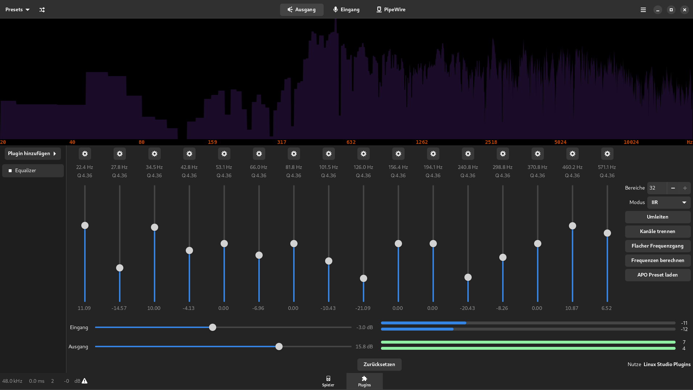
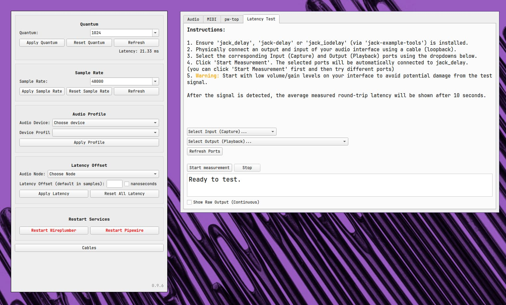
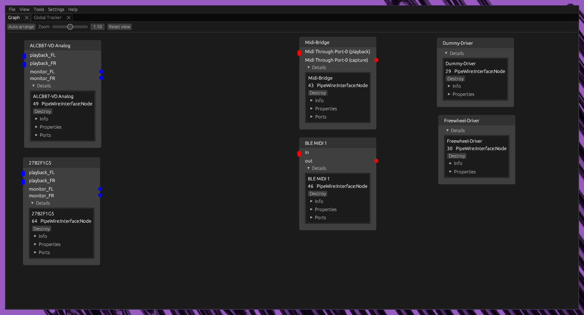
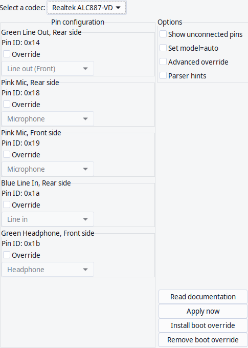
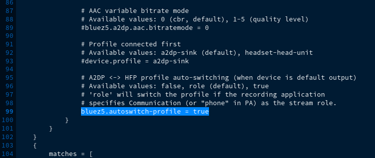
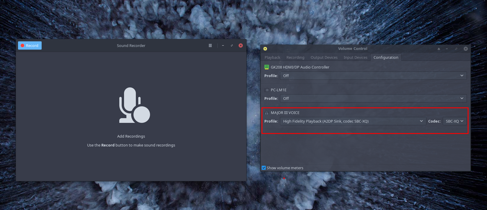
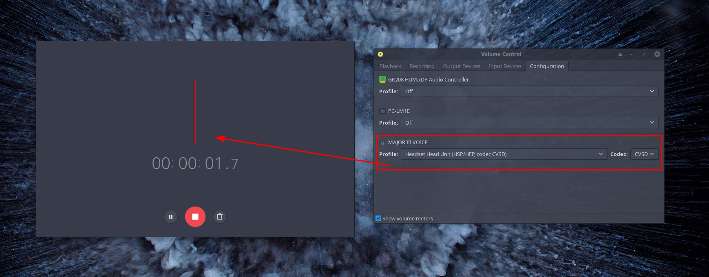

[https://pipewire.org/](https://pipewire.org/)

Up from the 4th release in 2021 called Atlantis new installs will have pipewire enabled per default.

If you are on older installs you can easily switch to pipewire from pulseaudio:

##### Installation:

`sudo pacman -S --needed pipewire-pulse pipewire-alsa pipewire-jack wireplumber`

You can also stay with **`pipewire-media-session`** but it is recommended to use `wireplumber` as **`pipewire-media-session`** is/was only there to start creating Session managers like wireplumber:

[PipeWire#Session_manager](https://wiki.archlinux.org/title/PipeWire#Session_manager) (archwiki)

⚑

#### Switching between pipewire-media-session and wireplumber:

**In case you want to do so, it is recommended to remove old created configs from using pipewire-media-session, inside your user's configurations:**

`rm -R ~/.config/pulse ~/.local/state/wireplumber ~/.local/state/pipewire`

In addition to clean of stuff not needed under pipewire:

You may need to remove `pulseaudio-alsa` and `pulseaudio-jack` packages before that.

The main pipewire package is installed already.

Pipewire uses systemd on userlevel not systemwide for management of the server and automatic socket activation

- `pipewire-media-session.service`
- `wireplumber.service`
- `pipewire-pulse.socket `
- `pipewire.socket`
- `pipewire-pulse.service `
- `pipewire.service`

- `pipewire-pulse.socket `
- `pipewire.socket`
- `pipewire-pulse.service `
- `pipewire.service`

So nothing else is needed to enable manually it will get enabled automatically on the next boot or if you want to run it without rebooting your system run:

`systemctl --user start pipewire-pulse.service `

Check if pipewire is running:

`pactl info`

Server Name should show this:

`Server Name: PulseAudio (on PipeWire 0.3.35)`

or with inxi:

`inxi -Aa`

`Sound Server-2: PulseAudio v: 15.0 running: noSound Server-3: PipeWire v: 0.3.51 running: yes`

## To complete for different use cases, there are these packages that could be needed in addition:

**easyeffects**

Audio Effects for Pipewire applications

**pipewire-zeroconf**

Low-latency audio/video router and processor - Zeroconf support

**pipewire-jack**

Low-latency audio/video router and processor - JACK support

**pipewire-docs**

Low-latency audio/video router and processor - documentation

**pipewire-alsa**

Low-latency audio/video router and processor - ALSA configuration

**Cable** 
[https://github.com/magillos/Cable](https://github.com/magillos/Cable)

PyQT GUI application to dynamically modify Pipewire and Wireplumber settings at runtime. Now, with side by side connections manager

**Coppwr**

[https://github.com/dimtpap/coppwr](https://github.com/dimtpap/coppwr)

Low level control GUI for [PipeWire](https://pipewire.org)

**Hdajackretask**

[https://github.com/alsa-project/alsa-tools/tree/master/hdajackretask](https://github.com/alsa-project/alsa-tools/tree/master/hdajackretask) 
part of `alsa-tools `package (only for hda_intel driver audio chips)

#### Automatic switching Bluetooth Headphone into Headset mode if you need Headset mode for microphone usage:

[https://forum.endeavouros.com/t/pipewire-stable-enough/16944/29?u=joekamprad](https://forum.endeavouros.com/t/pipewire-stable-enough/16944/29?u=joekamprad)

it will not switch automatically, this needs to be enabled..

This will only work if `pipewire-media-session` is installed for `wireplumber` you need to use a different setup.

`mkdir -p ~/.config/pipewire/media-session.d`

`cp /usr/share/pipewire/media-session.d/bluez-monitor.conf ~/.config/pipewire/media-session.d/bluez-monitor.conf`

`nano ~/.config/pipewire/media-session.d/bluez-monitor.conf`

and uncomment the line `bluez5.autoswitch-profile = true` and set it to true ….

save the file .. restart system or services:

`systemctl --user restart pipewire pipewire-pulse`

Working exactly as it says... if you start recording it enables Headset profile and seamlessly turns it back of, when you are stop recording…

**Switch from pipewire to pulseaudio:**

[Pulseaudio](/pulseaudio/)
