import YouTube from "../../components/YouTube.astro";
import { Image } from "astro:assets";
import cover from "../../assets/articles/printers/printer-22040.png";

<Image src={cover} alt="" class="cover" width={440} />

- updated by joekamprad 23. August 2026

### Printers

To get your printer working you will mainly need to install and setup [CUPS](https://www.cups.org/doc/overview.html).

If you choose the printer support option on the installer you will already have a working cups setup (for locally connected printers [usb] ) and only need to add your printer.

To install cups and an usb connected printer if you do not installed the printing option:

`sudo pacman -Syu --needed cups cups-filters cups-pdf avahi nss-mdns ipp-usb ghostscript gsfonts poppler poppler-glib qpdf`

To get full cups with support for many different printers per default. Install this packages on top of that:

`sudo pacman -Syu --needed foomatic-db-engine foomatic-db foomatic-db-ppds foomatic-db-nonfree foomatic-db-nonfree-ppds gutenprint foomatic-db-gutenprint-ppds`

For QT environments (like KDE/plasma LXQT):

`sudo pacman -Syu print-manager --needed`

On GTK based xfce4, cinnamon and others there is system-config-printer Gui:

`sudo pacman -Syu --needed system-config-printer cups-pk-helper python-notify2 python-pysmbc`

Now enable only the socket, which will listen if print-job is calling and then enable the service:

`sudo systemctl enable --now cups.socket`

or using the service, which will be running constantly.

`sudo systemctl enable --now cups.service`

⚠ **note:** Most modern Network Printers should support Driverless Printing. Those supporting [IPP](https://www.pwg.org/ipp/everywhere.html)[Everywhere](https://www.pwg.org/ipp/everywhere.html) or [AirPrint](https://en.wikipedia.org/wiki/AirPrint) should work out of the box. see: [#network-printer](/printers/#network-printer)

Read at the bottom about finding drivers for common printers (skip Network Printers):

[Find printer drivers](/printers/#procedure-to-find-the-right-driver-for-your-printer)

## Note:

in case you have a Multidevice including a scanner, you may want scanning support installed:

`sudo pacman -S sane `

Add `sane-airscan` for AirScan (eSCL) and WSD document scanners.

In case you want a Frontend (GUI) to scan documents, install `simple-scan` package.

General info on supported scanner devices:

[https://wiki.archlinux.org/title/SANE](https://wiki.archlinux.org/title/SANE)

### [Network Printer](#network-printer)

It is required to enable *local hostname resolution* for **avahi** to be able to connect to your network printer, up from EndeavourOS Galileo we set up **mdns** to work out of the box after you changed firewall to allow **mdns** traffic.

So the following is only needed if you have an installation with older ISO, or you are not using EndeavourOS at all.

[https://wiki.archlinux.org/title/Avahi#Hostname_resolution](https://wiki.archlinux.org/title/Avahi#Hostname_resolution)

Avahi provides local hostname resolution using a “*hostname*.local” naming scheme. To enable it, make sure the [nss-mdns](https://archlinux.org/packages/?name=nss-mdns) package is installed and `avahi-daemon.service` is running:

`pacman -Qs nss-mdns ` to see if it is installed

Make sure **avahi-daemon** is running:

`systemctl status avahi-daemon.service`

If not install and enable it:

`sudo pacman -Syu avahi --neededsudo systemctl enable --now avahi-daemon`

In case, you do not have local hostname resolution enabled (EndeavourOS has enabled this by default.)

Edit the file `/etc/nsswitch.conf` and change the `hosts` line to include

`mdns_minimal [NOTFOUND=return]`

before `resolve` and `dns`:

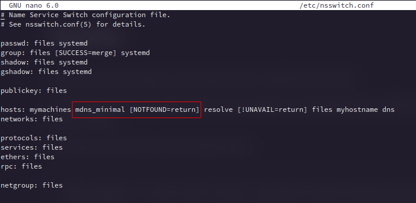

Restart avahi-daemon and NetworkManager after this, or reboot machine:

`sudo systemctl restart avahi-daemon NetworkManager`

Forward for all users (mdns is enabled):

##### Automatically add network printers:

[CUPS](https://www.cups.org/index.html) can use [Avahi](https://wiki.archlinux.org/title/Avahi) browsing to discover unknown shared printers in your network. This can be useful in large setups where the server is unknown. To use this feature, set up local hostname resolution, and start `avahi-daemon.service`

Most modern Network Printers should support Driverless Printing. Those supporting [IPP](https://www.pwg.org/ipp/everywhere.html)[Everywhere](https://www.pwg.org/ipp/everywhere.html) or [AirPrint](https://en.wikipedia.org/wiki/AirPrint) should work out of the box.

Check if yours is supported here: [https://openprinting.github.io/printers/](https://openprinting.github.io/printers/)

This is also very usefull for mobile devices, or for usage in offices where a number of changing network printers is used.

But you can use this at home too, it can be less troublesome in case, as you do not need to set up drivers and URI.

With this you will see local network printers actively showing op as print options when triggering a print from any app, it will not create a printer queue that shows permanently in printer settings.

### Automatic Queue Discovery (Zero-Config)

Automatic Print Queues via `cups-browsed`

By enabling `cups-browsed`, your system listens for mDNS/Bonjour broadcasts from printers on your local network. It automatically creates and removes local CUPS print queues in the background without requiring any manual setup.

Install additional required package:

```bash
sudo pacman -Syu --needed cups-browsed
```

And enable the service: `sudo systemctl enable cups-browsed.service`

To have this working firewall needs to allow mdns and avahi-deamon have to be enabled (as mentioned before)

⚠

**Note on Security & Laptops:** 
*If you frequently use your laptop in public/shared networks (universities, cafes, hotels), *`cups-browsed`* may automatically register every discovered public printer. In that case, keep *`cups-browsed`* disabled*. Having cups-browsed enabled could also cause security risks: [CVE-2024-47176](https://www.cve.org/CVERecord?id=CVE-2024-47176) it is patched in actual versions, but could still call in risk in insecure networks.

##### Firewall is blocking mdns:

To make use of local hostname resolution (mdns) you need to change firewalld from **public** to **home** (zone change).

Assigning a Zone to a device will also be remembered on network changes, so if you leave home network and per example connect to a Wi-Fi network outside it will always use the default set public zone as long as you do not change that manually.

<div class="gallery">

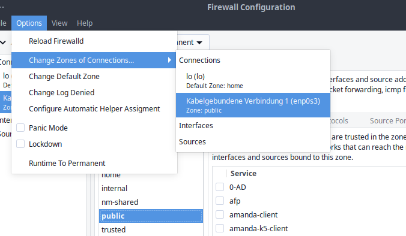

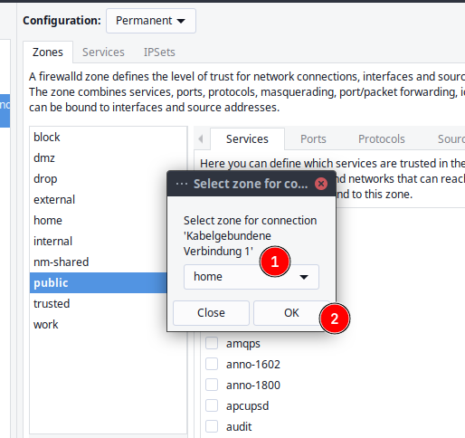

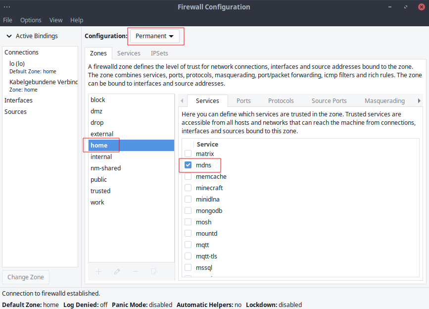

</div>

To make these permanent you need to set Configuration to **Permanent** and run the change to home zone, if **Runtime** is used it will get reset after logout. Now you should see network printers in printer setup tools showing up.

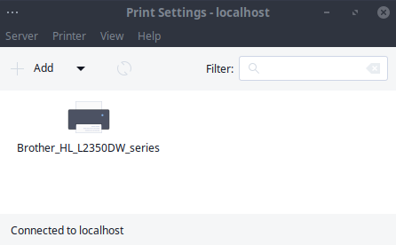

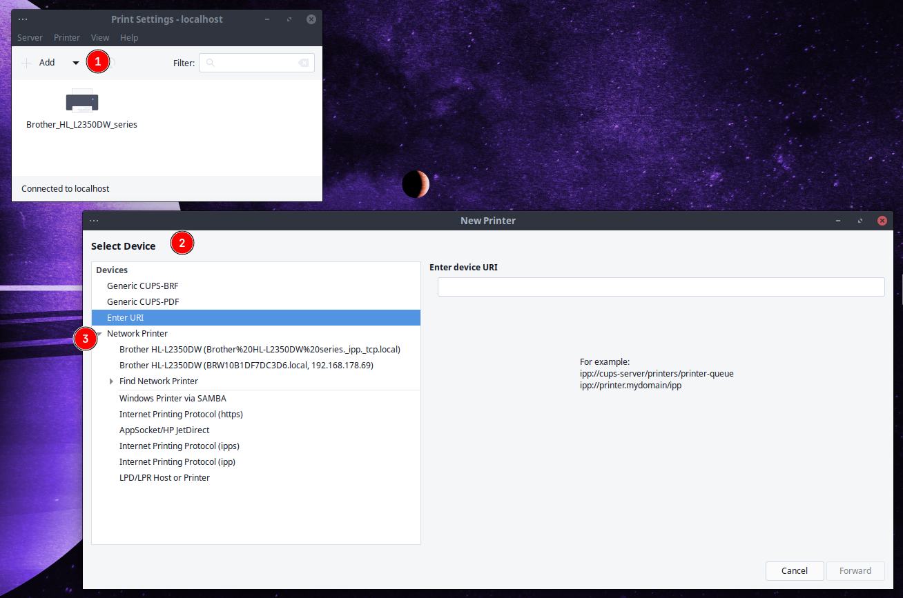

<YouTube url="https://youtu.be/9MCdy8ZGQ1I?si=XW4yzwTTiFgn5TNX" />

### [Procedure to find the right driver for your printer](#procedure-to-find-the-right-driver-for-your-printer)

Go to the [open printing website](https://www.openprinting.org/printers) and search for whether your printer is supported on Linux at all, and what driver options are available.

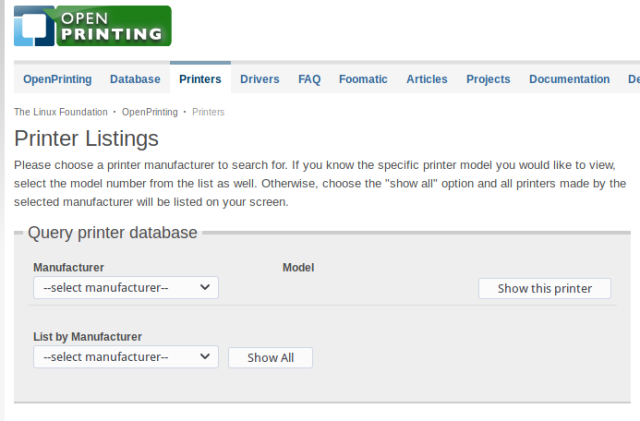

This is what the result will look like:

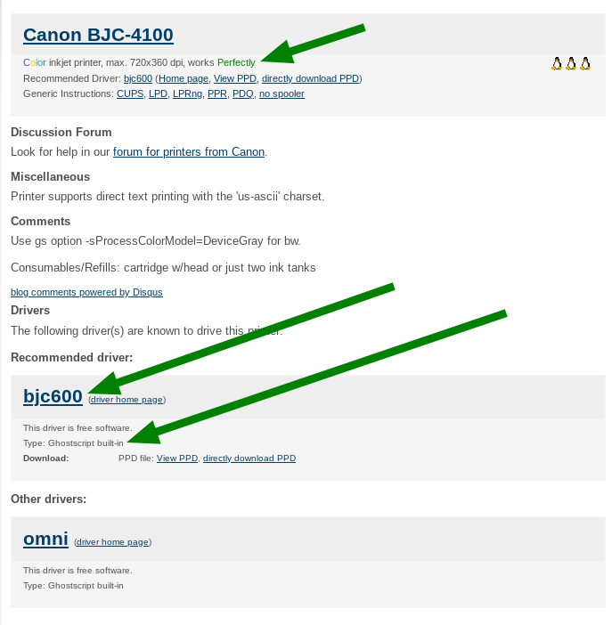

- On top you will see whether or not there is a working driver for your printer
- second it will show available driver options, in the example, you see **Type: Ghostscript built-in**, so go to package search on Archlinux (or use the tool of your choice) you will find [GhostScript](https://www.archlinux.org/packages/extra/x86_64/ghostscript/) (already installed if you followed the tutorial from top to bottom)

So install the driver available for your device, and proceed to install and configure the printer. But take a look at these links first, as it could be that your printer needs some extra configuration done to work properly:

### Some links to common printers' information on Archwiki:

- [Canon](https://wiki.archlinux.org/index.php/CUPS/Printer-specific_problems#Canon) printers
- [Epson](https://wiki.archlinux.org/index.php/CUPS/Printer-specific_problems#Epson) printers
- [HP](https://wiki.archlinux.org/index.php/CUPS/Printer-specific_problems#HP) printers
- [Lexmark](https://wiki.archlinux.org/index.php/CUPS/Printer-specific_problems#Lexmark) printers
- [Oki](https://wiki.archlinux.org/index.php/CUPS/Printer-specific_problems#Oki) printers
- [Samsung](https://wiki.archlinux.org/index.php/CUPS/Printer-specific_problems#Samsung) printers
- [Brother](https://wiki.archlinux.org/index.php/CUPS/Printer-specific_problems#Brother) printers

#### Notes on Common ways to install printer drivers:

Mostly all printers will be using cups as a backend to communicate with your system, but different brands will be needing different ways to get printers fully functional:

#### ***Hewlett*** and ***Packard*** (HP) printers:

Some of the HP-printers needs a proprietary plugin to work, this can be installed by hplip.

Here is an overview of some common printers and working drivers on Archwiki:

[Printer-specific_problems#HP](https://wiki.archlinux.org/title/CUPS/Printer-specific_problems#HP)

Most drivers for hp-printers come with the [HPLIP package](https://www.archlinux.org/packages/extra/x86_64/hplip/) you can install this with:

`sudo pacman -S hplip`

Notice that if `lpinfo -m` tells you that the driver "**requires proprietary plugin**", you need to build/install [hplip-plugin](https://aur.archlinux.org/packages/hplip-plugin/):

`yay -S hplip-plugin`

check [https://developers.hp.com/hp-linux-imaging-and-printing/binary_plugin.html](https://developers.hp.com/hp-linux-imaging-and-printing/binary_plugin.html) for mor information

install *python-pyqt5* to run GUI and hp-toolbox:

`sudo pacman -S python-pyqt5`

now run the program to install new printer queue and the possibly needed proprietary plugin for some hp-printers:

`sudo hp-setup -i` for CLI install without a GUI

or run hp-setup from menu.

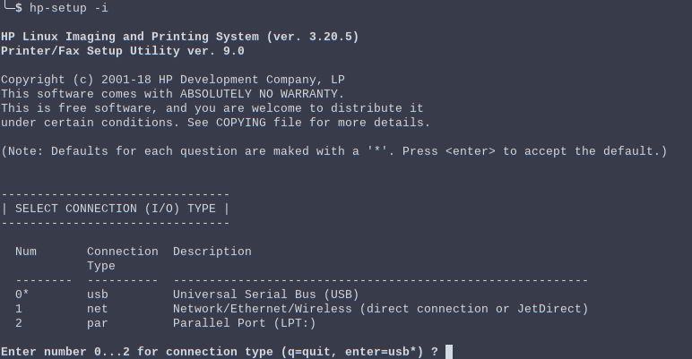

hp-setup from terminal CLI

The tool guides you through the installation - simply read the instructions.

You have your printer added now, so you do not need to set it up again as what follows, but you can use system-config-printer to setup configuration for papersize e.t.c.

## HP printers alternative driver (foo2zjs-nightly)

Uninstall hplip package: `sudo pacman -Rsc hplip`

install [foo2zjs-nightly](https://foo2zjs.linkevich.net/) from [AUR](https://aur.archlinux.org/packages/foo2zjs-nightly/):

`yay -S foo2zjs-nightly`

Use system-config-printer to set up your HP Printer.

Some may use [hpoj](https://aur.archlinux.org/packages/hpoj) ([https://hpoj.sourceforge.net/](https://hpoj.sourceforge.net/)), while for multifunction laser printers [hpuld](https://aur.archlinux.org/packages/hpuld) (HP Unified Linux Driver) might be required.

#### Common printer setup (not if hplip is used):

Use the system-config-printer tool to find and set up your printer:

<div class="gallery">

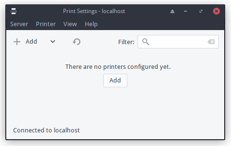

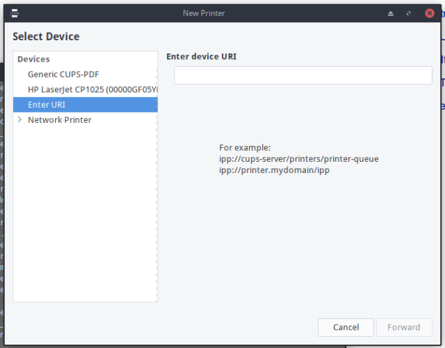

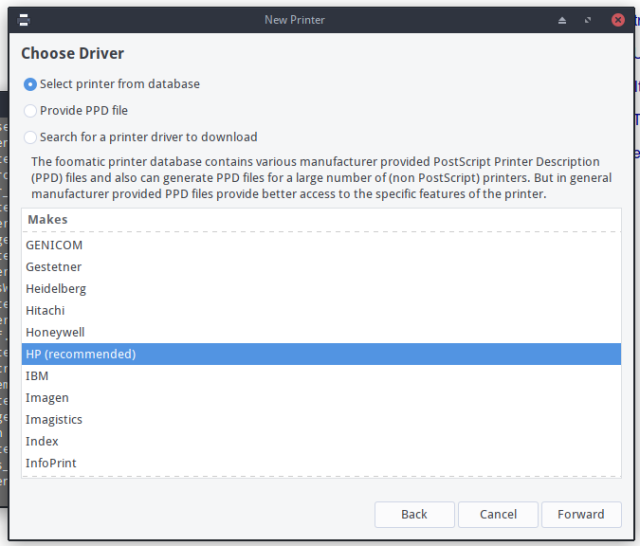

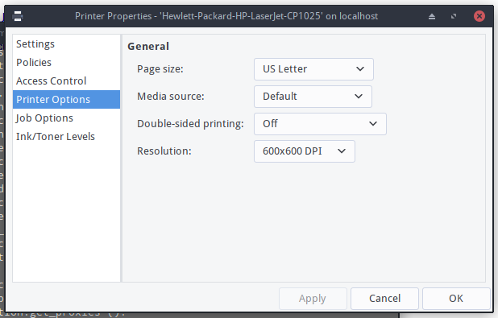

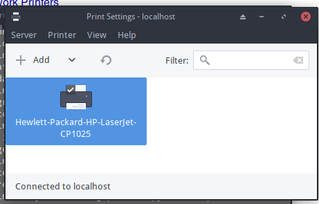

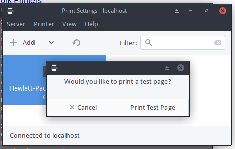

</div>
