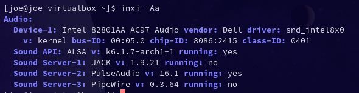

import { Image } from "astro:assets";
import cover from "../../assets/articles/pulseaudio/pulseaudio.png";

<Image src={cover} alt="" class="cover" width={345} />

[https://www.freedesktop.org/wiki/Software/PulseAudio/](https://www.freedesktop.org/wiki/Software/PulseAudio/)

EndeavourOS is using [Pipewire](/pipewire/) per default up from [Atlantis Release](https://endeavouros.com/news/the-atlantis-release-is-in-orbit/), but in case you do not want to use [Pipewire](https://pipewire.org/), or you need to use [Pulseaudio](https://www.freedesktop.org/wiki/Software/PulseAudio/) in case apps you need to use only work with PulseAudio, you can switch back to it:

`sudo pacman -S pulseaudio`

what will replace `pipewire-pulse`

In addition, you may need:

`sudo pacman -S pulseaudio-alsa pulseaudio-jack pulseaudio-bluetooth`

Depending on what is installed on your system it will be needed to remove some Pipewire packages before installing pulseaudio, or it will five you dependency errors:

`sudo pacman -S jack2 pulseaudio-alsa pulseaudio-jack`

It is currently possible again to completely remove pipewire too as I just tested (January 2023):

In this case you **could** use **-Rc** to take the dependencies with it as I want exactly this, but **keep care** to check the exact output to not remove half the system with it !!

`sudo pacman -Rc pipewire`

I would recommend using something like this instead:

`sudo pacman -R pipewire wireplumber libwireplumber gst-plugin-pipewire`

To use pulseaudio simply reboot your system **or** if you can not do that unload pipewire and load pulseaudio:

`systemctl --user stop pipewire-pulse.service`

`systemctl --user start pulseaudio`

`inxi -Aaz` will show if it is all working fine:

For the other way around switching from Pulseaudio to Pipewire:

[Pipewire](/pipewire/)
