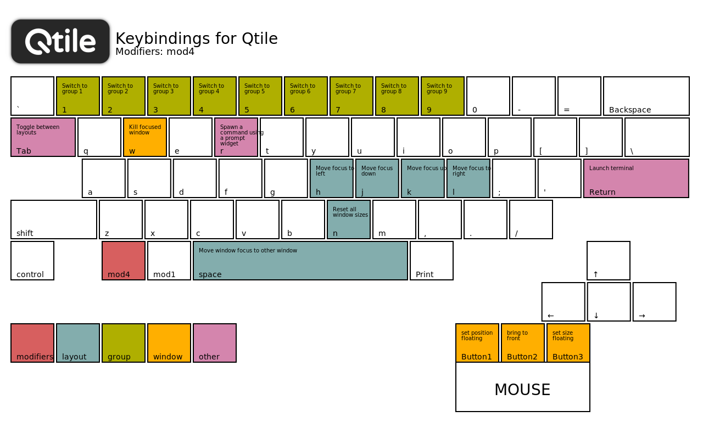

A full-featured, hackable tiling window manager written and configured in Python.

## About community edition

[**Github**](https://github.com/EndeavourOS-Community-Editions/qtile) | [**Forum**](https://forum.endeavouros.com/t/qtile-community-edition-general-discussion/13935)

- **Terminal**: xfce4-terminal
- **File manager**: pcmanfm-gtk3
- **Launcher**: rofi
- **Notifications**: dunst
- **Wallpaper**: feh
- **Compositor**: picom

## Configuration

- Main config file: `~/.config/qtile/config.py`
- Keybindings: `~/.config/qtile/modules/keys.py`
- Bar: `~/.config/qtile/modules/screens.py`
- Widgets: `~/.config/qtile/modules/widgets.py`
- Auto-start: `~/.config/qtile/autostart.sh`

## Keybindings

> **Documentation: 
[https://docs.qtile.org/en/latest/](https://docs.qtile.org/en/latest/)**
