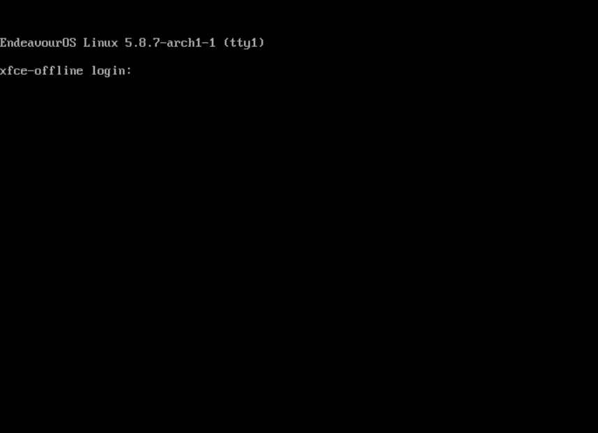
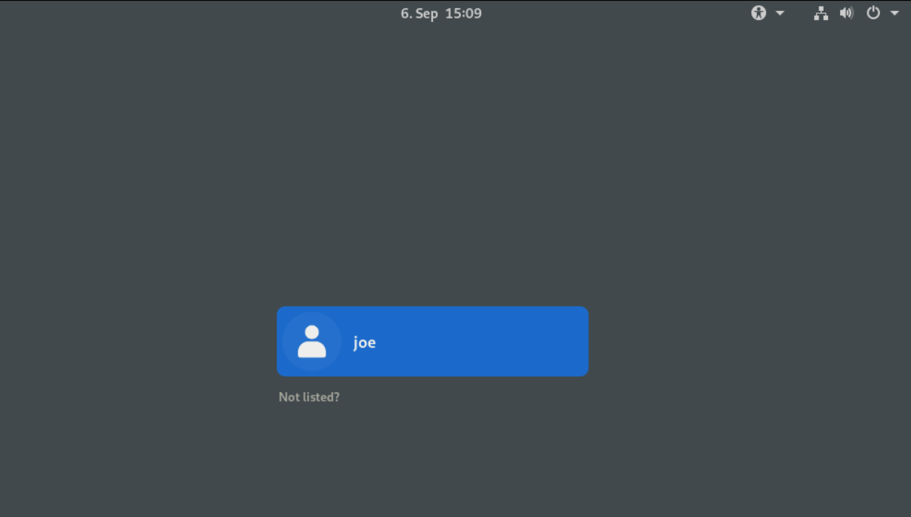

If you have changed to another DE ([**D**esktop **E**nvironment](https://en.wikipedia.org/wiki/Desktop_environment)) after initially installing the offline edition (XFCE4) or you just decided to move over to your freshly discovered DE, you might want to remove the unused one.

In most cases, this isn't easy to do, especially when you switch from GTK to QT, or vice-versa, there are still some dependencies you might need.

So I try to give an example here, the best practice is to update your system first:

`sudo pacman -Syu`

## Use desktop installer helper script **eos-packageslist**:

We have little helper script for handling DE/WM installs **[eos-packageslist](https://github.com/endeavouros-team/PKGBUILDS/blob/master/eos-packagelist/README.md)** that makes the handling more convenient for you:

example:

`eos-packagelist --install "GNOME-Desktop"`

more options on the tool: `eos-packagelist --help`

To list available groups `eos-packagelist --list`

A trick to uninstall per example a fresh offline XFCE4 after you installed an alternative Desktop:

create packages list for default xfce4:

`eos-packagelist "XFCE4-Desktop" > xfce4`

remove packages from that list:

`sudo pacman -Rc - < xfce4`

But check exactly what will get removed here too dependencies can be a hell ;)

### Most save way to handle is from TTY!

login to TTY4:

give username and password to login as user.

now follow these steps:

1. uninstall old Desktop: `eos-packagelist "XFCE4-Desktop" > xfce` followed by: `sudo pacman -Rc - < xfce4`
2. install new Desktop: `eos-packagelist --install "GNOME-Desktop"`
3. Make sure base system is intact: `eos-packagelist --install "Desktop-Base + Common packages"`
4. change Display Manager: `sudo systemctl -f enable GDM`

You can do this also while logged in to your current Desktop, but uninstalling it while using it can cause freezing.

Unfortunately, there isn't a full-proof way to do this, so always take a look at the exact terminal output, and be careful you do not uninstall certain system relevant packages or packages you have installed manually like a preferred browser or other apps.

If you remove an DE make sure to enable the new DM (LoginManager) before rebooting the system or you will boot into TTY without graphical login like this:

In that case, you will need to enable the DM manually:

`sudo systemctl -f enable --now GDM`

To get the graphical Login-Manager show up again.

This is only one example of the situation you could run into, but most of the time these steps will be enough for any DE change.

In case you are encountering issues, don't forget to ask our helpful community.

### You can find the lists also in this GitHub Repo:

[reinstall DE commands at GitHub](https://github.com/endeavouros-team/EndeavourOS-packages-lists)

So choose your new DE and copy and paste the command in your Terminal:

In this example I use GNOME:

`git clone https://github.com/endeavouros-team/EndeavourOS-packages-lists.git`

`cd EndeavourOS-packages-lists`

`ls` will list the files

`sudo pacman -S --needed - < gnome`

will install Gnome packages.
