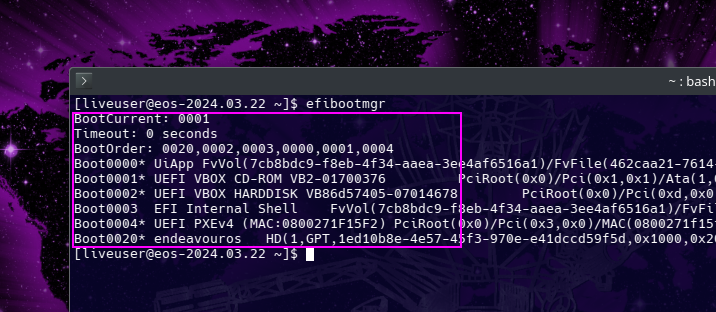
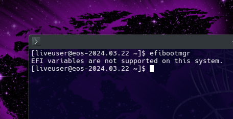
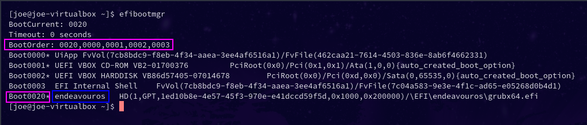

EndeavourOS comes with systemd-boot as default install option, but in case you opted to install using Grub.

It happens sometimes due to an update or perhaps because of your tinkering with the system, Grub refuses to boot.

Don't worry there are only a couple of steps needed to repair GRUB, so you can get into the system as you're used to.

First, you have to Chroot into the system, just follow the steps described in these articles:

[Arch-Chroot wiki on discovery](/arch-chroot/)

To validate if you are on UEFI or not run:

`efibootmgr`

It Will show like so if you are booted in UEFI mode.

And like this if you are booted in Bios legacy mode (MBR)

Before you proceed, these instructions are made for a standard automatic installation, if you installed the system with a modified manual partition scheme, just ask our community on the forum and make sure you provide them with the needed logs with our [log tools](/how-to-include-systemlogs-in-your-post/).

##### Repair GRUB on EFI/UEFI systems (Most modern systems)

Before you are going to repair GRUB, you should also check your EFI-boot-settings, this also can be the reason why GRUB isn't booting.

1. reinstall GRUB files:

Only `grub-install` is needed no need to add any options, at least on EndeavourOS where we use the default efi-path **/boot/efi** what is the default used for the command already. The `--bootloader-id` option will create a new entry with the given ID that in some cases will not get set as the default boot entry in the firmware.

If not used it will use the `GRUB_DISTRIBUTOR=` entry from the grub main config in `/etc/default/grub`, in case this is not the same as used before for bootloader-id it will create a new entry.

default boot entry in this **example** is 0020 that has the bootloader-id endeavouros (default set one)

2. Rebuild the grub.cfg configuration file:

`grub-mkconfig -o /boot/grub/grub.cfg`

Now GRUB should be repaired, and you should be able to boot into your system again.

If you have more than one operating system installed on your machine, and enabled the usage of os-prober in your `/etc/default/grub `config, grub-mkconfig will scan for other IOS and add them to boot menu in case.

##### Repair GRUB on BIOS systems (older systems or legacy boot enabled CSM)

1. reinstall GRUB:

`grub-install --target=i386-pc /dev/sdX`

Remember, the `X` must be replaced with the letter that is marked in your situation, for instance, `/dev/sda`

2. Rebuild grub.cfg configuration file:

`grub-mkconfig -o /boot/grub/grub.cfg`

Now, GRUB is repaired, and you should be able to boot into your system again.

If you have more than one operating system installed on your machine, and enabled the usage of os-prober in your `/etc/default/grub `config, grub-mkconfig will scan for other OS and add them to boot menu in case.

## ℹ

##### Grub no longer has os-prober enabled per default:

[https://wiki.archlinux.org/title/GRUB#Detecting_other_operating_systems](https://wiki.archlinux.org/title/GRUB#Detecting_other_operating_systems)

os-prober is troublesome in some cases, but it is used to autodetect other OS to add them to boot menu.

To re-enable os-prober usage for grub:

edit `/etc/default/grub` and change this:

GRUB_DISABLE_OS_PROBER=true 
to false: 
GRUB_DISABLE_OS_PROBER=false

save the file and regenerate grub.cfg again:

`sudo grub-mkconfig -o /boot/grub/grub.cfg`

##### Alternative to GRUB

There is an alternative for using GRUB, it is called rEFInd, and you can read more about it over here:

[How to install rEFInd?](/how-to-install-refind/)
