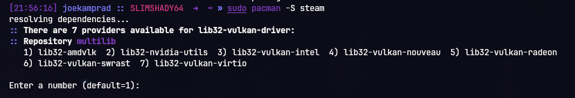

This article will guide you through the setup of game launchers on Arch Linux.

##### **Table of contents:**

1. **[Steam](#steam)**
2. **[Lutris](#lutris)**
3. **[Wine](#wine)**

> **Sources:** 
[**Linux gaming guide**](https://forum.endeavouros.com/t/linux-gaming-guide/7339) by **@[keybreak](https://forum.endeavouros.com/u/keybreak)**

## Steam

📖 **TL;DR**

1. Enable **Proton** in **Steam play**.
2. Check your game in **[protondb](https://www.protondb.com/)** for game state / recommendations.
3. Problems? Try **[GloriousEggroll](https://github.com/GloriousEggroll/proton-ge-custom/releases)** or **[TK-Glitch](https://github.com/Frogging-Family/wine-tkg-git/releases)** engines or see full **[4.4 Problems](#4-problems)** section.

- Config location: `~/.steam`
- **Proton** engines location: `~/.steam/steam/steamapps/common`

Keep in mind that **Proton** will be installed in the same library as the first Steam Play game you try to launch, and will only be installed in one location.

- Game **PREFIX** location, where [appid] is your game id: (look up **[steamdb](https://steamdb.info/)** if in doubt) 
`~/.steam/steam/steamapps/compatdata/[appid]/pfx/`

**[More Proton FAQ](https://github.com/ValveSoftware/Proton/wiki/Proton-FAQ)**

### 1. Setup

1. Install package:

```bash
pacman -S steam
```

Make sure to select a valid vulkan package fitting your used GPU (graphics-card) it will show up like this:



And read the output of the install process to make sure inserting the correct number.

1. If using a controller, also install:

```bash
yay -S game-devices-udev
```

1. Launch client and login to your account.
2. Enable **Proton** to play Windows games with Linux Steam;
   - Steam -> Settings -> Steam Play
   - ✓ Enable Steam Play for supported titles.
   - ✓ Enable Steam Play for all other titles.
   - ▾ **Run other titles with...** 
(here you can choose a **Proton** version which will be used globally)

### 2. Install games

Now you're ready to install games!

1. Download game.
2. Go to Library tab.
3. Select your game title on left panel.
4. Hit Play!

### 3. Configuration

To configure **Proton** through Environment variables, which you may see in **protondb** reports; 
(see available **[options](https://github.com/ValveSoftware/Proton#runtime-config-options)**)

1. Select game title on left panel.
2. Right Button -> Properties -> Set launch options…
3. Enter desired variables, separated by a space and ending with `%command%`

- To disable variable, add `=0` after
- To enable, use non `0` values
- For example, let's enable **[DXVK HUD](https://github.com/doitsujin/dxvk#hud)** 
`DXVK_HUD=full %command%`
- Install additional original Windows libraries with **Winetricks** (if required), where [appid] is your game id: 
(look up **[steamdb](https://steamdb.info/)** if in doubt) 
`WINEPREFIX="~/.steam/root/steamapps/compatdata/[appid]/pfx/" winetricks "win7"`

To use specific version of **Proton** for specific game (may be useful if latest has problems);

1. Select game title on left panel.
2. Right Button -> Properties
   - ✓ Force the use of a specific Steam Play compatibility tool.
   - ▾ From dropdown menu choose **Proton** engine.

Install custom **Proton** engine; 
(eg. **[GloriousEggroll](https://github.com/GloriousEggroll/proton-ge-custom/releases)** or **[TK-Glitch](https://github.com/Frogging-Family/wine-tkg-git/releases)**)

1. Create `~/.steam/root/compatibilitytools.d` directory, if it does not exist.
2. Extract archive to `~/.steam/root/compatibilitytools.d`
3. Restart **Steam**.
4. Select custom **Proton** engine for specific game or globally.

- Change default location for games library;
  - Steam -> Settings -> Downloads -> Steam library folders
  - Add library folder 
(you can choose for example another drive)
  - Right Button -> Make Default folder 
(if you want it as default)

- If you want to use NTFS disks with Linux Steam: **[Using a NTFS disk with Linux and Windows](https://github.com/ValveSoftware/Proton/wiki/Using-a-NTFS-disk-with-Linux-and-Windows)**
- Create log file to check if everything fine or file a bug, use Environment variable: 
`PROTON_LOG=1 %command%`
- Log will be saved at this location, where [appid] is your game id (look up **[steamdb](https://steamdb.info/)** if in doubt): 
`~/steam-[appid].log`

### 4. Problems

- Game doesn't launch or crash:
  - See if there are some known solutions to problems of this game at **[protondb](https://www.protondb.com/)** or **[lutris](https://lutris.net/)**.
  - Try to disable **DXVK** `PROTON_USE_WINED3D=1 %command%` If it works without **DXVK**.
  - Still doesn't work? Check **[Requirements](https://github.com/ValveSoftware/Proton/wiki/Requirements)** and **[Proton bugs](https://github.com/ValveSoftware/Proton/wiki/Checklist-Proton-bugs)**. If you have an AMD GPU **[check this](https://github.com/ValveSoftware/Proton/wiki/For-AMD-users-having-issues-with-non-OpenGL-games)**.
- Game stuttering on first launch:
  - This is normal, because shaders have to be loaded first. They are written directly into shader cache.

## Lutris

Best all-around game launcher, can be used for: **Wine**, **Steam**, **Native**, **Emulators** 
See how at **[2. Configuration](#2-configuration)** and **[4. Game configuration](#4-game-configuration)**.

- Config locations: 
`~/.config/lutris` 
`~/.local/share/lutris`
- Icons created by **Lutris** (might be useful to backup / transfer your library): 
`~/.local/share/icons/hicolor/128x128/apps`
- Wine / Proton engines location: 
`~/.local/share/lutris/runners/wine`
- A lot of useful libraries & runtimes which for example allow to easily run **Proton** without steam client! 
`~/.local/share/lutris/runtime`

### 1. Setup

Install package:

```bash
pacman -S lutris
```

### 2. Configuration

You can configure **Defaults** for each runner (default settings when you add new game).

1. On left panel hover over **Wine** tab and select ⚙ cog.
2. ✓ **Show advanced options** on bottom left.
3. Runner options tab:
   - **Wine version** - most important, here you can set / update the default **Engine** which will be used for all games. It can use anything installed: **System, PlayOnLinux, Steam,** or any **Engine** put in: 
`text ~/.local/share/lutris/runners/wine` 
`text ~/.PlayOnLinux/wine/linux-amd64`
   - ✓ **Enable DXVK/VKD3D** - useful to turn off globally, if your GPU doesn't support Vulkan.
4. System options tab:
   - ✓ **Restore resolution on game exit**. (may be useful in some cases)
   - ✓ **Switch to US keyboard layout**. (may solve problems for multi-lingual inputs)

### 3. Add game

1. Press to add a game, let's do a minimal setup required to start.
2. Game info tab
   - **Name** - enter name of your game, you can name it whatever makes sense for you.
   - **Runner** - select **Wine**.
   - **Release year** - optional, but nice in case you have big library. 
(you can look up year of your game in **[PCgamingWiki](https://www.pcgamingwiki.com/wiki/Home)**)
3. Game options tab
   - **Executable** 
Some games have multiple executables, prefer **x64** ones first! 
`text ~/.PlayOnLinux/wineprefix/Crysis/drive_c/Games/Crysis/Bin64/Crysis.exe`
   - **Wine prefix** 
`text ~/.PlayOnLinux/wineprefix/Crysis`
4. **Save** - your game will now be available on the list.
5. If there's no game image, that's caused by **Name** not being exactly identical to its database one. 
Fix with **Identifier**. Look up the game on **[Lutris db](https://lutris.net/games/crysis/)** 
Get this ID: `https://lutris.net/games/crysis`/ and paste it into **Game settings**.
6. Select game, Right  Button -> Configure
7. **Identifier** Change and paste `crysis`.
8. Apply
9. Save

### 4. Game configuration

Here are some essential configuration options to know.

1. Select game, Right  Button -> Configure
2. Runner options tab:
   - **Wine version** - you can force **Engine** for a specific game (will be used even if you change global, so don't forget to change that option back if needed).
   - ✓ **Enable DXVK/VKD3D** in most cases it's best to use, but can be toggled in case of problems.
   - **DXVK version** - you can force specific **DXVK** version for a specific game, in case of problems.
   - ✓ **Enable Esync** - best to enable in most games which heavily use CPU or to avoid stuttering.
   - ✓ **Enable Fsync** - same as **Esync**. Should be better, but **Engine** and **Kernel** must support it! (**Lutris** will alert you if it's not supported by **Engine** in use)

1. System options tab:
   - ✓ **Disable Lutris runtime**
2. Game options tab:
   - **Arguments** - a very useful option to pass game command-line options. 
(for example in **Crysis** to force DirectX 10 mode: `-dx10`)
3. Install game.

**Lutris** can auto-install the required **Engine** and **Winetricks**. Also you can download an **Install script**. 
⚠ Install scripts are not always a recommended method of installation;

- Scripts are made by regular users and can be outdated or not follow current best practices.
- Scripts can use a win32 **Engine**. (you can change Wine / Proton version later, but not it's **ARCH**!)

1. Find your game from **Lutris** (or on **[Lutris db](https://lutris.net/games)**) Search -> Search Lutris.net
2. Select game, Install
3. Choose **Installer script** to use, it can be either of; **Wine** / **Steam** / **Emulator** - choose wisely!
4. From now on follow dialogs and install whatever is offered to you.
5. Turn off **Lutris** search mode, now it will be available in your games library and you can begin playing.

```
 TIP: When using Proton or Protonified engine with Lutris you MUST use option:
Disable Lutris runtime either globally or for specific game.
```

## Wine

📖 **TL;DR**

1. Create non-system **WINEPREFIX** with non-system **Wine (amd64)**: 
**[POL](https://www.playonlinux.com/wine/binaries/phoenicis/)** (staging-linux-amd64, upstream-linux-amd64) 
⚠ It's better to use separate prefix for each game.
2. Check **[protondb](https://www.protondb.com/)** and **[lutris](https://lutris.net/)** for game state / recommendations.
3. Install game. (prefer DRM-free installers like **[GOG](https://www.gog.com/)**)
4. Use **Lutris** as launcher.
5. Enable **DXVK** and **Esync**.
6. Problems? Try **[GloriousEggroll](https://github.com/GloriousEggroll/wine-ge-custom/releases)** or **[TK-Glitch](https://github.com/Frogging-Family/wine-tkg-git/releases)** engines, or see full **[7. Problems](#7-problems)** section.

```
 TIP: Do NOT launch wine / winetricks directly from launcher or terminal without ENVIRONMENT VARIABLES, as this will add unnecessary stuff and mess with your mime-associations, icons, etc.
```

- Default **WINEPREFIX** for system version of Wine: 
(not needed for games, can be safely removed if not used by anything else) 
`~/.wine`
- **Mono** (FOSS .NET by Wine) & **Gecko** (FOSS Internet Explorer by Wine) installers location: 
(both auto-installed while creating **WINEPREFIX**) 
`~/.cache/wine`
- Winetricks downloaded installers location: 
`~/.cache/winetricks`

### 1. Prepare

Create the following bash scripts and make them executable with chmod;

`create-structure.sh`

```
#!/bin/bash
title=$(basename "$0")
echo -n -e "\033]0;$title\007"

# Colors
c0=

\e[0m'
c1=$(tput setaf 202)
c2=$(tput setaf 154)
b0=

\e[25m'
b1=

\e[5m'

# Force output in english
export LC_ALL=en_US.UTF-8

# OPTIONS
WINE_ROOT="$HOME/.PlayOnLinux"

STRUCTURE=(
    "$WINE_ROOT"
    "$WINE_ROOT/wineprefix"
    "$WINE_ROOT/wine"
    "$WINE_ROOT/wine/linux-amd64"
    "$WINE_ROOT/wine/linux-x86"
)

main() {

    create_structure
}

create_structure() {

    echo
    echo "   ---------------   Create structure   ---------------   "
    echo

    for path in "${STRUCTURE[@]}";
    do
        if [ ! -e "$path" ];
        then
            mkdir -p "$path" \
            &amp;&amp; echo "${c2}[+]${c0} ${path}" \
            || echo "${c1}[${b1} ${b0}]${c0} ${path}"
        else
            echo "${c2}[x]${c0} ${path}"
        fi
    done

    echo
    echo "${c2}Script finished!${c0}"
}

main "$@"
```

`create-prefix.sh`

```
#!/bin/bash
title=$(basename "$0")
echo -n -e "\033]0;$title\007"

# Colors
c0=

\e[0m'
c1=$(tput setaf 202)
c2=$(tput setaf 154)
b0=

\e[25m'
b1=

\e[5m'

# Force output in english
export LC_ALL=en_US.UTF-8

# OPTIONS
NAME="GameName"
ENGINE="5.11-staging"
ARCH="amd64"

WINE_ROOT="$HOME/.PlayOnLinux"
PREFIX="${WINE_ROOT}/wineprefix/${NAME}"
WINE="${WINE_ROOT}/wine/linux-${ARCH}/${ENGINE}"
LOADER="${WINE}/bin/wine"
SERVER="${WINE}/bin/wineserver"

main() {

    create_prefix
}

create_prefix() {

    echo
    echo "   ----------------   Create prefix   -----------------   "
    echo

    ARCH=$([ "$ARCH" == "amd64" ] &amp;&amp; echo "win64" || echo "win32")

    env WINEARCH="$ARCH" WINEPREFIX="$PREFIX" WINELOADER="$LOADER" WINESERVER="$SERVER" WINEDEBUG="-all" wineboot
    env WINEPREFIX="$PREFIX" WINE="$LOADER" WINESERVER="$SERVER" winetricks isolate_home mimeassoc=off

    echo
    echo "${c2}Script finished!${c0}"
}

main "$@"
```

`install.sh`

```
#!/bin/bash
title=$(basename "$0")
echo -n -e "\033]0;$title\007"

# Colors
c0=

\e[0m'
c1=$(tput setaf 202)
c2=$(tput setaf 154)
b0=

\e[25m'
b1=

\e[5m'

# Force output in english
export LC_ALL=en_US.UTF-8

# OPTIONS
SETUP="Setup.exe"
NAME="GameName"
ENGINE="5.11-staging"
ARCH="amd64"

WINE_ROOT="$HOME/.PlayOnLinux"
PREFIX="${WINE_ROOT}/wineprefix/${NAME}"
WINE="${WINE_ROOT}/wine/linux-${ARCH}/${ENGINE}"
LOADER="${WINE}/bin/wine"
SERVER="${WINE}/bin/wineserver"

main() {

    run "${SETUP}"
}

run() {

    echo
    echo "   ---------------------   Run   ----------------------   "
    echo

    local file="$1"
    [ -f "$file" ] || exit_error "$file doesn't exist"

    if echo "$file" | grep -iq '.msi';
    then
        echo "${c2}[&gt;] run .msi ${c0} $file"
        env WINEPREFIX="$PREFIX" WINELOADER="$LOADER" WINESERVER="$SERVER" WINEDEBUG="-all" WINEDLLOVERRIDES="winemenubuilder.exe=d" msiexec /i "$file"
    else
        echo "${c2}[&gt;] run .exe ${c0} $file"
        env WINEPREFIX="$PREFIX" WINELOADER="$LOADER" WINESERVER="$SERVER" WINEDEBUG="-all" WINEDLLOVERRIDES="winemenubuilder.exe=d" "$LOADER" "$file"
    fi

    echo
    echo "${c2}Script finished!${c0}"
}

main "$@"
```

`tricks.sh`

```
#!/bin/bash
title=$(basename "$0")
echo -n -e "\033]0;$title\007"

# Colors
c0=

\e[0m'
c1=$(tput setaf 202)
c2=$(tput setaf 154)
b0=

\e[25m'
b1=

\e[5m'

# Force output in english
export LC_ALL=en_US.UTF-8

# OPTIONS
TRICKS=(
    win7
)
NAME="GameName"
ENGINE="5.11-staging"
ARCH="amd64"

WINE_ROOT="$HOME/.PlayOnLinux"
PREFIX="${WINE_ROOT}/wineprefix/${NAME}"
WINE="${WINE_ROOT}/wine/linux-${ARCH}/${ENGINE}"
LOADER="${WINE}/bin/wine"
SERVER="${WINE}/bin/wineserver"

main() {

    tricks
}

tricks() {

    echo
    echo "   --------------------   Tricks   --------------------   "
    echo

    printf "%s\n" "${TRICKS[@]}"

    env WINEPREFIX="$PREFIX" WINE="$LOADER" WINESERVER="$SERVER" winetricks "${TRICKS[@]}"

    echo
    echo "${c2}Script finished!${c0}"
}

main "$@"
```

### 2. Setup

1. Install **Wine** package (it doesn't really matter which one you use as system version):

```bash
pacman -S wine
```

```bash
pacman -S wine-staging
```

1. Install **Winetricks** package:

```bash
pacman -S winetricks
```

1. Run **create-structure.sh** script, it will create folder structure in: 
`~/.PlayOnLinux` ├── wine │ ├── linux-amd64 │ └── linux-x86 └── wineprefix

### 3. Engine

With **Wine** you can use any **Engine**! Few things to know;

- Usually it's best to use the latest version, unless there is a known problem or an update has broken compatibility for a specific game.
- You can upgrade or downgrade to any **Engine** and **Version** without problems. Just note that if you go from **Wine** to **Proton** your new user directory will move to: `drive_c/users/steamuser/`

If your game configs / saves are in an old user directory, just move them to **steamuser** or create a symlink. Do the opposite to update from **Proton** to **Wine**.

- You can use only one **ARCH** for **PREFIX** since it’s created, and in most cases you should use **amd64**!

Best to choose engines in the given order, in case of problems;

- **[PlayOnLinux](https://www.playonlinux.com/wine/binaries/phoenicis/)** (**staging-linux-amd64**, **upstream-linux-amd64**) 
(best place for compiled versions of original **Wine** / **Wine-staging**)
- **[TK-Glitch](https://github.com/Frogging-Family/wine-tkg-git/releases)** (**Wine** version)
- **[GloriousEggroll](https://github.com/GloriousEggroll/wine-ge-custom/releases)**
- **Proton** **[Compile source](https://github.com/ValveSoftware/Proton)** or if you have **Steam** client download it and copy this dir: 
`~/.steam/root/steamapps/common/Proton 5.0/dist` 
...to your **Engines** path and rename it **5.0-proton**: 
`~/.PlayOnLinux/wine/linux-amd64/5.0-proton`

Once downloaded, put engine in: `~/.PlayOnLinux/wine/linux-amd64`

### 4. Create prefix

To now demonstrate a complex case, let's install **Crysis** from **GOG**. 
After all, this is the most important question of gaming: *"But can it run Crysis?!"*

1. Open **create-prefix.sh** with a text editor of your choice, and change these options: 
`# OPTIONS NAME="Crysis" ENGINE="5.11-staging"`
2. Run **create-prefix.sh** script. This will create your prefix at: 
`bash ~/.PlayOnLinux/wineprefix/Crysis`

```
 TIP: Such a PREFIX is fully portable, if you remove this dir with symlinks to devices:
~/.PlayOnLinux/wineprefix/Crysis/dosdevices
Now it's safe to copy / backup PREFIX.
It will be auto-created next time you run anything in PREFIX - so it's safe!
```

### 5. Install game

1. Open **install.sh** with a text editor of your choice, and change these options: 
`# OPTIONS SETUP="setup_crysis_2.0.0.7.exe" NAME="Crysis" ENGINE="5.11-staging"` 
You can use absolute or relative to Setup executable, if you use relative, like i did here - just copy script to your setup directory. Make sure your **NAME** and **ENGINE** variables are same as on **[4. Create prefix](#4-create-prefix)**.
2. Run **install.sh** script.
3. Follow installer steps and install to some simple location like `C:\Games\Crysis` 
if possible avoid and **disable**; 
Any redistributable software like **DirectX**, **Microsoft Visual C++**, etc. 
Create desktop icon / link.

```
 TIP: If you don't want auto-installed proprietary software (GOG installers don't ask you about installing redistributables);
Create temporary PREFIX CrysisTemp.
Install game as usual.
Move game folder to clean Crysis PREFIX.
Remove CrysisTemp PREFIX.
```

1. This is a rare case, but if you look on **[Lutris db](https://lutris.net/games/crysis/)** see **Wine GOG version**. 
Install -> dropdown ▾ -> Views install script. 
You will see some **winetricks** recommendations:

```
d3dx10_43
d3dcompiler_43
vcrun2005
```

You can try without, but in general Lutris has good recommendations.

- **d3d** stuff - see more on **[unfinished DirectX 10 effects API](https://github.com/doitsujin/dxvk/issues/551)**.
- **vcrun2005** is needed for some things like game saves (without it game will crash).

⚠ Always recommended to add `win7` at the end of tricks, because sometimes **winetricks** reset OS to install some software properly!

1. Open **tricks.sh** with text editor of your choice, and change this value: 
`# OPTIONS TRICKS=( d3dx10_43 d3dcompiler_43 vcrun2005 win7 ) NAME="Crysis" ENGINE="5.11-staging"` 
Make sure your **NAME** and **ENGINE** variables are same as on **[4. Create prefix](#4-create-prefix)**.
2. Run **tricks.sh** script. 
Just proceed with installers windows-style, if asked about **Sending anonymous information** or something along those lines - select **NO**.

### 6. Configuration

Use **Lutris** as a launcher, it will make things much easier! 
Read from **[Lutris](#lutris)** up to **[4. Game configuration](#4-game-configuration)**.

### 7. Problems

- Installer gives errors such as: 
`Runtime Error (at -1:0): Cannot Import dll: C:\users\user\Temp\is-VADAE.tmp\isskin.dll``err:module:import_dll Library MFC42.DLL (which is needed by L"C:\\users\\ready2rumbelx\\Temp\\is-L6E45.tmp\\isskin.dll") not found`
  - To solve, install those **winetricks** with **tricks.sh**: `mfc42 vcrun6`
- Installer fails;
  - Prefer simple installers and no DRM if possible, these are main points of failure. (for example **[GOG](https://www.gog.com/)**)
  - If a retail game (CD / DVD) fails to install directly in **Wine**, then install on a Windows VM and copy installed game folder in your **WINEPREFIX**.
  - Still doesn’t work? Please report bug to **[Wine](https://bugs.winehq.org/)**.
- Launch fails or crashes during gameplay;
  - Disable **DXVK / VKD3D**
  - If it works without **DXVK**, **[report bug](https://github.com/doitsujin/dxvk/issues)** to **DXVK**
  - ✓ **Disable Lutris runtime**.
  - Try another **Engine** or version.
- **Multiplayer** games might not work because of anti-cheat.

```
 TIP: To disable network for WINEPREFIX use Firewall.
```
