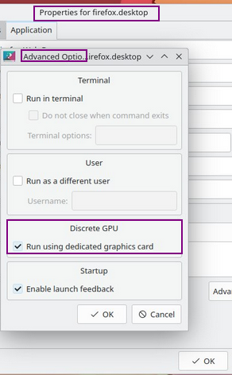

import YouTube from "../../components/YouTube.astro";
import { Image } from "astro:assets";
import cover from "../../assets/articles/switcheroo-control/hybrid.png";

<Image src={cover} alt="" class="cover" width={440} />

[Switcheroo-Control](https://gitlab.freedesktop.org/hadess/switcheroo-control) D-Bus service to check the availability of dual-GPU, integrates with the settings of KDE/plasma Gnome, and Cinnamon: “Launch using Dedicated Graphics Card” menu item appears on application starter contextual menu per example.

<YouTube url="https://youtu.be/NJqktGagD9E" />

Install it and enable the needed systemd-service:

`sudo pacman -Syu switcheroo-controlsudo systemctl enable --now switcheroo-control`

It has CLI tool:

`switcherooctl list`

*List the known GPUs. The device number can be used to specify the GPU to launch on for the launch command. This is the default command if no commands are passed to switcherooctl.*

`switcherooctl launch [OPTION] COMMAND `

*on a specific GPU. If no GPU are specified the first discrete (non-default) GPU is used, or the default GPU if there's no discrete GPU.*

Options

`-g --gpu=GPU` 
*The GPU to launch on. The GPU identifier can be gathered using the list command.*

**Some desktops have it integrated, providing settings in launchers for convenience:**

## **GNOME**

[https://wiki.archlinux.org/title/PRIME#GNOME_integration](https://wiki.archlinux.org/title/PRIME#GNOME_integration)

GNOME will respect the `PrefersNonDefaultGPU` property in the [desktop entry](https://wiki.archlinux.org/title/Desktop_entry). Alternatively, you can launch applications with GPU by right-clicking on the icon and choosing *Launch using Discrete Graphics Card*.

## KDE/plasma

It will show the option on Launcher settings:

## Cinnamon

The same option in Launcher Settings to tag "*Use Dedicated GPU if available*" will show up there.

[Optimus Notebooks (hybrid graphics)](/nvidia-optimus-notebooks-hybrid-graphics/)

---

credits:

[Hilmy Abiyyu A.](https://www.flaticon.com/free-icons/monitor)

[Good Ware](https://www.flaticon.com/free-icons/gpu)

[Freepik](https://www.flaticon.com/free-icons/chip)
