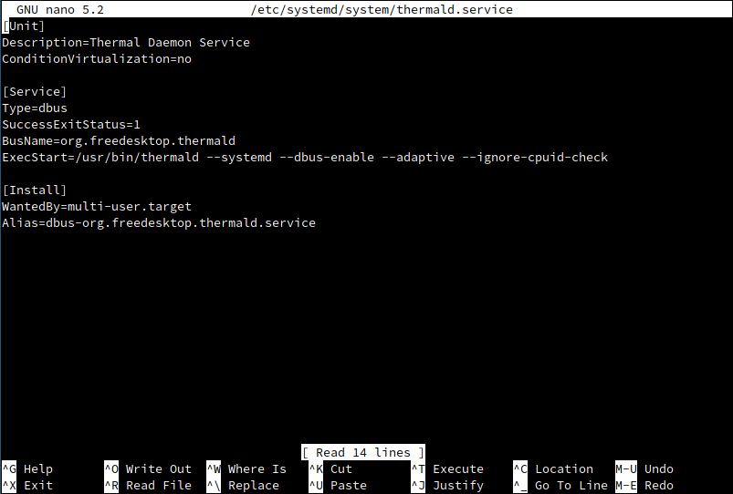
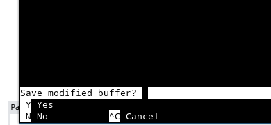

import { Image } from "astro:assets";
import cover from "../../assets/articles/tools-to-lower-power-consumption-and-device-cooling/546187.jpg";

<Image src={cover} alt="" class="cover" width={440} />

- **CPU frequency scaling **and** battery optimization** for Notebook and PC systems

Since the Atlantis release, in December 2021, every new install has power-profile-daemon installed by default.

## Why power-profiles-daemon

The power-profiles-daemon project was created to help provide a solution for two separate use cases, for desktops, laptops, and other devices running a “traditional Linux desktop”.

The first one is a "Low Power" mode, that users could toggle themselves, or have the system toggle for them, with the intent to save battery. Mobile devices running iOS and Android have had a similar feature available to end-users and application developers alike.

The second use case was to allow a "Performance" mode on systems where the hardware maker would provide and design such a mode. The idea is that the Linux kernel would provide a way to access this mode which usually only exists as a configuration option in some machines' "UEFI Setup" screen.

This second use case is the reason why we didn't implement the "Low Power" mode in UPower, [as was originally discussed](https://gitlab.freedesktop.org/upower/upower/-/issues/102).

As the daemon would change kernel settings, we would need to run it as root, and make its API available over D-Bus, as has been customary for more than 10 years. We would also design that API to be as easily usable to build graphical interfaces as possible.

## Introduction

power-profiles-daemon offers to modify system behaviour based upon user-selected power profiles. There are 3 different power profiles, a "balanced" default mode, a "power-saver" mode, as well as a "performance" mode. The first 2 of those are available on every system. The "performance" mode is only available on select systems and is implemented by different "drivers" based on the system or systems it targets.

In addition to those 2 or 3 modes (depending on the system), "actions" can be hooked up to change the behaviour of a particular device. For example, this can be used to disable the fast charging for some USB devices when in power-saver mode.

GNOME's Settings and shell both include interfaces to select the current mode, but they are also expected to adjust the behaviour of the desktop depending on the mode, such as turning the screen off after inaction more aggressively when in power-saver mode.

## [](#how-to-use)How to use

There are interfaces to switch profiles in the latest versions of KDE and GNOME. Those desktops also include more thorough integration with its low-power mode. Please check the user guides for each of them for details.

power-profiles-daemon also ships with a command-line utility called `powerprofilesctl` which can be used for scripting, as it allows getting and setting the active profile, listing the available profiles, and launching commands while holding the performance or the power-saver profile.

For example, this will be useful to avoid manual switching profiles while compiling large projects:

```
powerprofilesctl launch make
```

If you're a developer, you might also want to use GLib's [`GPowerProfileMonitor`](https://docs.gtk.org/gio/iface.PowerProfileMonitor.html) through C or one of its bindings, so your application can react to the user requesting a low-power mode.

## [](#debugging)Debugging

You can now check which mode is in use, and which ones are available by running:

```
powerprofilesctl get
```

You can change the selected profile by running (change `power-saver` for the chosen profile):

```
powerprofilesctl set power-saver
```

You can check the current configuration which will be restored on reboot in `/var/lib/power-profiles-daemon/state.ini`.

Those commands are also available through the D-Bus interface:

```
gdbus introspect --system --dest net.hadess.PowerProfiles --object-path /net/hadess/PowerProfiles
gdbus call --system --dest net.hadess.PowerProfiles --object-path /net/hadess/PowerProfiles --method org.freedesktop.DBus.Properties.Set 'net.hadess.PowerProfiles' 'ActiveProfile' "<'power-saver'>"
```

If that doesn't work, please file an issue, attach the output of:

```bash
sudo G_MESSAGES_DEBUG=all /usr/libexec/power-profiles-daemon -r -v
```

## [](#testing)Testing

If you don't have hardware that can support the performance mode or the degraded mode you can manually run the `power-profiles-daemon` binary as `root` with the environment variable `POWER_PROFILE_DAEMON_FAKE_DRIVER` set to 1. For example:

```bash
sudo POWER_PROFILE_DAEMON_FAKE_DRIVER=1 /usr/libexec/power-profiles-daemon -r -v
```

power-profiles-daemon source text and more info over [here.](https://gitlab.freedesktop.org/hadess/power-profiles-daemon)


## Thermald

*is a Linux daemon used to prevent the overheating of platforms? This daemon monitors temperature and applies compensation using available cooling methods.*

*By default, it monitors Intel CPU temperature using available CPU digital temperature sensors and maintains CPU temperature under control, before HW takes aggressive correction action. If there is a skin temperature sensor in thermal sysfs, then it tries to keep skin temperature under 45C.*

Source: [https://wiki.archlinux.org](https://wiki.archlinux.org/index.php/CPU_frequency_scaling)

Code Source:

[https://01.org/linux-thermal-daemon/documentation/introduction-thermal-daemon](https://01.org/linux-thermal-daemon/documentation/introduction-thermal-daemon)

[https://github.com/intel/thermal_daemon](https://github.com/intel/thermal_daemon)

As each update of the thermald-package will overwrite the service file we need to move this to

```bash
/etc/systemd/system/
```

So that it will not stop working after thermald updates.

install needed:

```bash
sudo pacman -S --needed thermald
```

```bash
sudo cp /usr/lib/systemd/system/thermald.service /etc/systemd/system/
sudo nano /etc/systemd/system/thermald.service
```

change the line:

```ini
ExecStart=/usr/bin/thermald --systemd --dbus-enable --adaptive
```

like so:

```ini
ExecStart=/usr/bin/thermald --systemd --dbus-enable --adaptive --ignore-cpuid-check
```



save the file by pressing [**Ctrl+Alt+x**] and confirm by typing “**y**”



The last two things to do is enable the systemd service for Thermald to automatic start it on every boot of your system:

```bash
sudo systemctl enable thermald
```

and now please reboot the system to make it start working.

As EndeavourOS is installing power-profiles-daemon per default you will need to mask its service or uninstall it.

`sudo systemctl mask power-profiles-daemon`

It will need some time to measure and then really control to hold the temperature down, so be patient and wait to see the effect for some time ( may need one or two hours before working for the first time)


### Alternative to thermald ([auto-cpufreq](https://github.com/AdnanHodzic/auto-cpufreq))

[https://github.com/AdnanHodzic/auto-cpufreq](https://github.com/AdnanHodzic/auto-cpufreq)

Not available on the official repository, so it needs to be built from AUR:

[https://aur.archlinux.org/packages/auto-cpufreq-git/](https://aur.archlinux.org/packages/auto-cpufreq-git/)

`yay -S auto-cpufreq-git`

On how to enable and use this read the documentation on GitHub:

[https://github.com/AdnanHodzic/auto-cpufreq#aur-package-archmanjaro-linux](https://github.com/AdnanHodzic/auto-cpufreq#aur-package-archmanjaro-linux)


## Cpupower

*is a set of userspace utilities designed to assist with CPU frequency scaling.*

full list of available modules:

```bash
sudo ls /usr/lib/modules/$(uname -r)/kernel/drivers/cpufreq/
```

Load the appropriate module (see [Kernel modules](https://wiki.archlinux.org/index.php/Kernel_modules) for details). Once the appropriate cpufreq driver is loaded, detailed information about the CPU(s) can be displayed by running

```bash
sudo cpupower frequency-info
```

#### Scaling governors

Governors (see table below) are power schemes for the CPU. Only one may be active at a time. For details, see the [kernel documentation](https://www.kernel.org/doc/Documentation/cpu-freq/governors.txt) in the kernel source.

**NOTE:** If you want to use this method, make sure you disable CPU-scaling from TLP (as this is enabled by default on EndeavourOS and using both together for the same mechanism will cause failure)

| Governor | Description |
|---|---|
| performance | Run the CPU at the maximum frequency. |
| powersave | Run the CPU at the minimum frequency. |
| userspace | Run the CPU at user-specified frequencies. |
| OnDemand | Scales the frequency dynamically according to the current load. Jumps to the highest frequency and then possibly back off as the idle time increases. |
| conservative | Scales the frequency dynamically according to the current load. Scales the frequency more gradually than onDemand. |
| schedutil<br />……………………….. | Scheduler-driven CPU frequency selection [[1]](http://lwn.net/Articles/682391/), [[2]](https://lkml.org/lkml/2016/3/17/420). |

set one for all cores: 
(replace *governor* with e.g. what you want *ondemand* p.e…)

```bash
sudo echo *governor* > /sys/devices/system/cpu/cpu*/cpufreq/scaling_governor
```

see live output:

```
watch grep \"cpu MHz\" /proc/cpuinfo
```

making one permanent:

```bash
sudo systemctl enable cpupower.service
```
