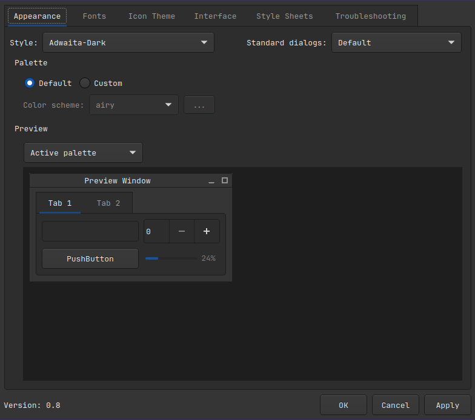
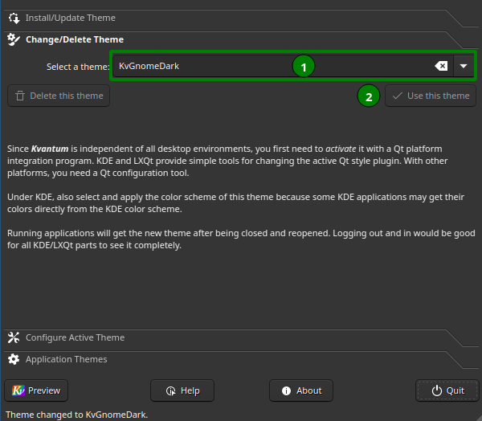
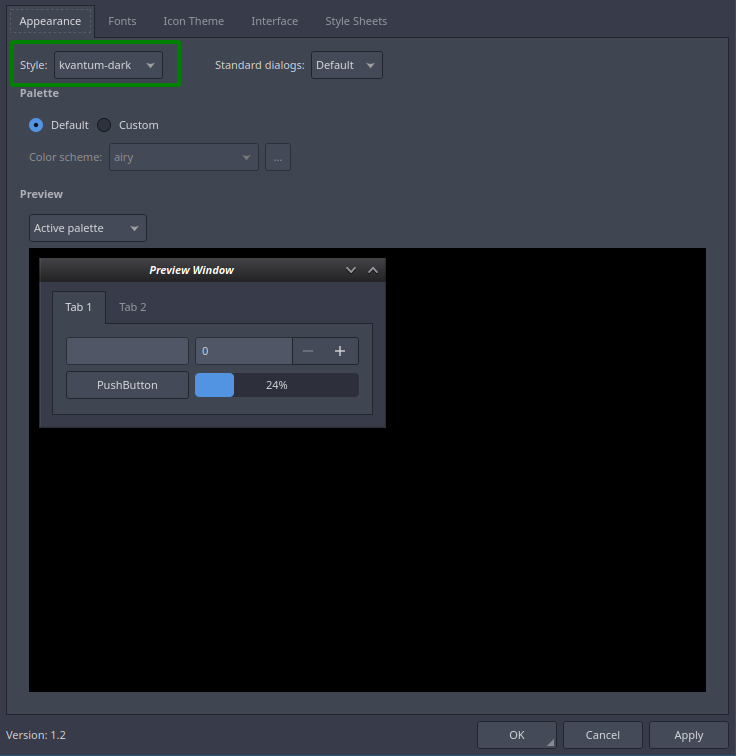
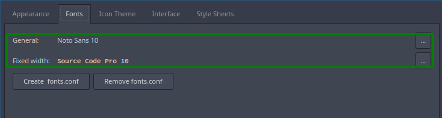
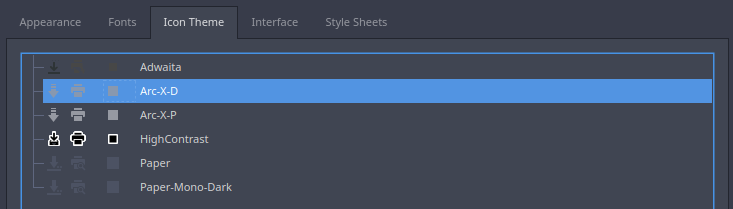
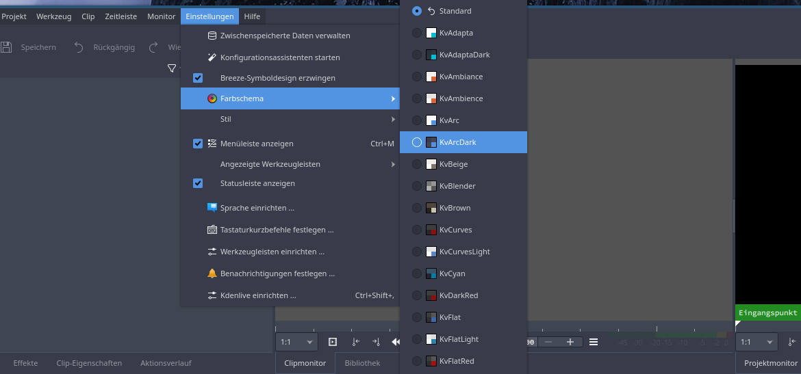

**By @joekamprad**

There are many ways to get a uniform look and feel working, and here we show only one or two solutions.

#### QGnomePlatform

The easiest way to set a uniform appearance for QT applications under GTK environments is using [QGnomePlatform](https://wiki.archlinux.org/title/Uniform_look_for_Qt_and_GTK_applications#QGnomePlatform)

**Sources are marked unmaintained: **https://github.com/FedoraQt/QGnomePlatform#qgnomeplatform-project-is-unmaintained-a-no-longer-actively-developed as of August 2023.

But still simply possible to build and install from AUR:

`yay -Syu qgnomeplatform-qt5 qgnomeplatform-qt6`

This will bring in `adwaita-qt5 adwaita-qt6` can be replaced with other themes that supports both gtk and qt these two will use adwaita (default gtk theme) and making qt apps following adwaita dark and light theme.

( per example `breeze` and `breeze-gtk `will work too)

Add the environment variable either systemwide at `/etc/environment` or user specific into a `~/.config/environment.d/envvars.conf` file or `~/.profile` depending on the used Desktop or WM setup it could be zthe one or the other needs to be used.

QT_QPA_PLATFORMTHEME=gnome

**Note:** this variable is set per default for Gnome and if you are using Gnome you do not need to set the vatriable.

After a reboot qt apps should use adwaita same as set for gtk in settings.

To set font sice and some opther setting `qt5ct` and `qt6ct` will come in handy: `sudo pacman -Syu qt5ct qt6ct`

qt5/6ct gui let you set theming for qt apps per example set adwaita dark if it does not apply per default..

#### Kvantum:

Another way will be to use [Kvantum](https://archlinux.org/packages/community/x86_64/kvantum-qt5/) and QT5/6CT:

Install both packages:

`sudo pacman -Syu kvantum qt5ct qt6ct`

Both applications are required because kvantum does not allow the font settings. Therefore qt5ct is also set as an environment variable, as it works in most desktop environments or when using a window manager as a user. In some cases, e.g. when using Cinnamon, it is necessary to set the variable system-wide, because Cinnamon seems to ignore variables that are set as users. Then we set qt5ct to use the kvantum theme and set fonts inside qt5ct.

Per-user variable will be configured like so:

It seems this method is not working on XFCE4 where using `~/.profile` usage is working!

Same counts for Cinnamon.

Create the needed directory

`mkdir ~/.config/environment.d`

and the needed config file with the needed variable:

`echo "QT_QPA_PLATFORMTHEME=qt5ct" > ~/.config/environment.d/qt-theme.conf`

To use `~/.profile` method:

`echo "export QT_QPA_PLATFORMTHEME=qt5ct" >> ~/.profile`

To set this systemwide (if per user variable does not work at all):

`su `

`echo "QT_QPA_PLATFORMTHEME=qt5ct" >> /etc/environment `

`exit`

If you use per user settings log out and back in to make it work, for systemwide settings reboot the system.

Now use the Apps to set your Theme, Fonts, and Icons:

**Using kvantummanager for the theme settings**

**After this use qt5ct to use kvantum Style (dark for dark ones and only kvantum for light ones)**

**Set the font for Windows and the fixed width, but do NOT create a font.conf!!!**

**Now choose an icon-theme**

Changes will work without the need to log out or reboot, only apps already running need to be restarted to take the theme changes.

for QT6 applications install qt6ct and setup the same with qt6ct tool.

**Notes:**

Some applications may have their own theme settings like kdenlive:

Do you want to descend into the sources of endless information and possibilities? … Consult the Archwiki:

[https://wiki.archlinux.org/title/Uniform_look_for_Qt_and_GTK_applications](https://wiki.archlinux.org/title/Uniform_look_for_Qt_and_GTK_applications)

---
