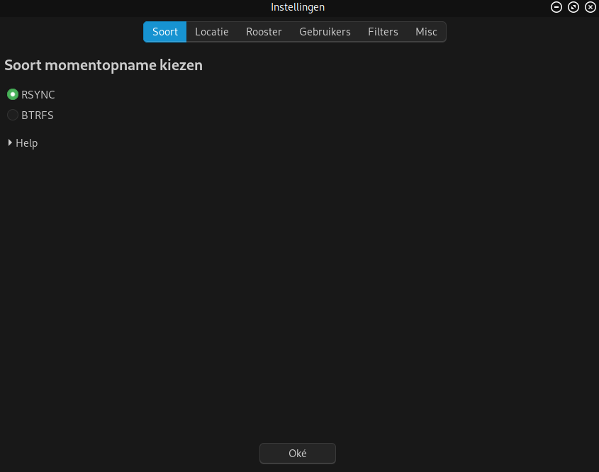
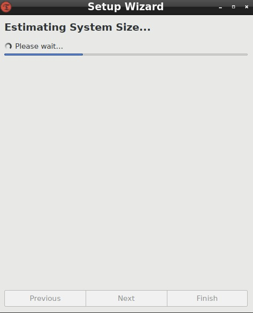
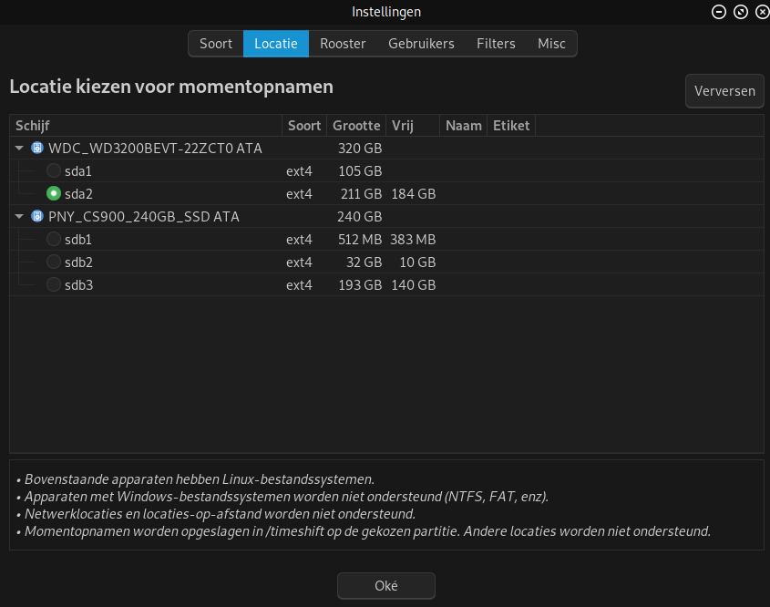
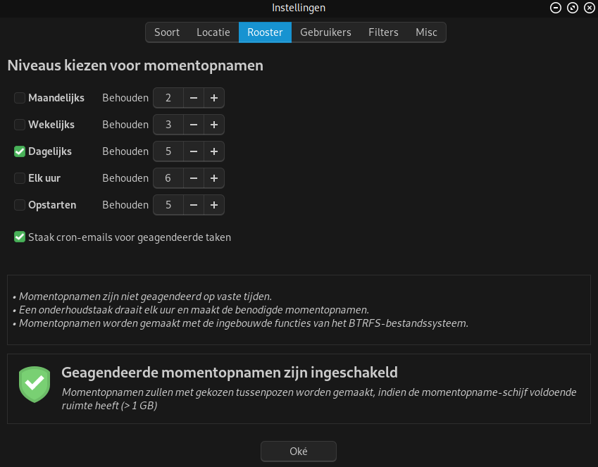
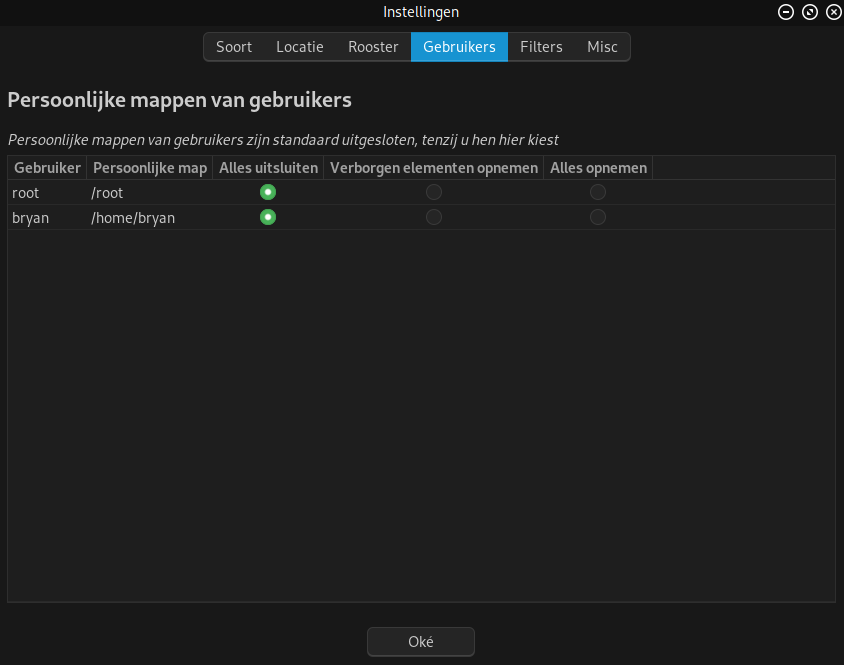
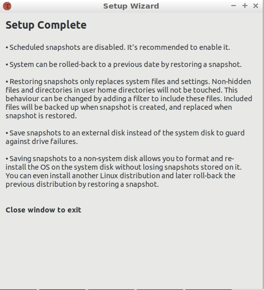
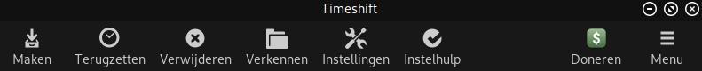

I love running EndeavourOS because of its flexibility and its abundant of package choices. Apps and packages are continuously updated and you don't have to worry that you're working on a system that's out of date or has security risks. The perfect system right?

Well, I have to admit that running a bleeding-edge distro can be a pain from time to time. Don't get me wrong, I'm not confirming that big claim by non-Arch users that Arch and it's derivatives constantly break because that is a big myth and we all know it.

No the thing I'm referring to is when that DE release finally hits the repo after weeks and weeks of hype and you can't wait for all the packages to arrive, so against better judgement, you type yes after that sudo command and after installation you reboot the system, Grub boots fine and then you're greeted with the all dreaded blinking cursor in a black screen. Or you can log into your system to find out that the window manager isn't reacting on any command or click, no matter how hard you push that poor trackpad/mouse or how hard you shout at your screen.

We've all been there and in the case, as described above, there's no other way than roll back and downgrade the culprit packages. You can do it manually but with Timeshift, you can go back in time and put back the previous snapshot of your system that did work. That's all that Timeshift does, making a snapshot of your system on a regular base, so you can revert back without a hassle.

**How do you install it?**

Make sure that your system is up-to-date if you're in doubt run:

`sudo pacman -Syu`

Then run:

`yay -S timeshift`

The system asks you to choose RSYNC or BTRFS, choose RSYNC. (The BTRFS option only works on systems running on the BTRFS filesystem, and is usually quite different in its setup. This is covered in a separate article.) Cronie is then required and will be installed as a dependency for automatic scheduling.

After install Timeshift isn't enabled by default, to enable it, type the following command:

`systemctl enable --now cronie.service` (**--now** will start and enable in one command)

Now you're ready to activate Timeshift in its settings menu, so open the app and you'll be greeted with a wizard that looks like this:

Select RSYNC and go to next

Then Timeshift is running to estimate the size of the system, according to the size it can take some time.

In this screen, you're prompted to choose the partition or disk where Timeshift can store the snapshots. Choose the desired destination and click on next.

In this screen, you can select the interval you wish Timeshift will make automated snapshots and how many snapshots you want to keep, select one or more options and click next. NOTE: Boot snapshots will delay the booting process until the snapshot is completed.

In this screen, you can choose whether you want to include the Home folder in the snapshot. This can be useful in case you need full recovery. Choose as you desire and click next.

The final screen gives you some extra information, close the window and Timeshift is scheduled.

**Creating a snapshot manually**

If you wish to create snapshots manually instead of a schedule, you can skip the previous steps and click on the left button to create a snapshot and the delete button to remove a snapshot.

**How to revert back to a snapshot?**

To revert back you have three options:

When Grub is booting you can follow the instructions over [here](/how-to-boot-without-a-graphical-environment/) and after that type:

`timeshift --restore`

Select the desired snapshot date and let Timeshift do its work.

In case of a non-booting system, boot the device with the Live USB or another Arch-based Live USB and use Arch-chroot then follow the same instructions as above. When Timeshift is finished, you can reboot the system.

In case you don't have the EndeavourOS or another Arch-based Live USB at hand and only another Linux Live USB, you can boot that one also and install Timeshift in the Live environment using the distro's repo. After install start the application and it will search automatically for your snapshots. Select the desired snapshot and reboot after completion.

Having Timeshift installed and working gives yourself, whilst exploring the system, some ease of mind.

So, go and explore the system and if it goes wrong, you know you have a reliable tool to fall back on.
