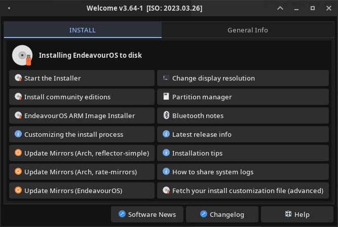
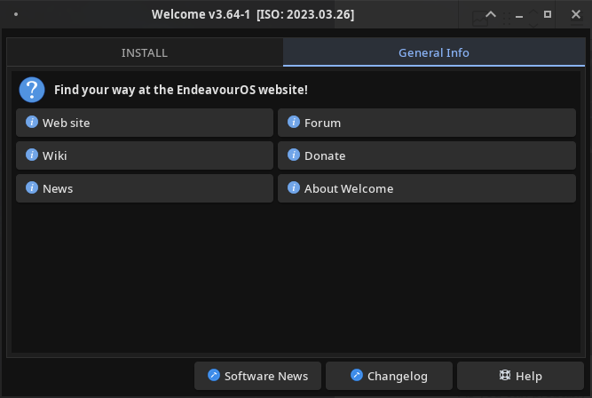
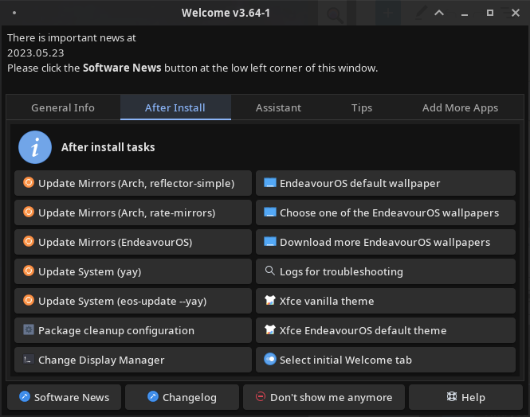
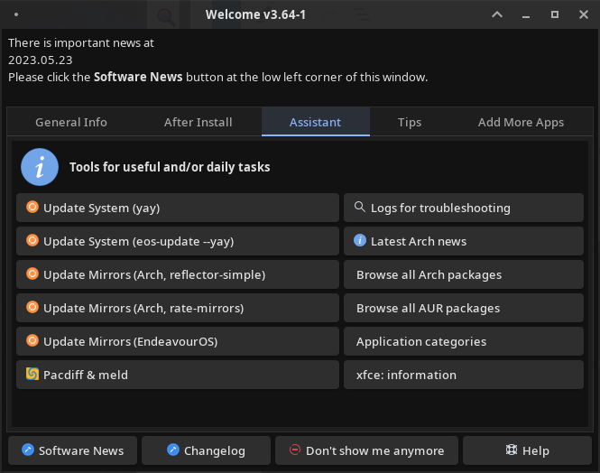
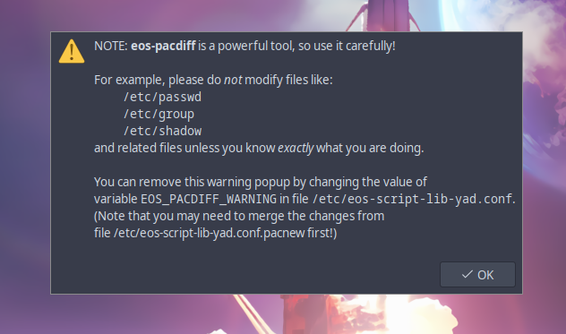
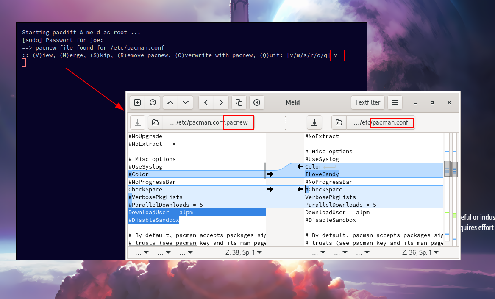
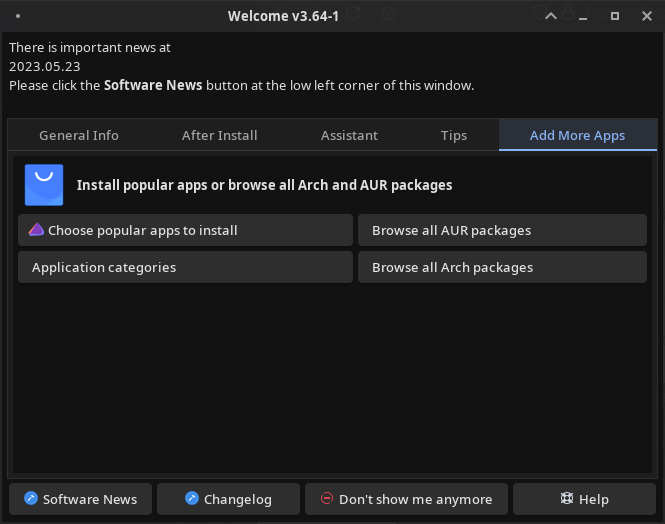
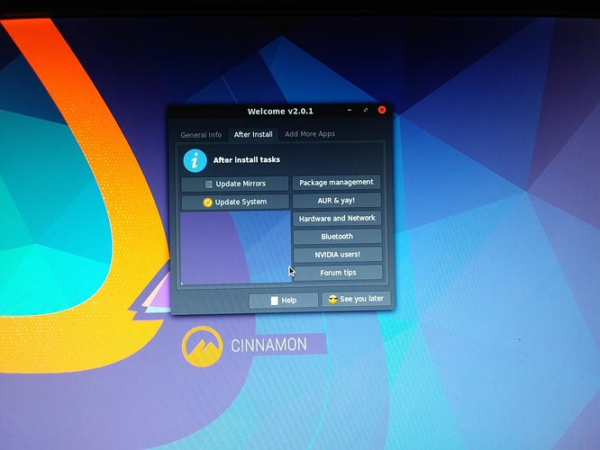
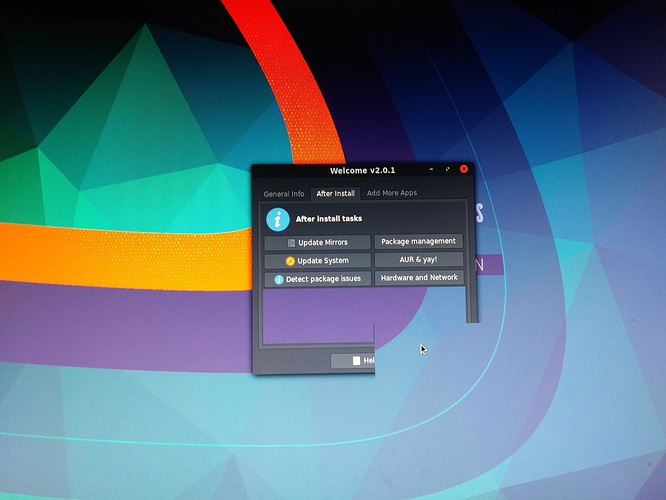
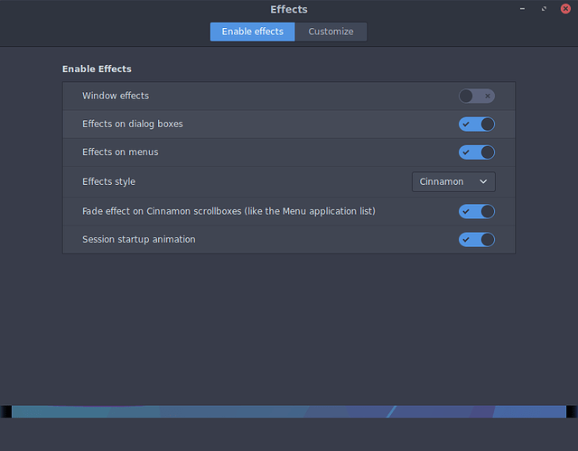

By: @manuel 
Created: 2019-Jul 
Updates of this document: go to the end of this doc.

The EndeavourOS Welcome app is one of the first apps to encounter, both while installing EndeavourOS, and when starting the installed system.

The purpose of the Welcome app is to help users

- find relevant information about EndeavourOS
- provide an easy way to do some useful operations on the system

Note that the Welcome app is under constant development, and will include more features, as well as bug fixes, over time.

## Enabling or disabling Welcome

To have Welcome app started when you log in, make sure

- Welcome app is selected in the Autostart feature of the DE 
or
- `Hidden=false` is set in file `/etc/xdg/autostart/welcome.desktop`

On DEs that do not work well with system's *Autostart* feature, you may also disable the Welcome app from the app itself

- with the `--disable` option
- with a button in the app (some DEs only)

To re-enable the app, click the Welcome app icon, or use the terminal command: `eos-welcome --enable`

To run Welcome *once* even if it is already disabled, use option `--once`: `eos-welcome --once`

Welcome will stay disabled after using option `--once`.

Note: check also settings in the configuration file `~/.config/EOS-greeter.conf`.

Below we’ll go through the window tabs of the Welcome app.

## INSTALL

This window is what you’ll see when starting to install EndeavourOS:



This is the contents of the INSTALL tab. The tab is available only in the install phase. 
Note: some buttons may not show as above, depending on the installed software or new/changed features of Welcome.

To start the install process, simply click the **Start the Installer** button. This will allow selecting from a few popular desktop environments, or even no desktop at all. In addition to the installer window, it starts a terminal window that shows plenty of detail of the install process.

Another installer button **Install community editions** allows installing editions with a window manager (currently: Sway, Bspwm) instead of a desktop environment. Also, you can start ARM version install on ARM hardware.

Button **Update Mirrors (toolname)** starts program `reflector-simple` or `rate-mirrors` which helps you select the **Arch** mirrors to use. This is very useful for the ***online*** install mode (that you may choose a bit later during the install) as it can speed up the install process quite dramatically. Another button can update the **EndeavourOS** mirrors.

The **Change Display Resolution** button (added in Welcome version 3.4.7) helps you to change display resolution. Note that, by default, this button is active only in a virtual machine (supports VirtualBox, VMware, and QEMU). This may be useful if you want to change the VM window size and your display is large enough. It is also useful in the live session if you have a high resolution monitor, and text and other things look too small to work with. 
The above feature is implemented on top of the `xrandr` command, so package `xorg-xrandr` must be installed.

If certain disk management functions like special partitioning or partition formatting is needed, button **Partition manager** may help you.

The **Bluetooth notes** button shows information how to enable bluetooth functionality. We do not enable bluetooth by default due to reasons mentioned in the page the button opens.

Buttons **Latest release info**, **Installation tips**, and **How to share system logs** should be self explanatory – they will show you related EndeavourOS web pages in a browser. Note that the last of these 3 buttons is a useful tool for troubleshooting.

Button **Fetch your install customization file (advanced)** is meant for power users to customize the install to a certain degree (like adding/removing packages, customizing features, etc.). This feature is explained in more details in other Discovery articles.

The bottom line buttons are:

- **Software News** button shows important "last minute" information about the EndeavourOS software and its changes. Be sure to click this! The button goes [here](https://gitlab.com/endeavouros-filemirror/Important-news/blob/main/README.md). 
Note that it will be available also in the installed system.
- **Changelog** button provides a view to version history of the Welcome app.
- **Help** button shows the discovery article about Welcome.
- **Don’t show me anymore** button is meant to silence (i.e. not start automatically) the Welcome app until you explicitly enable it again. To enable the Welcome app is easy – just click the Welcome icon in the start menu.
- **See you later** button closes this window. Note: this button is no more available.

Note that if you want to *customize* the install process, see [this](/customizing-the-endeavouros-install-process/).

## General Info

The next tab contains links to general information about EndeavourOS. This may be quite useful for users that know very little or nothing about EndeavourOS.

The General Info tab contents look like this:



As you can probably guess, the buttons contain links to much more information at the EndeavourOS web site.

And since developing and maintaining a distribution takes resources that the development team must pay for, we’d appreciate any size of donation (the **Donate** button) to help us cover the mandatory costs.

## After Install

Note you’ll see the following Welcome tabs *after* you have installed EndeavourOS, rebooted, and logged in to your new system. The **General Info** tab has the same contents now as while installing.

The next tab is (as some might say) where the real fun starts!



This tab (and the last tab) are meant to be used (mainly) in the installed system.

On the picture you can see text above the tabs. This is an embedded ***notification*** area in Welcome, and is meant for informing users about important events or matters. To see the contents of the notification, simply click the **Software News** button. Note that the notification are can be empty too, but the Software News button is still available.

The **Update Mirrors (repo, tool)** button may be good to click as the first thing after logging in the first time, especially if software updates seems (see the **Update System** button below) very slow, or even break. It creates a list of "good" mirrors for your system. And you’ll use precisely those mirrors when updating the system, or installing new packages to it. Note that you may use this button also at a later time, for example if any of the listed mirrors is no more available, or should you have other problems with mirrors. 
These buttons run commands `reflector-simple`, `rate-mirrors`, and `eos-rankmirrors` respectively. You can run them from the terminal as well.

The next buttons, **Update System (command)**, are important buttons. Click any of them right after booting to the installed system (maybe after “Update Mirrors” operation has finished), and your system will be up-to-date (and may need to be rebooted). These buttons can be used later as well, always when a system update is needed.

Tip for **NVIDIA** graphics hardware users: the **eos-update** command can check on kernel (with option `--nvidia`) updates (`linux` and `linux-lts`) that the required NVIDIA driver (`nvidia` or `nvidia-lts`) will also be updated! This helps preventing problems when a kernel is updated but the required NVIDIA driver is not. 
In addition, **eos-update** will take care of updating Arch and EndeavourOS *keyrings* before updating other packages. This should help handling the situation when either of the keyring packages are updated.

Tip: it is recommended to update system software at least about once a week. Note that new package updates will be available very frequently, often many times a day. Systems that haven't been updated for a very long time (like months or even years) usually *can* be updated, but may require extra work. The EndeavourOS forum will help you in case of any trouble.

After updating all packages your system is ready to be used.

After you have been using your EndeavourOS system for a while, your disk (more precisely, the *package cache*) may fill up with old packages that are stored there for convenience. Eventually it may contain gigabytes of old packages that are no more used! So in order to remove the unneeded old packages automatically, button **Package cleanup configuration** was added. It helps configuring the service that automatically removes old packages, and saves the number of packages that you want to keep. By default it keeps 3 versions of each package, but for many purposes 2 would be enough, and even 1 if your disk doesn't have much free space.

Another useful maintenance button is **Configure eos-update-notifier**. It helps configure the app that, by default, notifies about available updates according to a schedule, and lets you do the actual system update as well. You can, for example, schedule update checks to occur weekly instead of daily (=default).

You may change the Display Manager by clicking the **Change Display Manager** button. Usually this is not needed, but you may have a reason for doing so.

The **EndeavourOS default wallpaper** button assigns the default EndeavourOS wallpaper back. This may be handy after experimenting with other wallpapers. Note also that this button uses the program `eos-wallpaper-set`, and that program can be used to set the wallpaper directly on the command line.

There are two related wallpaper buttons. **Choose one of the EndeavourOS wallpapers** lets you choose another wallpaper from a predefined location of wallpapers. You may browse with this application and select other wallpapers as well.

Then **Download more EndeavourOS wallpapers** gives a possibility to download and use the legacy EndeavourOS wallpapers, or wallpapers made by the EndeavourOS community members. So, if you are artistically oriented, you have the opportunity to contribute!

**Logs for troubleshooting** helps you create many logs at once, and send them to a pastebin service on the internet. These logs are very useful in troubleshooting issues especially if you want other fellow users to help you e.g. on the EndeavourOS forum. Note that you may look at the logs before sending them to pastebin - any personal information should be hidden in the logs.

**Select initial Welcome tab** lets you choose the tab Welcome open to. Often users want to open to the next tab, the **Assistant**, which will be explained a bit later.

If you installed Xfce as your desktop, then you’ll see the related Xfce buttons. They can be used for changing the theming (appearance) of the desktop. The **Xfce vanilla theme** puts the vanilla theming in place. The **Xfce EndeavourOS default theme** sets up our default theming. Note that the offline install mode provides the latter, but the online install mode results in the vanilla theming. Note also that both options will bring the *default* theming, and your own modifications are *not* included – but your old theming is saved if you want to go back. The buttons will give more instructions about that.

## Assistant

This tab consists of a collection of most useful buttons. Some buttons have already been explained, and some are new, which are explained here.



The **Pacdiff & &lt;diff-app>** button is meant for managing certain configuration files (e.g. *.pacnew) and their changes. Pacdiff is a program that walks through the *changed* configuration files one by one, and lets you view the changes with the &lt;diff-app> to possibly merge the changes you'd like to include. The &lt;diff-app> is typically `meld` but can be changed to e.g. `kdiff3` or another suitable for you. 
Related configuration: EOS_WELCOME_PACDIFFERS, see more about this later in this document.

The following picture shows `pacdiff` in action:





Button **Latest Arch news** will open a web page showing the latest Arch news. This is useful e.g. for finding out latest developments or potential need for manual intervention because of recent changes by the Arch devs.

Buttons to *browse* Arch or AUR packages, and the **Application categories** button are links to web pages that contain valuable information about various applications in a well organized manner.

You may also see a button (above: **xfce: information**) which will show information about the currently used DE (Desktop Environment).

## Tips

Buttons under this tab include more links to information about either useful or more advanced things. All users (unless already familiar with the topics) are recommended to check the links under **Package management** and **AUR & yay!** buttons. Buttons related to hardware may also be very useful if you have that particular hardware. And **Forum tips** provides general tips for Forum usage.

The **EndeavourOS & ARM** button shows information about the ARM software provided by EndeavourOS.

Then there’s information about *personalizing* the Welcome app. 
Button **Tutorial: Personal Commands** explains how you can easily create new command buttons into Welcome. They will appear on a new tab *Personal Commands*. Button **Personal Commands drag&drop** shows a small window where user can drop items that will appear under the Personal commands tab.

More about the ***Personal Commands*** is explained below under *Personalizing Welcome*.

## Add More Apps

The last *default* tab includes buttons for installing some popular applications.



Button **Choose popular apps to install** opens an app that helps you to install apps from a curated list. Other buttons should be familiar from the **Assistant** tab explanation above. 
Even though the apps in the curated list are popular and useful, we’ve chosen not to install them by default. This gives users a better opportunity to “tailor” their system, but still, have an easy way to install these apps.

By the way, do you remember that the previous tab included a button **AUR & yay!**? As you (should!) know by now, **pacman** is the main package manager in EndeavourOS. It manages packages that are available from the Arch Linux repositories. But there is a huge amount of more apps available in the *AUR* (Arch User Repository). AUR is *not* managed by pacman. That’s why EndeavourOS provides another package manager, **yay**. It is like pacman, but supports AUR applications in addition to Arch Linux repositories.

## Personalizing Welcome

Welcome version 3.0 introduced a new feature: users can personalize Welcome by adding their own command buttons.

Here’s an example what it might look like:

You can see a new tab **Personal Commands** and some command buttons are already added in the picture above.

The new tab will be activated only if the configuration file

**$HOME/.config/welcome-own-commands.conf**

exists, and the file contains command definitions.

The first button **Tutorial: Personal Commands** will be automatically created, and it shows a short tutorial about how to create new Welcome commands. Check that out!

The next button, **Personal Commands drag&drop** starts a window (called a **dnd** window) where items can be dropped. As you probably remember, the same two buttons appeared also under the *Tips* tab. They are on both tabs for convenience.

There are two ways to create the configuration file. One is to manually write the file, and the other (the easier way) is to use button **Personal Commands drag&drop** and drop items to the dnd window.

If you don’t already have the *Personal Commands* tab available, click the same button under the ***Tips*** tab.

Dropping items to the dnd window will cause

- the configuration file to be created if it doesn’t exist
- the configuration file to be updated with button definitions
- the Welcome app to instantly contain the new buttons!

Now your part begins! All additional buttons on this tab are there because *you* (the user) will add or have added them there.

### A bit more about the configuration file

Here’s a very simple example configuration file:

```
#!/bin/bash

# Own commands:
# - Create a local array variable 'welcome_own_commands'.
# - Add yad form fields as in the example below.

local welcome_own_commands=(
    # Legend: --field=" name!icon!description":fbtn "command"

    --field=" Firefox!firefox-default!Web browser":fbtn "firefox"
    --field=" Mousepad!accessories-text-editor!Text editor":fbtn "mousepad"
)

# To have own commands activated initially, set local variable
# 'activate_own_commands_tab' to "yes";
# otherwise the default tab is active from the start.

local activate_own_commands_tab=yes    # "yes" or "no"
```

If you don’t want to drop items to the drag&drop window, you can simply copy the above configuration into the configuration file mentioned above. Then just restart the Welcome app. Now you have enabled this new feature!

The Tutorial button shows more details about the configuration file.

## Known issues

### Cinnamon

Community member and Moderator Ricklinux discovered a bug that affects the Welcome app on the Cinnamon desktop and it looks like this:





Until now a solution hasn’t been found but the workaround is simple. Go to the preferences menu and disable window effects like this:



### Yad and Wayland

Yad is not fully working with Wayland, and this affects Welcome in particular (e.g. on KDE/Wayland). The reason is Wayland does not support a protocol that yad is using for its notebook feature. And Welcome is built on the notebook feature of the yad program. So if you want to use Welcome, you must use X11 instead of Wayland.

More information here:

[https://github.com/v1cont/yad/issues/109#issuecomment-719887730](https://github.com/v1cont/yad/issues/109#issuecomment-719887730)

## Special note about the code

The welcome app includes code that is directly used by some other apps, like eos-update-notifier. The shared code files are:

`/usr/share/endeavouros/scripts/eos-script-lib-yad`

- contains functions common for the using programs

`/etc/eos-script-lib-yad.conf` contains the following settings for the using programs:

- EOS_YAD_TERMINAL: name of the terminal program. With this you can force your favorite terminal to be used with the apps welcome and update notifier. But please note that it is possible that the terminal you select may not be compatible with the way the above programs use it, especially if it is not on the list of compatible terminals. By default this is commented out, and one of the supported terminals is used. See list of supported terminals in file `/usr/share/endeavouros/scripts/eos-script-lib-yad`.
- EOS_ROOTER: chooses the program to give elevated privileges for running programs in the terminal. Supported programs are
  - `su` (default)
  - `su-c_wrapper`
  - `sudo`
  - `pkexec`
- EOS_WELCOME_CONNECTION_WARNING: specifies whether the welcome app shows the warning about missing internet connection or not. Values are simple “yes” or “no”.
- EOS_CONNECTION_CHECKER: configures the program to be used for checking if internet connection is available. Supported values are “ping” or “curl”.
- TERMINAL_AT_START: if properly set, makes the welcome app to start a terminal whenever the welcome app is started. See details at the config file.
- EOS_WIFIDEV_CHECK: enable or disable certain ad hoc checks about the wifi driver. The checks are made by clicking the **Detect system issues** button of the welcome app.
- EOS_KEEP_PKGS: lists the name of packages that shouldn’t be removed when the **Detect system issues** button is clicked.
- EOS_AUR_HELPER: name of the AUR helper program. Supported values: “yay” and “paru”. Yay is the default.
- EOS_WELCOME_PACDIFFERS: array of diff program names that can be used with `pacdiff` via a button in Welcome. The array is in preference order, the first one found is used. Supported values: kdiff3, kompare, diffuse, meld, vim, code, and more. Other diff programs may work but haven’t been tested.
- EOS_SUDO_EDITORS is a list of editor names to choose the editor for changing files that require root permissions. Currently used only by `eos-update-notifier-configure`.
- EOS_WALLPAPER_FETCHER selects the program that is used for downloading additional wallpapers. By default `git` is used, alternatively `curl` can be used.

Please look at file `/etc/eos-script-lib-yad.conf` for the latest settings and up-to-date explanations.

## Note for the translators

The Welcome app has already been translated to many languages. If you (yes, you!) feel like translating Welcome to your language, this is the way to proceed:

- Take the latest English translation file [https://raw.githubusercontent.com/endeavouros-team/PKGBUILDS/master/eos-translations/translation-en.bash](https://raw.githubusercontent.com/endeavouros-team/PKGBUILDS/master/eos-translations/translation-en.bash) 
as the base for your translation. 
Or, if you have a **github** account, clone the PKGBUILDS repo: 
`git clone https://github.com/endeavouros-team/PKGBUILDS.git`.
- In the beginning of this file, change the *language id* (e.g. `en`) of the variable `_tr_lang` to your language (for example `pt_BR` or `de`). You can get the value with command: `echo $LANG`. Note that the language id is two letters for some languages, but more letters for some other languages.
- If you need certain special characters (to show them properly in Welcome), look how variables `_exclamation`, `_and` and `_question` are defined (search the internet for the value codes). You can create new such variables if needed.
- Then simply change the quoted strings on lines starting with `_tr_add2`. This is of course the biggest part of this task.
- Keep the line numbers as they are in the English translation file; this helps with future changes.

**Testing** is an important part in creating translations. You can do it in many ways, but a straightforward way is to copy your translation file to folder

`/usr/share/endeavouros/scripts`

Then you can start Welcome with command:

`eos-welcome --lang=<your-language-id>`

For example: `eos-welcome --lang=de`

If you see error messages (see below), or some translations are not right, you can make required changes and test again.

When your new translation file is ready for publishing, you have many options how to deliver it to us:

- If you have a **github** account (or want to create one), simply make a pull request. This assumes you have cloned the EndeavourOS PKGBUILDS repo, and make all your translation work in this context.
- Create an account into the EndeavourOS forum: **https://forum.endeavouros.com**, and send the translation as a public forum message (or a private message to @manuel).
- You can also use command: 
`cat "translation-xx.bash" | eos-sendlog` 
and send the returned URL in the EndeavourOS forum like above.

Please note that not *everything* is translated in Welcome or in Welcome’s helper programs. We are working on it, but obviously it takes time.

### How to know when ***more*** stuff needs to be translated?

There are some symptoms to notice when there are more stuff to be translated:

- The contents of the English translation file (mentioned above) has changed.
- When you start Welcome at the terminal (command: `eos-welcome`), you’ll see a “warning” like this: 
`Info: translation issues detected, see file '/tmp/translations-X3yzK.errlog'`.

Note that the warnings in the log file only indicate that some text translations are missing. By default, English translations are provided for those texts.

### How to know if an *earlier* translation has been changed?

See here: [https://github.com/endeavouros-team/PKGBUILDS/blob/master/eos-translations/Translation_changes.md](https://github.com/endeavouros-team/PKGBUILDS/blob/master/eos-translations/Translation_changes.md)

## Conclusions

The Welcome app will become more powerful over time. 
The purpose of Welcome is not to give all possible help in all possible situations, but simply help to go in the right direction without a great hassle. And Welcome should provide more useful features in the future, so it is not a helper only in the beginning, but a truly useful app to have and keep using.

So, enjoy!

## Document updates

Update: 2020-Jul-15: added info about personalizing Welcome 
Update: 2020-Jul-25: new pictures and more info 
Update: 2020-Aug-11: added info for the translators 
Update: 2020-Sep-04: text fixes, new button: Change Display Resolution 
Update: 2020-Dec-11: added info about the Pacdiff button 
Update: 2020-Dec-12: minor change to Pacdiff support 
Update: 2020-Dec-15: updated file paths at **Note for translators** 
Update: 2021-Apr-12: bring this document up to date 
Update: 2021-Apr-14: clarified translation instructions 
Update: 2021-Sep-30: added a tip for NVIDIA users on kernel updates; updated docs in general 
Update: 2021-Nov-12: added yad/wayland known issue 
Update: 2021-Dec-21: added a link to list of changed translations 
Update: 2023-Feb-02: minor doc additions update Update: 2023-Mar-16: added enabling and disabling Welcome 
Update: 2023-May-30: updated explanations of apps in the Welcome tabs
