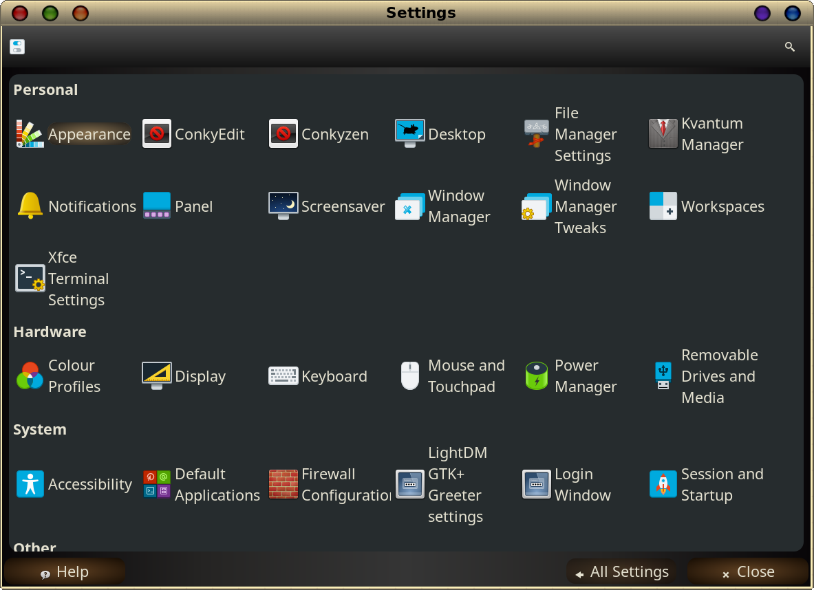
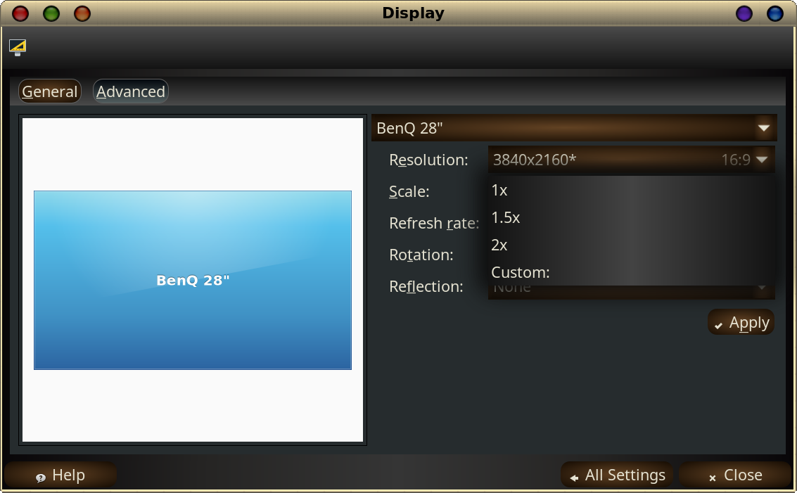
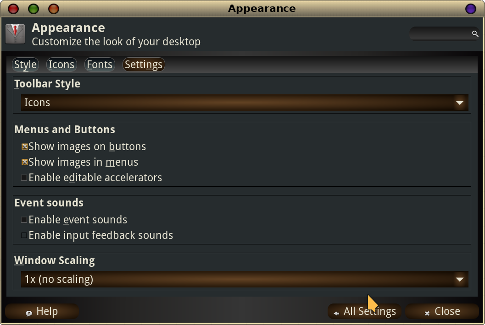
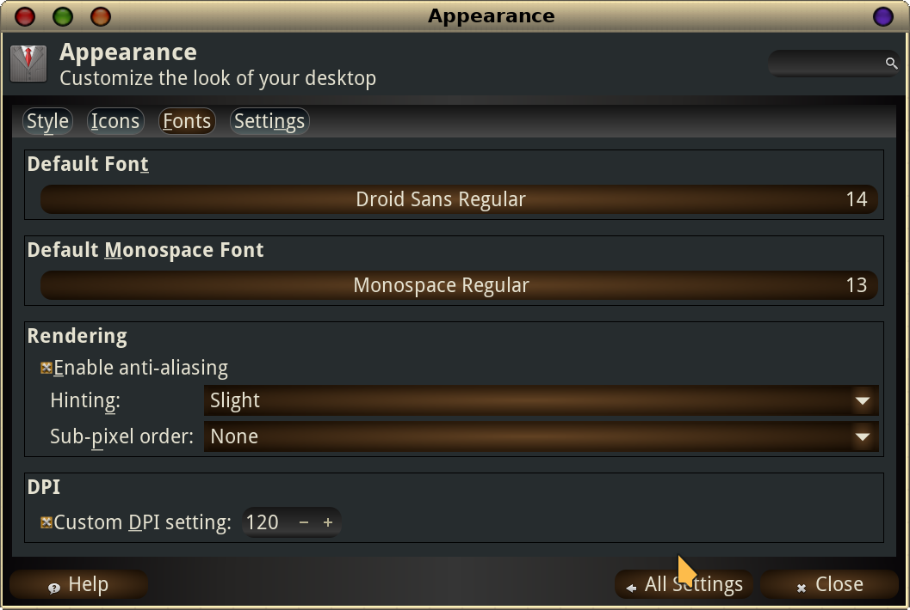
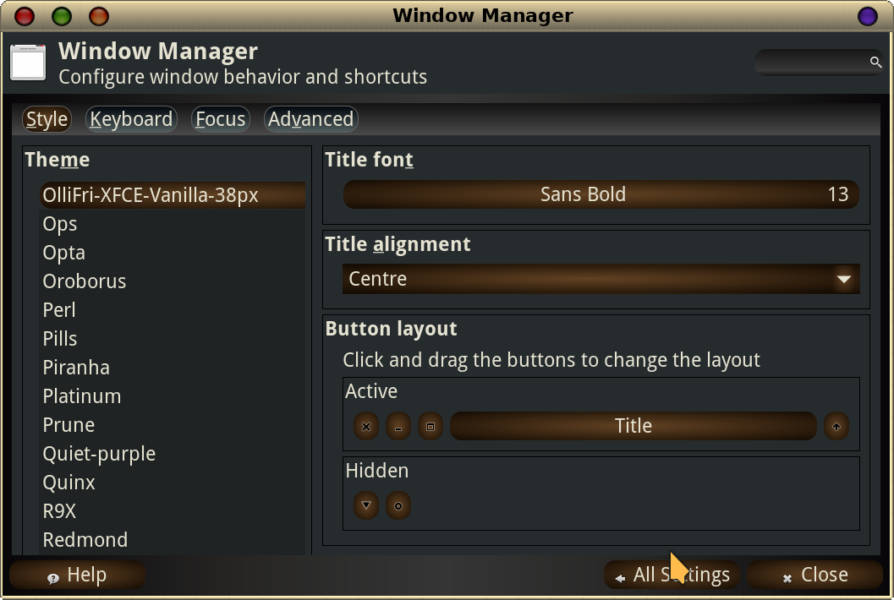

## Some things to do with a Hi-DPI screen on XFCE

To begin - here is a screenshot of the ***Settings*** app for XFCE.

First off, there is a possibility that you would be happy with a simple scaling change, that changes the effective resolution to a value other than what you actually have. If you would be happy with such a change, there are two ways to achieve it. One is to use the ***Settings/Display*** application,

and select the resolution you consider correct for your use. If you have, for example, a 3840x2160 monitor, you could choose 1920x1080 as your resolution - giving you half the screen real-estate, with items on it at double the size. Another choice might be (depending on your hardware) 2560x1440, which would give you about 75% of the original resolution - or an increase in size of about 150% of the features (and fonts!) on your screen.

There is also a ***Scale*** option there that allows changing apparent size as well (this is shown as the active choice in the screenshot above). The choices are 1x, 1.5x, 2x and Custom. Strangely, it works the opposite way to what you would expect - choosing 2x will seem to shrink your windows and fonts to half-size, for example, giving you lots of screen real estate, but requiring a magnifying glass to read anything! If I were using this method, I would choose Custom, and a value of perhaps 0.7 - growing the size of the screen contents to about 150%.

This works well, and the system can remember your settings and fire up graphic sessions in that mode thereafter.

However - if you want to keep your **full **resolution (especially for graphics), but still want to be able to see and use the features of the User Interface (UI) and the text on the screen, there are other ways. Take a look here at the ***Settings/Appearance/Settings*** screen:

Again, there is a Scaling option in the ***Settings/Appearance/Settings/Window Scaling***. This one works the right way around, a scale factor of 2 will double the size of the screen elements. This enables a scaling factor for the system to apply, but it only takes whole numbers (1 or 2 or 3 etc.) which keeps your choices limited. This may be made more flexible in the future, but for now… other options are better.

Assuming neither of these appeal to you, there are a number of steps you can take which will give you more flexibility - keeping your full resolution - while still allowing you to see the UI and the text clearly. The example I use is what I actually run with on my 28 inch 3840x2160 monitor.

### The Steps to a more nuanced setting for HI-DPI screens

In ***Settings/Appearance/Fonts/DPI*** there is an opportunity to make a change. Most setups first come up with** 96 dpi **selected as standard. One of the most useful settings is to change to **120 dpi** - which is a substantial step up without trying to double everything. Just above this, on the same screen, is the rendering setting - where I would recommend you check the "Enable anti-aliasing" box, and select Slight for the font hinting. Experiment if you wish, it can vary.

Now that you can see a bit better, you can choose a font size that works for you in the ***Default Font*** and ***Default Monospace Font ***categories. Increase these until you are reading comfortably. **12** might do it, **13** is probably OK, but I'm a bit older so I choose **14** on both as a workable and non-tiring option.

Now, in the ***Window Manager*** app, under the ***Style*** tab, there are a couple of more changes worth doing. The Window Manager handles the Titlebars and their text, and the 'outside envelope' of the window. Again, you can set the font appropriately, probably to the same size (12, 13, 14) as you opted for in the previous section.

This leaves only the size of such things as toolbars (play. pause and stop buttons in a music player for example) to be set up. There are many themes that can be downloaded, and some of them specify the size in pixels of the toolbar. I run with an assortment of XFCE-38px (Found on XFCE-look.org and Gnome-look.org - I like the ones by Ollifri for example - found dated from about April 2018) options, which, again, I find comfortable - and allow sufficient room for the upsized font you chose in the step before. By the way - this is also where you can choose which window control buttons you wish to use, and where they are located on the titlebar. As you see, I move them left (where they were before Windows degraded workflow), and I hide the menu button.

The final 'tweak' is a global setting to inform those applications that use the **QT** decoration scheme that you wish a size increase of its UI elements. XFCE is a GTK-based setup, and it can be better to have the QT apps looking similar if you can. There are several ways of making this happen (see the Archwiki [https://wiki.archlinux.org/title/Uniform_look_for_Qt_and_GTK_applications](https://wiki.archlinux.org/title/Uniform_look_for_Qt_and_GTK_applications) for more) - my solution involves adding 3 statements entered in a file that will be executed when you start up - such as **.bashrc** - or from a file that .bashrc calls (perhaps **.bashrc-personal** or **.bash_aliases**), or even in **~.profile**. These statements are:

**export QT_QPA_PLATFORMTHEME=qt5ct 
export QT_SCALE_FACTOR=1.5 
export QT_STYLE_OVERRIDE=kvantum**

and they can be added to the .bashrc file (or another as you choose) using any text-capable editor. (nano, micro, leafpad, mousepad, featherpad, gedit - whatever you have or like for the task). They will most simply take effect after a relogin.

These effectively cause a resizing of QT UI elements. It also allows you (in Settings/Kvantum Manager) to pick a colour theme etc that you like and matches adequately to your GTK settings. IF you happen not to have the necessary packages already on your system then ***pacman -S qt5ct kvantum-qt5*** will add them in.

A few applications may need their own settings to fit in properly (Chromium-based browsers come to mind). They often need an entry with their startup command - probably by putting it in their .desktop file (in ***/usr/share/applications***). The addition of

**--force-device-scale-factor=1.5**

to end of the **Exec=** entry of the .desktop file will cause the browser to grow all elements by the specified factor, greatly increasing readability.

Enjoy your new Hi-dpi screen - and now having the familiarity with the possible settings you can use to make it yours - and to change it as you need to suit your wishes.

*Freebird54*
