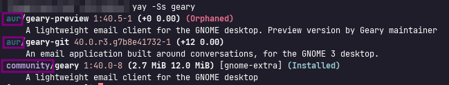

import { Image } from "astro:assets";
import cover from "../../assets/articles/yay-an-aur-helper-written-in-go/yay.jpg";

<Image src={cover} alt="" class="cover" width={1200} />

by Bryanpwo

**Warning: Installing packages built from the AUR is at your own risk. These build instructions are user-provided content and not supported by Arch Linux, so be aware that installing from it can cause system failures.**

Although the official Arch repo houses a lot of useful packages, some packages aren’t included in it because of various reasons like being closed source, custom-made packages by Arch users, or because the original package creator dropped support for it and it’s being maintained by Arch users.

Unlike the packages in the Arch repo, the AUR build instructions are being maintained by Arch users and the majority are doing this on the side as a hobby next to their regular lives. Therefore package updates aren’t tested extensively and can cause trouble by a non-responding app or even can cause breakage to the system, so using it is your own responsibility. However, don’t hesitate to ask the community for help if an update has caused problems, we will help you anyway.

Having informed you of that, you can use yay to install packages from the AUR and Pacman easily.

## Installing packages

To install packages with yay is basically the same as with using pacman itself:

```bash
yay -S package_name
```

With yay you can also get a choice and let it search if there are alternatives:

```bash
yay package_name
```

After that, you will see a numbered list of the package names in the installed repos of your system. Simply type in the number of the package version you want to install and yay is going to install it on your system.

If you want some more information on a package you can type in:

```bash
yay -Si package_name
```

Yay can also update both Pacman and AUR packages at once by this command:

```bash
yay
```

This will call yay -Syu which is set as default on running yay.

Again, think twice before using built from AUR and ask yourself if you really need the package you want to install.

If you use yay to install and search, it will always show both real packages from the repositories and the AUR build options you can be built with yay using the built instructions and files it will download from the AUR.

You can search and install or remove normal packages from the repositories using yay.

You can identify where it finds the search term as a package or AUR build-instructions-files in the output:



## Troubleshooting

In some cases it happens that the yay package in the EndeavorOS repository is not completely up to date. In such cases, you can also build and install it yourself, as is preferred in the [Archwiki:](https://wiki.archlinux.org/index.php/Makepkg)

```bash
git clone https://aur.archlinux.org/yay.git
cd yay
makepkg -si
```

This is not magic, everyone who uses an Archlinux based system should get the knowledge about some [basic commands](https://wiki.archlinux.org/index.php/Makepkg).

It will indeed replace the package from EndeavourOS repository, but this generally build with the same PKGBUILD.

If we update it after this, you will again receive the newer package from the repository, you can also force in case it is updated run: ` sudo pacman -Syu yay` ... but that's not needed.

## Building complex packages, Parallel compilation:

By default arch do not set to use all CPU cores to compile packages, this can be an issue if you want to build bigger packages like kernels and other stuff.

The [make](https://archlinux.org/packages/?name=make) build system uses the `MAKEFLAGS` environment variable to specify additional options for *make*. The variable can also be set in the `makepkg.conf` file.

Users with multi-core/multi-processor systems can specify the number of jobs to run simultaneously. This can be accomplished with the use of [nproc(1)](https://man.archlinux.org/man/nproc.1) to determine the number of available processors:

`MAKEFLAGS="--jobs=$(nproc)"`

Simply add this to you /etc/makepkg.conf file to use all CPUs.

##### See the links above for more Information:

**More information:**

AUR official Website: [https://aur.archlinux.org/](https://aur.archlinux.org/)

Sourcecode: [https://github.com/Jguer/yay](https://github.com/Jguer/yay)

About AUR helpers: [https://wiki.archlinux.org/index.php/AUR_helpers](https://wiki.archlinux.org/index.php/AUR_helpers)

About building packages: [https://wiki.archlinux.org/index.php/Makepkg](https://wiki.archlinux.org/index.php/Makepkg)
